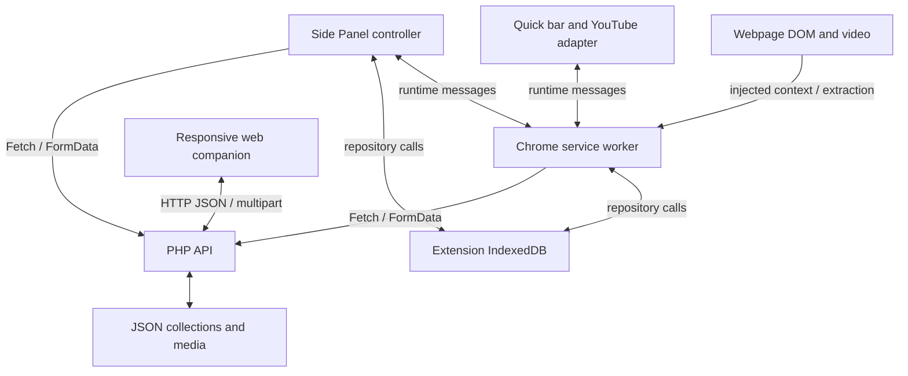

# XtraType — Architecture, ownership and seams

**Canon edition:** 1.0 approval candidate · **Baseline:** supplied v2.3 / extension 2.3.0 · **Audit date:** 2026-10-01

## Runtime topology — current

The panel talks directly to IndexedDB and HTTP as well as the worker. The worker is not a single centralized application service. The webpage and its content scripts share DOM access, but have different JavaScript environments. Shadow DOM is style encapsulation, not a security boundary against page DOM access.

## Concern decomposition

| Concern | Current owners | Responsibilities / boundaries |
|---|---|---|
| C-01 Domain and identity | `ext/core/anchors.js`; duplicated web functions | Constructors, identity keys, geodesic helper; worker has separate applicability rules |
| C-02 Schema vocabulary | `core/schemas.js`, server schema files, both UI controllers, schema endpoint | Catalog, install checks, generated fields, dispatch metadata; no execution |
| C-03 Browser host | Worker, manifest, content scripts | Tab selection, permission-sensitive injection/capture, side-panel launch, site DOM |
| C-04 Authoring and presentation | Panel, quick bar, web, YouTube cards | Form state, validation, status, feeds and interactions; multiple creation paths |
| C-05 Local durability | `core/db.js`, Chrome local/session storage | Five stores, blobs, settings, transient context; no multi-store unit of work |
| C-06 PortaShape transport | `core/api.js`, panel sync loop, worker pulls, PHP endpoints | Local-to-wire transformations and remote-to-local merge; no standalone runtime |
| C-07 Server persistence | `api/bootstrap.php`, config, data/media | File locking, full-array replacement, generated media paths; no identity/ACL |
| C-08 Observation and comparison | Panel capture functions, worker host messages | Screenshot orchestration, extraction, history, pixel comparison |
| C-09 Site adaptation | `content/youtube.js` | Projection into host UI; should not redefine stored target semantics |
| C-10 Operations and verification | Scripts, README, tests | Manual deployment/checks, no CI or recovery tooling |

## Actual sharing and duplication

The panel and worker import the same `db.js`, `api.js`, and `anchors.js`. Each execution context has its own module state and `dbPromise`, while the extension origin addresses the same IndexedDB database. This does not serialize panel/worker HTTP or logical writes.

Both full composers implement target forms, conversion, file validation, escaping, previews and feed rendering separately. Web `targetKey` omits fragment handling; web GPS construction omits bounds validation; numeric enum coercion differs. PHP validates a third, looser contract. Built-in schemas have compact extension and fuller disk definitions. Quick creation/replies independently assemble annotation envelopes. Screenshot upload reuses annotation image limits without a distinct capture policy.

There is no React component library, package dependency graph, shared frontend bundle, dependency injection container, task queue or domain service layer. “Shared component” currently means a shared helper/module or a repeated concept, not automatically shared code.

## Seam register

| Seam | Producer → consumer | Contract / main hazard | Required extension discipline |
|---|---|---|---|
| S-01 | Page → worker → panel | Active context, selection and dimensions; tab/navigation can change | Tie operations to tab/document identity; keep stale drafts visible |
| S-02 | Form → target constructor → key | Conversion and validation; blank GPS→0, lost fragments, key collisions by rounding | Shared validation and conformance examples |
| S-03 | Target → contextual views | Exact key, URL applicability, video grouping and GPS distance differ | Name each resolver; never assume they are interchangeable |
| S-04 | Blob write → annotation/snapshot write → event | Separate IDB transactions; partial success/orphans | Add aggregate commit or explicit recovery semantics |
| S-05 | Local attachment → multipart → server media → local merge | IDs/references replaced; local Blob lineage lost | Preserve local references and remote descriptors separately |
| S-06 | Local unsynced state ↔ full remote pull | Unconditional overwrite, no revision check | Dirty records protected; conflict/retry protocol |
| S-07 | API base setting → all local records | One global synced flag, no server identity | Destination-bound sync state and migration confirmation in product UX |
| S-08 | Schema registry → form/dispatch | Remote definitions overwrite local; kind metadata trusted | Normalize all ingress, reserve built-in dispatch, fail unsupported shapes |
| S-09 | Window capture ↔ tab extraction | Screenshot captures active tab, extraction uses stored tab ID | Abort when identity changes; validate every operation result |
| S-10 | DOM observer → YouTube renderer → DOM observer | Self-generated changes can retrigger rendering | Exclude owned subtree, diff/idempotently render, bounded refresh |
| S-11 | Metadata JSON ↔ filesystem media | No transaction or garbage collection across them | Staged writes, cleanup, complete backups |
| S-12 | Server API/webroot → external clients | No ACL, raw data files available under static root | Private storage and access controls before wider exposure |
| S-13 | Export → future importer | Export lacks blobs/settings/versioned manifest | Label metadata-only; design a separate lossless portable bundle |
| S-14 | Current host capabilities → future scripts | Powerful generic messages lack caller policy | Separate low-trust script API; least privilege and revocation |

## Dependency and authority rules — proposed

Domain code may depend on language/platform-neutral data utilities, never `chrome`, DOM or HTTP. Repositories own persistence only. Application services own workflow policy. Browser adapters own page mechanics. PortaShape adapters own serialization, transport, version translation and remote reconciliation. Views own input/presentation and call services. The server remains independently responsible for validation and access control.

The current code does not yet satisfy these rules. Extract incrementally while preserving tests and wire compatibility; do not replace the working vertical slice in a single rewrite. Document 15 defines module boundaries and change order.

## Cross-cutting quality concerns

Integrity spans target fidelity, stale UI state, sync overwrite and media linkage. Availability spans worker/panel lifetime, absent PHP, network hangs and missing browser APIs. Performance spans full scans/pulls, DOM observer churn, large canvases and unreclaimed URLs. Privacy spans selected content, page HTML, GPS and server choice. Maintainability spans compressed source, duplicate contracts and absent migrations. Accessibility spans generated labels, hidden file inputs, image alternatives and dynamic status. All of these belong in engineering acceptance, not solely in product prose.
