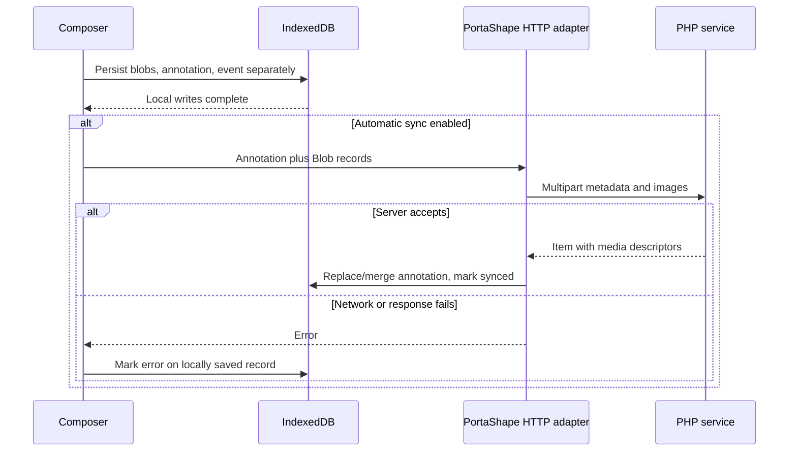

# XtraType — End-to-end workflows and internal message API

**Canon edition:** 1.0 approval candidate · **Baseline:** supplied v2.3 / extension 2.3.0 · **Audit date:** 2026-10-01

## Workflow catalog

| ID | Trigger | Ordered data flow | Success / partial-failure semantics |
|---|---|---|---|
| WF-01 | Open/refresh panel | Session read → worker getContext → injected read/fallback → schema merge → rebuild target → local feed/timeline | Panel may show context fallback with `ok:true`; no dimensions guaranteed |
| WF-02 | Full annotation submit | Body/files/target validation → settings → Blob writes → annotation put → event put → optional POST → local response merge → clear body/files → feed → YouTube refresh | Local note survives upload failure; aggregate writes not atomic; event failure can misreport note failure |
| WF-03 | Quick post | Read live page URL/time + quote dataset → message → constructor → local put/event → optional POST | Worker returns local error-state item if sync fails; bar shows generic Saved |
| WF-04 | YouTube reply | Parent lookup → copy target/key → create child locally → unconditional sync attempt | No worker body validation, no creation event, ignores auto-sync; sync failure swallowed |
| WF-05 | Recent/video lookup | If auto-sync, pull **all** annotations → put each as synced → local full scan/filter | Failed pull ignored; successful pull may overwrite dirty local record |
| WF-06 | Manual Sync now | Push nonsynced annotations → push all local custom schemas → push nonsynced snapshots → pull all annotations → load schemas → refresh views | Per-item failures swallowed; summary can say complete despite them |
| WF-07 | Schema install | Parse/normalize → local wrapper → always attempt push → reload local/remote catalog | Local install survives server failure, but remote precedence can replace local definition |
| WF-08 | Snapshot | Acquire tab/context → pixels/scroll tiles → extraction → Blob → snapshot → optional upload → local timeline | No all-step transaction; errors can leave scroll changed/orphan Blob |
| WF-09 | Web post | Form/file validation → target/key → memory payload → multipart POST → clear body/files → reload full feed | No persistent offline draft/queue |
| WF-10 | Nearby | Geolocation → load all server annotations → GPS distance filter → render | No location upload solely for lookup; form posting stores chosen coordinates |
| WF-11 | Export | Read four stores sequentially → JSON Blob → anchor download → revoke URL | No cross-store snapshot transaction or binaries |

## Local save and network boundary

This sequence documents ordinary full/quick annotation creation. It does not describe web posting or reply preference behavior.

## Message envelope and response rules

Messages are plain objects with `type` plus fields below. No runtime schema/version validation exists. Successful responses generally have `ok:true`; errors caught by worker have `ok:false,error` string. Unknown type returns `Unknown message.`. A content-script Promise can separately reject due to browser/runtime failure. Callers must handle both channels; several currently do not.

| Type | Caller(s) | Inputs | Success response / effects |
|---|---|---|---|
| `xtratype:getContext` | Panel | None; ignores sender tab for selection | `{ok:true,context,tabId}` from active tab; injection failure still successful fallback; absent tab returns error |
| `xtratype:openQuickBar` | Panel; available internal route | None | Select sender.tab or active tab; require scriptable tab; remember context and inject; `{ok:true}` |
| `xtratype:openSidePanel` | Quick bar, YouTube card | None | Sender.tab or active tab; remember, setOptions, open; `{ok:true}` |
| `xtratype:quickCreate` | Quick bar | `payload:{body,highlightedText,pageUrl,title,currentVideoTime}` | `{ok:true,item}`; local persistence; optional sync; sender YouTube tab refresh; title is not persisted in annotation |
| `xtratype:getRecentContextAnnotations` | Quick bar | `pageUrl`, optional `limit` | `{ok:true,items}`; URL/video resolver and newest-first bounded list |
| `xtratype:getYouTubeAnnotations` | YouTube | `videoId` | `{ok:true,items}`; same-video list, no explicit ordering/cap |
| `xtratype:quickReply` | YouTube | `annotationId`, `body` | `{ok:true,item:a}` local child object; function returns pre-sync `a` even if DB was updated to synced |
| `xtratype:scrollTo` | Panel full capture | `tabId,x,y` | Inject scrollTo; `{ok:true}`; no verified achieved offset |
| `xtratype:captureVisible` | Panel capture | Optional `windowId` | `{ok:true,dataUrl}` PNG; window precedence message → sender.tab.windowId → default; captures active tab in window, no tabId parameter |
| `xtratype:pageExtract` | Panel capture | `tabId` | `{ok:true,html,text,title,url}`; HTML/text truncated by slice, no truncation flags |
| `xtratype:refresh` | Worker quick-create, panel full-create → YouTube | Type only | Content listener calls refresh; no defined response payload |

Messages are not public HTTP endpoints. The v2.3 bus should not be exposed wholesale to future user scripts. Sender identity and allowed fields need validation before introducing a lower-trust caller.

## Other event interfaces

Worker hooks `runtime.onInstalled`, `runtime.onStartup`, `contextMenus.onClicked`, `runtime.onMessage`. Panel assigns click/change/submit properties directly, with top-level module await. Quick bar attaches textarea keydown and button handlers. YouTube registers MutationObserver, 700 ms interval, runtime refresh listener, marker hover/click and card mouseleave. Web binds nav button clicks, form submit, file changes, location, refresh and target selection.

No `chrome.storage.onChanged`, `tabs.onActivated`, `tabs.onUpdated`, connectivity listener or durable alarm/job callback coordinates the surfaces. Local creation in one UI does not automatically refresh every other view. A content refresh is specifically sent only on some YouTube creation paths; reply does not explicitly request it.

## Proposed messaging contract

MSG-01: validate discriminated input/output envelopes and string/size limits. MSG-02: classify callers (panel, bundled adapter, future user script), enforce operation policy, and derive tab identity from trusted sender/context. MSG-03: capture operations require job ID, tabId, windowId and document identity/generation; stale context returns a structured error. MSG-04: distinguish local commit, remote acknowledgement and partial success. MSG-05: error codes are stable machine values, messages are user text. MSG-06: newly added optional fields preserve legacy clients until a versioned migration is approved.
