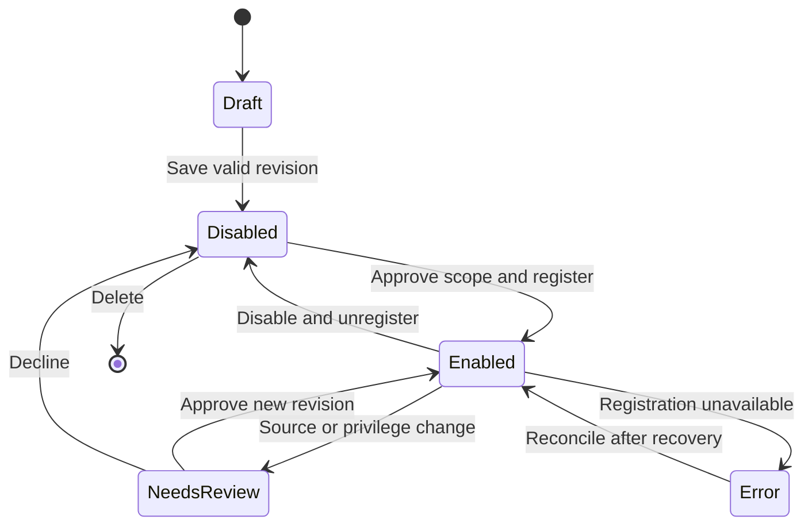

# XtraType — Expansion roadmap and userscript proposal

**Canon edition:** 1.0 approval candidate · **Baseline:** supplied v2.3 / extension 2.3.0 · **Audit date:** 2026-10-01

## Scope boundary

**PROPOSED, not implemented and not yet approved.** The user identified a next direction similar to Tampermonkey, then the message ended after “and”. No second product, full compatibility contract, marketplace, script source trust model or delivery schedule was supplied. This document makes useful executive choices for a safe first slice and keeps those unknowns explicit.

Existing custom schemas add **target vocabulary**. Bundled YouTube code adds a **site adapter**. Future userscripts would add **user-controlled executable behavior**. These must be separate registries and trust boundaries. Do not put script code inside annotation body/schema metadata and execute it.

## Phase roadmap

| Phase | Outcome | Entry/exit gate |
|---|---|---|
| R0 Canon approval | Accepted baseline, decisions and known gaps | Owner records accepted/deferred scope and unconfirmed roadmap clause |
| R1 Stabilization | Correct target/draft/media/sync/observer/capture foundations | Relevant P1 tests pass; deployment P0 controlled |
| R2 Shared contracts | Modular services, migrations, portable bundle and host interfaces | Client/server fixture parity; old data round-trip and rollback |
| R3 Userscript first slice | Explicitly installed, site-scoped local scripts with lifecycle UI | Dedicated permission review, reliable disable/update/reconcile and controlled-site tests |
| R4 Context-aware automation | Optional recipes using bounded approved capabilities | Separate recipe/run model, cancellation, provenance and side-effect policy |
| R5 Collaboration and scale | Authenticated workspaces, conflict-safe sync, search/retention | Identity/ACL, migration, capacity and recovery gates |

R4/R5 are candidate directions inferred from existing capture/context/transport seams and prior reports. They are not commitments and need their own product approval.

## Proposed first userscript scope

Create/import local script text, inspect metadata and source, edit/save versions, enable/disable per script, choose explicit website match patterns, list effective registrations, show last registration error, export scripts and remove them. Default new scripts disabled until the user explicitly enables them for a reviewed site scope. First execution mode: isolated user-script world, document_idle, top frame. Initial scripts have no extension storage/network/capture privileges through an XtraType bridge.

Keep the main XtraType composer first in the panel. Add a supporting Scripts module with list/detail/editor/permission summary. Do not hide powerful execution under “custom schema”. Web/mobile can eventually inspect portable metadata, but no equivalent extension execution capability is assumed there.

Do not promise full Tampermonkey compatibility. The first slice should reject unsupported metadata/directives/API calls with a clear compatibility report. Candidate supported metadata: name, namespace, version, description and site match/exclusion rules after exact syntax is specified. Defer `@require`, remote update URLs, arbitrary GM APIs, cross-origin privileged fetch, main-world execution, all-frame execution, automatic marketplace installation and arbitrary capture automation.

## Platform facts checked for this proposal

Chrome's official userScripts documentation identifies the API as MV3/Chrome 120+, requiring `userScripts` and applicable host permissions. Chrome versions before 138 use a Developer mode gate; 138+ uses an extension-specific Allow User Scripts toggle. User-script messages use dedicated handlers, and registrations must be reconciled after extension updates. [Official userScripts API](https://developer.chrome.com/docs/extensions/reference/api/userScripts), consulted 2026-10-01.

The current extension minimum is 116 and it has no userScripts permission. **Proposed decision:** raise the minimum for the userscript-capable release to Chrome 138+ to simplify the user-facing permission flow, subject to owner approval and release-time platform verification. Preserve the existing v2.3 baseline documentation unchanged. This proposal is not a Chrome Web Store approval guarantee; review applicable distribution policy before shipping user-authored execution.

## Proposed data model, not current stores

| Record | Fields / semantics |
|---|---|
| Script definition | `id`, record type/version, name/namespace, description, createdAt/updatedAt, desired enabled state, current revision ID |
| Immutable script revision | scriptId, revisionId, source text/hash, declared metadata, parsed normalized matches/exclusions/runAt/world, compatibility report |
| Local grant | scriptId/revision scope, allowed sites, approved capabilities, approval time, revoked state; device-local authority |
| Registration receipt | scriptId/revision hash, browser registration ID, effective match policy, status/error, reconciledAt |
| Run diagnostic | scriptId/revision, page origin or redacted context, started/ended/status; no automatic full page content |

Allocate a new DB version and stores only when the exact contract/migration is approved. Names above describe concepts, not finalized wire schema IDs. Permissions/grants MUST NOT become active merely because a script record was synced or imported. PortaShape may transport source/metadata as inert content; each device requires its own enablement and grants.

## Lifecycle state machine

Stored desired state and effective browser registration are separate. Reconcile on install/update/startup and when permissions change; do not equate “enabled” checkbox with successful registration. Source change creates a new revision and invalidates relevant approval. Disable/unregister prevents future injection; it cannot generally undo arbitrary DOM changes or cancel already-running arbitrary script code. State this limitation and offer reload guidance rather than promising a hard kill.

## Capability broker specification

If later scripts need XtraType services, introduce a **separate** validated API with script/revision identity, trusted sender metadata, site grants, operation allowlists, size/rate limits and structured results. Do not forward arbitrary `xtratype:*` messages. Do not accept script-provided author identity, tab ID or grant claims as authoritative. Keep secrets and unrestricted repository access unavailable.

Potential later operations: request current-context summary; propose an annotation draft for user confirmation; attach explicitly permitted derived metadata. Capture/navigation/network/file/export/write operations require separate capability decisions. A timeout can stop waiting for a request; it is not proof an arbitrary page script has been terminated. Isolation reduces JavaScript-environment interference but scripts can still affect shared DOM and observe content on granted pages.

## Portability and coexistence

Script packages should carry source hashes, compatibility manifest and revisions, not effective grants or credentials. Imported scripts remain disabled. Annotation and snapshot records stay meaningful without a script runtime; when a future recipe creates content, add explicit versioned provenance referencing script/recipe revision rather than changing target identity implicitly.

Site adapter-owned DOM, user scripts and screenshot jobs must coexist: define owned root identifiers, cleanup hooks and capture overlay policy. No schema or downloaded annotation can request automatic script activation. Server-side execution of these scripts is out of scope.

## First-slice acceptance

Install valid/invalid metadata; duplicate namespace/name; enable on one origin and confirm no other origin injection; disable and verify no future injection; update revision with broader match requires reapproval; restart/update reconciliation; revoked platform toggle produces truthful UI; source remains preserved after registration failure; import never activates; no privileged broker access; hostile script input cannot spoof another script's grants. Use controlled fixtures, not only live websites.

## Decisions still open

The missing second comparison; desired Tampermonkey API/metadata compatibility level; trusted script acquisition sources; distribution route and supported Chrome floor; whether userscripts sync across devices; retention of source/revisions/run diagnostics; whether annotation drafts may be programmatically proposed; any external-write automation; and whether web/mobile gets management UI. These are expansion questions, not reasons to leave the baseline undocumented.
