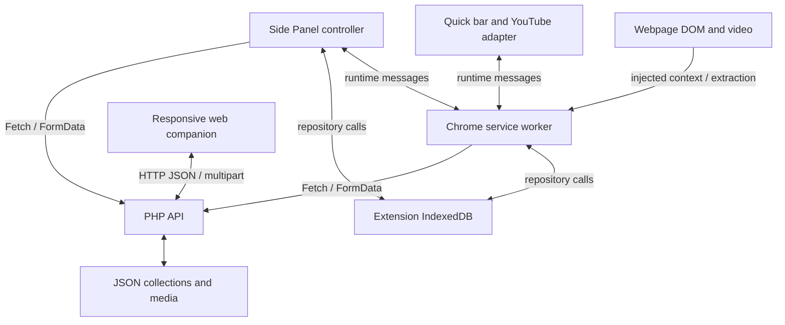
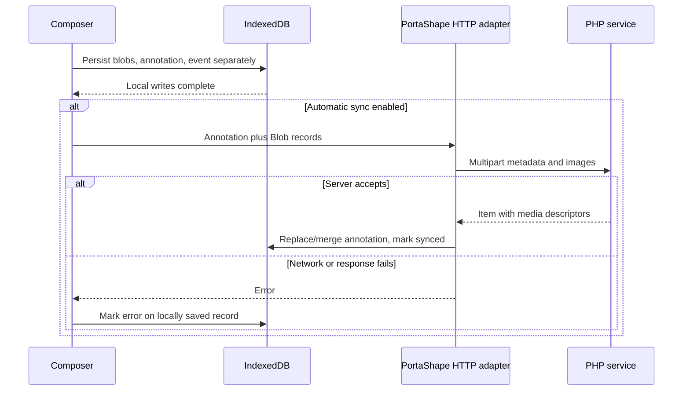
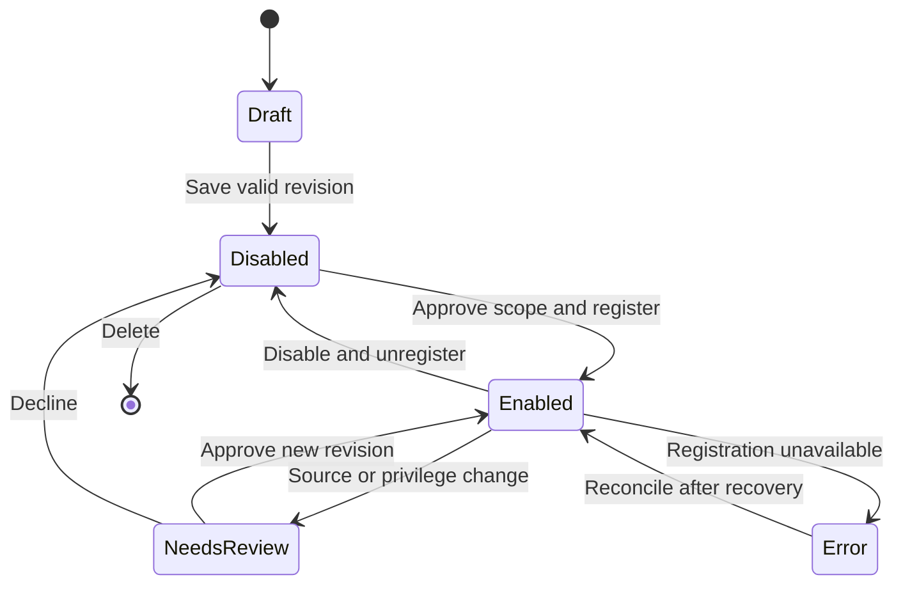

# XtraType — Canon and engineering specifications

**Edition 1.0 — approval candidate** · Baseline v2.3 · 1 October 2026

This reading edition compiles all 21 modular documents. The modular source files in the companion bundle are the maintainable authority candidate. The application code has not been changed.

## Reading index

- [00 · Engineering canon and specification index](#chapter-00)
- [01 · Authority, language and executive decisions](#chapter-01)
- [02 · Product inventory and current status](#chapter-02)
- [03 · Architecture, ownership and seams](#chapter-03)
- [04 · Persisted records and transient data contracts](#chapter-04)
- [05 · Anchor identities and contextual resolution](#chapter-05)
- [06 · Schema catalog, rendering and validation](#chapter-06)
- [07 · Extension hosts, lifecycle and user interfaces](#chapter-07)
- [08 · End-to-end workflows and internal message API](#chapter-08)
- [09 · HTTP API and server implementation](#chapter-09)
- [10 · Local durability and synchronization semantics](#chapter-10)
- [11 · Capture, history and visual comparison](#chapter-11)
- [12 · Responsive web and mobile companion](#chapter-12)
- [13 · Security, privacy, deployment and recovery](#chapter-13)
- [14 · Concern and defect register](#chapter-14)
- [15 · Stabilization specifications and modular target architecture](#chapter-15)
- [16 · Expansion roadmap and userscript proposal](#chapter-16)
- [17 · Verification, engineering acceptance and approval](#chapter-17)
- [18 · Complete source and interface inventory](#chapter-18)
- [19 · Function and handler reference](#chapter-19)
- [20 · Provenance, historical corrections and glossary](#chapter-20)


---

<a id="chapter-00"></a>

# XtraType — Engineering canon and specification index

**Canon edition:** 1.0 approval candidate · **Baseline:** supplied v2.3 / extension 2.3.0 · **Audit date:** 2026-10-01

This is a fresh, source-grounded engineering documentation set for **XtraType**. It describes the supplied application, identifies defects and incomplete seams, and establishes proposed decisions for its next iteration. It is ready for approval; it is **not represented as already approved**. No application source has been changed.

XtraType attaches comments, quoted text, and images to typed targets, preserves browser-page observations, and resurfaces context through a Chrome extension and a responsive web companion. **PortaShape** names the interoperability, data transformation, and transport concerns beneath that product. The current package has no separate PortaShape SDK, service, or general transformation runtime.

## Read by purpose

| Document | Canonical responsibility |
|---|---|
| [01_AUTHORITY_AND_DECISIONS.md](#chapter-01) | Authority, vocabulary, versioning, executive decisions, approval scope |
| [02_PRODUCT_AND_STATUS.md](#chapter-02) | Product inventory, history evidence, supported surfaces, missing capabilities |
| [03_ARCHITECTURE_AND_SEAMS.md](#chapter-03) | Runtime topology, concern ownership, shared code, trust and dependency seams |
| [04_RECORD_CONTRACTS.md](#chapter-04) | Every persisted record, settings, context, media and export shapes |
| [05_ANCHORS_AND_RESOLUTION.md](#chapter-05) | URL/GPS/YouTube/custom semantics, exact keys, contextual matching, parity gaps |
| [06_SCHEMA_SYSTEM.md](#chapter-06) | Catalog resolution, installation, primitive form behavior, validation gaps |
| [07_EXTENSION_SURFACES.md](#chapter-07) | Worker, panel, quick bar and YouTube lifecycles and UI contracts |
| [08_WORKFLOWS_AND_MESSAGES.md](#chapter-08) | End-to-end write/read flows and all internal message interfaces |
| [09_HTTP_AND_SERVER.md](#chapter-09) | All routes, filters, status codes, uploads, file persistence helpers |
| [10_STORAGE_AND_SYNC.md](#chapter-10) | Durability, state transitions, replication order, overwrite and media hazards |
| [11_CAPTURE_AND_COMPARISON.md](#chapter-11) | Capture math, limits, page identity, timeline, pixel score and failure modes |
| [12_WEB_COMPANION.md](#chapter-12) | Web/mobile behavior, geolocation, target parity, responsive/accessibility concerns |
| [13_SECURITY_AND_OPERATIONS.md](#chapter-13) | Trust, privacy, deployment, recovery, troubleshooting and release constraints |
| [14_CONCERN_REGISTER.md](#chapter-14) | Prioritized findings with evidence, reproduction conditions, required outcomes |
| [15_CHANGE_SPECIFICATIONS.md](#chapter-15) | Modular fix specifications, target architecture and acceptance gates |
| [16_EXPANSION_AND_USERSCRIPTS.md](#chapter-16) | Roadmap and bounded userscript proposal; unconfirmed scope explicitly held open |
| [17_VERIFICATION_AND_APPROVAL.md](#chapter-17) | Checks actually run, missing verification, scenario matrix, approval checklist |
| [18_SOURCE_INVENTORY.md](#chapter-18) | Complete file inventory, checksums, imports, DOM IDs, configuration and event index |
| [19_SYMBOL_REFERENCE.md](#chapter-19) | Source-located named function and handler index |
| [20_PROVENANCE_AND_CORRECTIONS.md](#chapter-20) | Supplied-source provenance, prior-report reconciliation and glossary |

## Evidence language

- **CURRENT**: visible in this exact source package. It does not imply browser or server runtime certification.
- **VERIFIED**: reproduced by the checks explicitly reported in document 17.
- **DEFECT / RISK / GAP**: respectively a demonstrable contradiction, a plausible failure requiring additional runtime evidence, or absent functionality.
- **PROPOSED**: an executive specification for approval and subsequent implementation. It is not current behavior.
- **UNRESOLVED**: needs a product decision or external verification. Do not invent a commitment.

Use the structured target as semantic evidence. Do not infer a feature from a schema keyword, store, helper, endpoint, imported function, or label alone. In particular: there is no user-script manager; no snapshot download/restore flow; no event replication; no authenticated identity; and no complete offline image guarantee after annotation sync.

## Most consequential review findings

The local-first write path is valuable and implemented, but later full pulls can replace unsynced data. Successful annotation sync replaces local attachment descriptors with remote descriptors, losing the local Blob linkage. YouTube converts null start times to zero, contrary to the supplied reference, and its observer can be triggered by its own DOM changes. The 140 ms capture delay does not enforce Chrome's capture-rate ceiling. Startup scripts bind to all interfaces while the service has no access controls and its JSON data is beneath the web root.

These findings do not negate the user's working MVP. They establish its boundaries and the order in which to make it dependable before expanding execution capabilities.

## Package layout and use

The numbered Markdown files are the modular source of truth candidate. `evidence/baseline/` is an unchanged source copy for precise review; `evidence/legacy-reports/` and `evidence/legacy-reference.md` preserve historical claims, not new authority. `evidence/characterize.mjs` reproduces selected current quirks. `evidence/verification.json` records this audit's checks. `evidence/source-manifest.json` fingerprints inputs and files.

The companion single-file reading edition is a convenience compilation. On approval, maintain the modular documents and regenerate the compilation. Do not edit both independently.

The user's final phrase ended at “features similar to tampermonkey and”. Only the userscript direction is visible; the missing second comparison and full compatibility scope remain open. That omission does not block approval of the baseline architecture.


---

<a id="chapter-01"></a>

# XtraType — Authority, language and executive decisions

**Canon edition:** 1.0 approval candidate · **Baseline:** supplied v2.3 / extension 2.3.0 · **Audit date:** 2026-10-01

## Authority and evidence precedence

This set supersedes the supplied reports **for the scope approved by the owner**, after approval. Until then it is the proposed replacement canon. It covers the attached source, not an unseen deployed build or unprovided repository history.

Current behavior resolves in this order: exact supplied source and reproducible results; supplied user statement that this iteration works; historical architecture intent; prior descriptive reports. Source inspection establishes implemented control flow; it cannot establish all platform behavior or live-site reliability. The supplied reports' PHP/browser claims are retained as historical evidence and are not borrowed as tests performed in this audit.

For future development, an approved change specification takes precedence over a current defect description. Preserving compatibility means preserving valid records and meaningful contracts, not reproducing bugs. `MUST` in a proposed section means a proposed acceptance requirement awaiting approval. A source assertion and a future requirement must never be silently conflated.

## Naming and compatibility decision

The product, document titles, feature names and future release-facing branding use **XtraType**. PortaShape remains the name for portable record interchange, schema adaptation, local-to-wire transformation, transport, and import/export boundaries. The legacy database identifier `portashape-xtratype` MUST remain unchanged until an explicit migration is implemented. Renaming it cosmetically would create a different database and make existing data appear absent.

Existing literal manifest name `XtraType — PortaShape MVP`, health service string `PortaShape XtraType MVP`, archive filenames and source-history titles remain evidence. Their presence is not a requirement to keep mixed product branding. A later branding patch can change visible strings without changing schema IDs, record types, message names, storage keys or IDs.

## Executive decision register

| ID | Proposed decision | Rationale and implementation consequence |
|---|---|---|
| ADR-001 | XtraType owns product semantics and primary UI | Keep annotation first; capture, history, schemas and automation are supporting capabilities |
| ADR-002 | PortaShape is an explicit interoperability boundary | Group transformations and transport under interfaces; do not claim a separately implemented framework |
| ADR-003 | Preserve typed targets and derived keys | Full target is required; keys are caches/indexes, with migrations when algorithms change |
| ADR-004 | Preserve extension local-first authoring | Commit user intent before network; unify entry-point behavior and retain local binaries |
| ADR-005 | Separate exact identity from contextual applicability | A video-wide view, selected-query resolver and GPS nearby query are distinct operations |
| ADR-006 | Keep the current companion as a development host until hardened | No multi-user or public-service claim without authentication, authorization and protected storage |
| ADR-007 | Fix loss/privacy/observer/capture seams before executable extensions | Userscripts amplify existing privileges; foundation work precedes runtime exposure |
| ADR-008 | Use one semantic implementation across JS hosts | Extract host-neutral constructors, keys and validation; maintain server conformance fixtures independently |
| ADR-009 | Keep schema data separate from executable code | Installing an anchor schema must never execute code or select built-in behavior via untrusted metadata |
| ADR-010 | New captures create new logical observations | Make server immutability explicit later; v2.3 POST currently allows replacement by ID |
| ADR-011 | Do not promise bidirectional sync until reconciliation exists | Directional capability labels and error summaries must reflect reality |
| ADR-012 | Treat userscripts as a new capability with separate trust and lifecycle | Separate registry/permissions from annotations; no execution from arbitrary annotation/schema fields |
| ADR-013 | Adopt migration-first evolution | Never silently change key semantics, storage names, record meaning or server destinations |
| ADR-014 | Defer framework/database selection until a measured requirement | Modular vanilla JS is sufficient for stabilization; future authenticated transactional persistence needs a separate decision |

## Version dimensions

| Dimension | Current value | Meaning |
|---|---|---|
| Extension package | `2.3.0` | Chrome manifest version |
| Source package label | v2.3 | Supplied archive name; no commit ID supplied |
| Canon | 1.0 candidate | Documentation release, independent from executable version |
| IndexedDB | 1 | Physical local store/index schema |
| Annotation | `schemaVersion:2` | Envelope version forced by annotation endpoint |
| Snapshot | `schemaVersion:1` in extension | Endpoint does not force this number |
| Built-in target IDs | `xtratype.anchor.{url,gps,youtube}@1` | Target vocabulary versions |
| Custom target | `$id` chosen by author | No enforced migration or registry version protocol |
| HTTP/message protocols | Unversioned routes and `xtratype:*` | No negotiation/version field |

New releases MUST record these dimensions independently. For any breaking change: document old/new contract, migration, collision handling, rollback and tests. A new field alone does not justify falsely marking existing persisted data as migrated.

## Change control and ownership

Assign engineering ownership by concern, not by the accidental size of a file. Every change request should name its concern ID, records/interfaces affected, behavior change, migration requirement and acceptance cases. One engineer can own several concerns; no staffing structure is assumed.

Approval should record owner, date, canon checksum/version, accepted ADRs, deferred ADRs, and exceptions. Baseline descriptions may be approved separately from userscript scope. Unknown earlier history and unprovided roadmap clauses remain unknown after approval.


---

<a id="chapter-02"></a>

# XtraType — Product inventory and current status

**Canon edition:** 1.0 approval candidate · **Baseline:** supplied v2.3 / extension 2.3.0 · **Audit date:** 2026-10-01

## Product model

A user identifies a thing through a typed target, adds a required comment plus optional quote/images, and later sees that context through a relevant surface. Quoted text is stored text; it is **not** a durable text-range selector and is not automatically re-highlighted in the page. There is no source DOM-node identity or annotation-to-snapshot relationship in the current envelope.

The desktop workspace is the Chrome Side Panel. The optional quick bar is a smaller page overlay. The YouTube integration projects annotations into a site-specific player. The responsive PHP web companion provides server-backed posting and GPS discovery. Local capture/history is available in the extension only.

## Capability inventory

| ID | Capability | Current surface / implementation | Status and boundary |
|---|---|---|---|
| CAP-01 | Native workspace launch | Manifest + worker | Toolbar uses native side-panel behavior; context-menu paths use explicit open |
| CAP-02 | Context acquisition | Worker script injection | URL/title/selection/first-video time/dimensions; top frame only |
| CAP-03 | Full annotation composer | Panel | Four target families, quote, body, image files; local-first |
| CAP-04 | URL variants | Panel/web + keys | Query policies; fragment model exceeds authoring UX |
| CAP-05 | GPS targets | Panel/web | Coordinates/radius/label; validation differs between clients |
| CAP-06 | Video/time targets | Panel/web | Bare, point and range; extension understands Shorts, web composer does not |
| CAP-07 | Structured custom targets | Panel/web | Primitive object forms and requiredness, not full JSON Schema |
| CAP-08 | Images | Panel/web/API | Three PNG/JPEG/WebP files, 8 MiB each in normal multipart path |
| CAP-09 | Context Here | Panel | Exact target key plus same-video expansion; at most 50 shown |
| CAP-10 | Quick comments | On-demand overlay | URL or automatic video time; no image/GPS/custom editor |
| CAP-11 | Recent comments | Quick bar | Worker contextual matching; four requested, limit clamped 1–10 |
| CAP-12 | YouTube projection | Automatic content script | Markers/cards/toast; defects in null handling and observer lifecycle |
| CAP-13 | Quick replies | YouTube card + worker | Child record shares parent target; no thread renderer |
| CAP-14 | Visible snapshot | Panel + worker | One screenshot plus separate HTML/text extraction |
| CAP-15 | Full-page snapshot | Panel + worker | Scroll/stitch with caps; not guaranteed full or atomic capture |
| CAP-16 | Timeline | Panel | Local snapshot page-key index, newest-first, no remote restoration |
| CAP-17 | Compare latest two | Panel canvas | Thresholded RGB comparison, no saved comparison record |
| CAP-18 | Schema distribution | Local store + API | Built-ins/local/remote merge, server can exceed renderer capability |
| CAP-19 | Annotation mirroring | Panel/worker/API | Push/pull with full replacement by ID; no conflicts/tombstones |
| CAP-20 | Snapshot archive | Panel/API | Upload only; screenshots not downloaded into another extension |
| CAP-21 | Events | DB + unused remote API | `annotation.created` logged for full/quick create only |
| CAP-22 | Settings | Panel/Chrome local storage | Server base, display name, default GPS gate, auto-sync |
| CAP-23 | Metadata export | Panel | Four metadata collections, no binaries/settings/import |
| CAP-24 | Web Post/All context | Web companion | Online server-first authoring and unpaginated global feed |
| CAP-25 | Nearby | Web companion | Browser-local Haversine filtering over server annotations |
| CAP-26 | Health probe | Settings/API | Availability response; not a storage integrity or auth test |

## Explicitly absent or incomplete

No accounts, permissions, private workspaces, sharing policy, authenticated authors, general search/tags, edit/delete UI, thread navigation, remote snapshot recovery, event synchronization, full backup/import, quotas/retention, background sync scheduler, automatic capture scheduling, text/DOM comparison, deterministic archive replay, script editor, userscript registry, GM API compatibility, automation runner, billing, or multi-browser implementation is supplied.

Annotation and schema DELETE endpoints exist. Record replacement through POST exists. Those API affordances do not constitute implemented end-user editing/deletion workflows. `remove()` is a repository helper with no shipped UI caller.

## History supported by the inputs

| Evidence | What it supports | What it does not establish |
|---|---|---|
| Packaged architecture's “UI priority in v2.2”; CSS v2.2 comments | Side-panel-first layout and polish were associated with the earlier iteration |
| README “What changed”; v2.3 permission notes; manifest | Native toolbar side panel, optional quick bar, revised quote/recent UI, broad host access are declared v2.3 behavior |
| Old “Object Click” terminology | Browser-capability conceptual ancestry beneath XtraType | No separately present Object Click module/service |
| Prior reports and reference | Previous source-review descriptions and reported checks | No repository commit sequence, release dates for older builds, or current runtime proof |
| User statement | The provided iteration works and is the intended foundation | Does not erase code-level bugs or certify every feature |
| User's truncated roadmap | Interest in Tampermonkey-like additions | No complete feature list or named second comparison |

There is no supplied VCS history, license file, CI configuration or deployment manifest. Do not fabricate past milestones, feature completion dates, authorship, licensing grants or committed delivery dates.

## Direction

Stabilize context integrity, storage/sync, adapter lifecycle and capture. Extract common domain contracts. Then add a narrowly specified, permission-aware userscript capability beside the existing annotation model. More ambitious collaboration, schema richness, web offline mode and automation can reuse those contracts after their prerequisites are met; they are roadmap candidates, not promises.


---

<a id="chapter-03"></a>

# XtraType — Architecture, ownership and seams

**Canon edition:** 1.0 approval candidate · **Baseline:** supplied v2.3 / extension 2.3.0 · **Audit date:** 2026-10-01

## Runtime topology — current



The panel talks directly to IndexedDB and HTTP as well as the worker. The worker is not a single centralized application service. The webpage and its content scripts share DOM access, but have different JavaScript environments. Shadow DOM is style encapsulation, not a security boundary against page DOM access.

## Concern decomposition

| Concern | Current owners | Responsibilities / boundaries |
|---|---|---|
| C-01 Domain and identity | `ext/core/anchors.js`; duplicated web functions | Constructors, identity keys, geodesic helper; worker has separate applicability rules |
| C-02 Schema vocabulary | `core/schemas.js`, server schema files, both UI controllers, schema endpoint | Catalog, install checks, generated fields, dispatch metadata; no execution |
| C-03 Browser host | Worker, manifest, content scripts | Tab selection, permission-sensitive injection/capture, side-panel launch, site DOM |
| C-04 Authoring and presentation | Panel, quick bar, web, YouTube cards | Form state, validation, status, feeds and interactions; multiple creation paths |
| C-05 Local durability | `core/db.js`, Chrome local/session storage | Five stores, blobs, settings, transient context; no multi-store unit of work |
| C-06 PortaShape transport | `core/api.js`, panel sync loop, worker pulls, PHP endpoints | Local-to-wire transformations and remote-to-local merge; no standalone runtime |
| C-07 Server persistence | `api/bootstrap.php`, config, data/media | File locking, full-array replacement, generated media paths; no identity/ACL |
| C-08 Observation and comparison | Panel capture functions, worker host messages | Screenshot orchestration, extraction, history, pixel comparison |
| C-09 Site adaptation | `content/youtube.js` | Projection into host UI; should not redefine stored target semantics |
| C-10 Operations and verification | Scripts, README, tests | Manual deployment/checks, no CI or recovery tooling |

## Actual sharing and duplication

The panel and worker import the same `db.js`, `api.js`, and `anchors.js`. Each execution context has its own module state and `dbPromise`, while the extension origin addresses the same IndexedDB database. This does not serialize panel/worker HTTP or logical writes.

Both full composers implement target forms, conversion, file validation, escaping, previews and feed rendering separately. Web `targetKey` omits fragment handling; web GPS construction omits bounds validation; numeric enum coercion differs. PHP validates a third, looser contract. Built-in schemas have compact extension and fuller disk definitions. Quick creation/replies independently assemble annotation envelopes. Screenshot upload reuses annotation image limits without a distinct capture policy.

There is no React component library, package dependency graph, shared frontend bundle, dependency injection container, task queue or domain service layer. “Shared component” currently means a shared helper/module or a repeated concept, not automatically shared code.

## Seam register

| Seam | Producer → consumer | Contract / main hazard | Required extension discipline |
|---|---|---|---|
| S-01 | Page → worker → panel | Active context, selection and dimensions; tab/navigation can change | Tie operations to tab/document identity; keep stale drafts visible |
| S-02 | Form → target constructor → key | Conversion and validation; blank GPS→0, lost fragments, key collisions by rounding | Shared validation and conformance examples |
| S-03 | Target → contextual views | Exact key, URL applicability, video grouping and GPS distance differ | Name each resolver; never assume they are interchangeable |
| S-04 | Blob write → annotation/snapshot write → event | Separate IDB transactions; partial success/orphans | Add aggregate commit or explicit recovery semantics |
| S-05 | Local attachment → multipart → server media → local merge | IDs/references replaced; local Blob lineage lost | Preserve local references and remote descriptors separately |
| S-06 | Local unsynced state ↔ full remote pull | Unconditional overwrite, no revision check | Dirty records protected; conflict/retry protocol |
| S-07 | API base setting → all local records | One global synced flag, no server identity | Destination-bound sync state and migration confirmation in product UX |
| S-08 | Schema registry → form/dispatch | Remote definitions overwrite local; kind metadata trusted | Normalize all ingress, reserve built-in dispatch, fail unsupported shapes |
| S-09 | Window capture ↔ tab extraction | Screenshot captures active tab, extraction uses stored tab ID | Abort when identity changes; validate every operation result |
| S-10 | DOM observer → YouTube renderer → DOM observer | Self-generated changes can retrigger rendering | Exclude owned subtree, diff/idempotently render, bounded refresh |
| S-11 | Metadata JSON ↔ filesystem media | No transaction or garbage collection across them | Staged writes, cleanup, complete backups |
| S-12 | Server API/webroot → external clients | No ACL, raw data files available under static root | Private storage and access controls before wider exposure |
| S-13 | Export → future importer | Export lacks blobs/settings/versioned manifest | Label metadata-only; design a separate lossless portable bundle |
| S-14 | Current host capabilities → future scripts | Powerful generic messages lack caller policy | Separate low-trust script API; least privilege and revocation |

## Dependency and authority rules — proposed

Domain code may depend on language/platform-neutral data utilities, never `chrome`, DOM or HTTP. Repositories own persistence only. Application services own workflow policy. Browser adapters own page mechanics. PortaShape adapters own serialization, transport, version translation and remote reconciliation. Views own input/presentation and call services. The server remains independently responsible for validation and access control.

The current code does not yet satisfy these rules. Extract incrementally while preserving tests and wire compatibility; do not replace the working vertical slice in a single rewrite. Document 15 defines module boundaries and change order.

## Cross-cutting quality concerns

Integrity spans target fidelity, stale UI state, sync overwrite and media linkage. Availability spans worker/panel lifetime, absent PHP, network hangs and missing browser APIs. Performance spans full scans/pulls, DOM observer churn, large canvases and unreclaimed URLs. Privacy spans selected content, page HTML, GPS and server choice. Maintainability spans compressed source, duplicate contracts and absent migrations. Accessibility spans generated labels, hidden file inputs, image alternatives and dynamic status. All of these belong in engineering acceptance, not solely in product prose.


---

<a id="chapter-04"></a>

# XtraType — Persisted records and transient data contracts

**Canon edition:** 1.0 approval candidate · **Baseline:** supplied v2.3 / extension 2.3.0 · **Audit date:** 2026-10-01

## Scope

These are observed client-produced shapes, not claims that the server validates every field. The PHP endpoints retain arbitrary extra fields and validate only limited envelopes. Field names and literal identifiers below are compatibility-sensitive. Evidence: `ext/core/db.js`, `ext/core/api.js`, `ext/sidepanel/app.js:saveAnnotation/persistSnapshot`, worker `quickCreate/quickReply`, web `post`, and all API endpoints.

## Annotation envelope

| Field | Typical type/value | Writer / semantics |
|---|---|---|
| `id` | string, `annotation:<UUID>` locally | Chrome/web generate UUID; server missing-ID fallback is prefix + 32 hex chars |
| `recordType` | `Context.Annotation` | All creators; server forces literal |
| `schemaVersion` | 2 | All creators; server forces 2 |
| `target` | `{kind,schemaId,value}` | Full structured meaning; server checks only nonempty array-like decoded structure |
| `targetKey` | string | Client-derived; server neither requires nor recomputes |
| `highlightedText` | string, often empty | Quote; no text selector/provenance locator |
| `body` | nonempty trimmed string from UI | Server requires nonblank string, preserves submitted whitespace, rejects >80,000 bytes |
| `attachments` | array | Empty for quick create/reply; local and remote shapes differ |
| `parentAnnotationId` | string or null | Reply shares parent target/key; no foreign-key/cycle/deletion enforcement |
| `author` | display string | Settings fallback `Local user`; web `Web user`; unverified identity |
| `createdAt` | ISO-style UTC string | Client timestamp; server preserves non-null supplied value or uses `gmdate('c')` |
| `updatedAt` | ISO-style UTC string | Client initially; server replaces on every POST |
| `syncState` | `local`, `pending`, `synced`, `error` | Workflow metadata; not revision or durable queue |
| `syncError` | optional string | Written by some failure paths; later success does not explicitly remove it |

Full composer/web text controls have `maxlength=20000` for body and 10000 for quote. Quick inputs and runtime message handlers do not reproduce all those limits. JavaScript/string controls and PHP byte count are not interchangeable units. Client-generated times use `toISOString()`; PHP uses a timezone-offset format. Lexicographic sorting of arbitrary accepted timestamps is not a normalized chronological protocol.

```json
{
  "id":"annotation:11111111-1111-4111-8111-111111111111",
  "recordType":"Context.Annotation","schemaVersion":2,
  "target":{"kind":"url","schemaId":"xtratype.anchor.url@1","value":{
    "url":"https://example.com/a","queryMode":"ignore","queryParameters":[],
    "fragmentMode":"ignore","fragment":null}},
  "targetKey":"url:https://example.com/a","highlightedText":"A quoted sentence",
  "body":"A comment about this page.","attachments":[],"parentAnnotationId":null,
  "author":"Local user","createdAt":"2026-10-01T06:00:00.000Z",
  "updatedAt":"2026-10-01T06:00:00.000Z","syncState":"local"
}
```

This is a documentation fixture, not user data.

## Media and attachment transformation

| Stage | Fields | Identity consequence |
|---|---|---|
| Local Blob record | `id`, `blob` (Blob), `type`, `size`, `createdAt`, optional `name`; metadata spread can override defaults | Stored independently under `blob:<UUID>` |
| Local attachment | `id:attachment:<UUID>`, `name`, `type`, `size`, `blobId`, `serverUrl:null` | Links annotation to local bytes |
| Outbound annotation JSON | Only attachment entries with `serverUrl` or `url`; normalize `url` from either | Local-only descriptors removed; bytes sent as `images[]` |
| Server media descriptor | `id:media:<32 hex>`, sanitized `name`, detected `type`, `size`, `url:/media/YYYY-MM/...` | New media ID, no original attachment ID or Blob ID mapping |
| Synced local annotation | Returned server attachment array | Normal local Blob references lost; old Blob still stored |

`serverUrl` is a client-supported legacy/optional field, not a field emitted by the upload helper. Do not document attachment IDs as stable across synchronization. Root-relative media paths are resolved by the panel against settings `apiBase` after stripping terminal `/api`; this couples data to the current server setting. Web rendering uses `url` directly. There is no checksum, image width/height, ownership, content-addressed ID, deduplication, media download cache, or deletion reference count.

## Snapshot envelope

| Field | Local/current meaning | Server behavior |
|---|---|---|
| `id` | `snapshot:<UUID>` per capture | Generate if empty; upsert permits same-ID replacement |
| `recordType` | `Revision.Snapshot` | Forced |
| `schemaVersion` | 1 | Preserved if supplied; not required/forced |
| `pageKey` | Default URL key, query and fragment ignored | Accepted without validation |
| `url`, `title` | Initial context's page URL/title | No canonicalization |
| `capturedAt` | Persistence-time ISO string | Retain or default server time |
| `mode` | `visible` or `full-page` | Not enum-validated |
| `metrics.viewport` | `width,height,scrollX,scrollY,devicePixelRatio` | Stored as received |
| `metrics.page` | `width,height` | Original measured page, not actual clipped screenshot bounds |
| `renderedText` | Extraction text or empty string | No server length cap |
| `renderedHtml` | Extraction HTML or empty string | No server length cap |
| `screenshotBlobId` | Local Blob reference | Removed by extension transport |
| `syncState`, `syncError` | Local upload status | Payload may retain pending/error state; endpoint does not force synced |
| `serverScreenshot` | Added locally from response `.screenshot` | Not the server's canonical screenshot field |
| `screenshot` | Normally only remote | First generic uploaded image descriptor |

Snapshot metadata and bytes are separate writes. Snapshot is append-oriented by normal creation, not API-enforced immutable. There is no DOM dependency archive, capture manifest, truncation flag, content hash, annotation link, recipe provenance, baseline choice, or stored comparison result.

## Schema storage

Extension custom wrapper: `{id:schema.$id,schema,updatedAt}`. Server custom wrapper adds `$id` alongside `id`: `{id,$id,schema,updatedAt}`. Catalog GET returns bare schemas; both clients tolerate wrappers in some paths. Built-ins reside in source files rather than an automatically persisted local store. Remote custom schemas are cached locally and can survive loss of server availability.

## Events

Local event: `{id:'event:<UUID>',type,data,occurredAt}`. Full creation uses `type:'annotation.created'` and `data:{annotationId,targetKey}`. Quick creation adds `source:'quickbar'`. Quick replies, captures, sync, deletes and web posts do not log corresponding local events. Server event POST accepts arbitrary object/array-like JSON, defaults ID/time, upserts, and has no connection to the extension event store. This is not an event-sourced architecture or complete audit trail.

## Settings and session context

`chrome.storage.local.xtratypeSettings` defaults to `{apiBase:'http://localhost:8787/api',author:'Local user',defaultGpsRadius:75,autoSync:true}`. `settings()` overlays stored fields; `saveSettings(next)` replaces the settings value. No account, credential, server ID, retention preference, script policy or local migration version is stored. Extension GPS gate setting is currently not consumed by the panel's exact-key feed; web default comes from PHP config instead.

`chrome.storage.session.xtratypeLastContext` successful shape: `pageUrl,title,highlightedText,currentVideoTime,viewport,page,tabId,capturedAt`. Injection-failure fallback retains URL/title/tab/time, empties highlight, sets video time null, adds `scriptAccess:false,accessReason`, and lacks dimensions. Successful `getContext` returns live context without necessarily refreshing this session record. No expiry, document ID or generation token is present.

## Metadata export

`{exportedAt,annotations,schemas,snapshots,events}` is serialized with indentation into `xtratype-export-YYYY-MM-DD.json`. Blob bytes, Blob store records, settings and remote media files are omitted. References alone cannot restore an installation. There is no import handler. The export is useful for inspection but MUST NOT be described as a complete backup.


---

<a id="chapter-05"></a>

# XtraType — Anchor identities and contextual resolution

**Canon edition:** 1.0 approval candidate · **Baseline:** supplied v2.3 / extension 2.3.0 · **Audit date:** 2026-10-01

## Identity versus applicability

An annotation's structured `target` describes intent. `targetKey(target)` derives exact identity. Contextual retrieval may intentionally match more than one exact identity. Current consumers disagree in useful and accidental ways:

| Consumer | Matching rule | Result bound |
|---|---|---|
| Panel Context Here | Current form exact key; YouTube additionally same video ID | 50 newest by string `createdAt` |
| Worker quick-bar recent | URL policy against live page, or same YouTube video | Default 4, integer-like numeric request clamped 1–10 |
| YouTube adapter | All annotations for video ID | Unbounded |
| Web Nearby | GPS distance ≤ effective radius | Unbounded |
| Web All context | No target filter | Entire server collection |
| Annotation API | ID shortcut; otherwise optional videoId and targetKey filters combined | Entire matching collection |
| Snapshot timeline | Default URL page key | All local captures for origin/path |

If panel `buildTarget()` throws, `renderFeed()` falls back to **all** annotations instead of an empty/error context. Form-field edits do not generally trigger feed recomputation; target-kind changes, save, refresh and sync do. A displayed feed can lag the form's current target.

## URL anchor

Schema ID `xtratype.anchor.url@1`; shape: `value:{url,queryMode,queryParameters:[{key,value,include}],fragmentMode,fragment}`.

`parseUrlTarget(raw)` uses the platform URL parser and requires HTTP(S). It stores `origin+pathname`, all query pairs in order with `include:false`, query mode `ignore`, fragment mode `ignore`, and fragment text without `#` or null. The original raw URL, credentials and query ordering are not preserved as a separate source field.

Key generation starts with `new URL(value.url)`, selects all pairs for `all` or included pairs for `selected`, sorts by `key.localeCompare` then `value.localeCompare`, appends them and optionally sets a nonempty fragment. Prefix is `url:`. Duplicate pairs remain; sorting discards original order. This is application-specific canonicalization, not a universal canonical URL algorithm. Locale-sensitive sorting must be stabilized before cross-runtime conformance can be assumed for arbitrary Unicode.

| Input/policy | Key |
|---|---|
| `https://example.com/a?x=1&y=2#z`, ignore | `url:https://example.com/a` |
| Same, selected x | `url:https://example.com/a?x=1` |
| Same, all | `url:https://example.com/a?x=1&y=2` |
| Same, selected x + fragment include with preserved z | `url:https://example.com/a?x=1#z` |
| `https://example.com`, ignore | `url:https://example.com/` |

The worker's page matcher first requires exact origin/path. Fragment inclusion requires exact fragment text, including empty-versus-nonempty handling. Selected query matches require a multiset of chosen pairs; extra live pairs are allowed. All query matches require equal pair counts and matching pairs **except** that an early return treats zero chosen pairs as a wildcard. Thus an `all` anchor with no query pairs incorrectly matches a page with queries. Characterized in this audit.

The panel initially strips fragment from its bare-URL field and does not retain a dedicated fragment input. “Include fragment” normally therefore has no fragment value to include. Typing a complete URL with a fragment manually can reach the constructor, but extracting variables strips it again. Query rows are similarly authoritative: typing queries without extraction does not automatically update the rows. The web composer always emits ignore/null fragment and its key implementation ignores fragment entirely.

## GPS anchor

Schema ID `xtratype.anchor.gps@1`; `value:{latitude,longitude,radiusMeters,label}`. Extension converts coordinates with `Number`, enforces finite latitude [-90,90] and longitude [-180,180], radius null or positive, and stringifies label. Blank coordinate strings become zero and pass; fields are not `required`. This is a defect, not a supported “use equator/prime meridian by default” feature.

Key is `gps:<latitude.toFixed(6)>,<longitude.toFixed(6)>` plus `@<Number(radius)>` when radius is truthy. Label is excluded. Distinct coordinates may collide after rounding; stored full values still govern distance. Null radius and explicit 75 produce different keys despite sharing a default 75 m gate in some consumers.

Distance uses spherical Earth radius 6,371,000 m and Haversine formula, inclusive `distance <= radius`. Core `gpsMatches` defaults to 75; web uses explicit radius or `window.XT_CONFIG.defaultGpsRadius`. Web conversion checks finiteness but not coordinate bounds. Schema disk maximum radius 100,000 and label length 200 are not constructor/server guarantees. No geolocation accuracy, altitude, acquisition time or CRS is stored in the target.

## YouTube anchor

Schema ID `xtratype.anchor.youtube@1`; `value:{videoId,videoUrl,startSeconds,endSeconds}`. Both times nullable. A start alone is a point; both times make a range; neither is whole-video; end-only is rejected; equal start/end is accepted despite “after” error wording. Core accepts finite nonnegative times and does not clamp to duration.

Extension recognition uses hostname substring tests for `youtu.be` and `youtube.com`. It supports short paths, `?v=` and `/shorts/<id>` but also accepts lookalike hosts. There is no schema pattern enforcement on actual ID construction. Web URL parsing is even looser: a non-short-link host with a `v` query can provide an ID, and Shorts paths are not handled.

Keys: `youtube:<id>`, `youtube:<id>@12.500`, `youtube:<id>@12.500-18.000`. Key times round to milliseconds, stored values do not. Panel prefill rounds current video time to tenths; quick capture takes the numeric time directly. The first `<video>` is used, not a uniquely verified player.

The panel's ID field can override the ID parsed from URL; the canonical URL is then reconstructed. Quick creation supplies a point only when payload time is finite, otherwise bare video. The content script currently coerces `null` to zero for rendering and toast checks, so whole-video notes can incorrectly appear at 0:00. Replies share parent target and can therefore add markers at the same time.

## Custom anchor

Shape `{kind:'custom',schemaId:<installed $id>,value:<object>}`. Key: `custom:<schemaId>:<JSON.stringify(stable(value))>`. `stable()` recursively sorts object keys using `.sort()` and preserves array order. Empty strings, null, omitted fields, numbers and strings remain distinct where JSON serialization does. There is no ISBN cleanup, aliasing, case-folding or semantic equivalence. Optional empty controls are materialized as empty string/null/false and participate in identity.

Normal schema UI is limited to primitives, but the key function itself can canonicalize nested objects/arrays. Do not infer nested form support from that ability. Numeric enums are coerced by schema type in the panel but by HTML input type in the web client; web select values can stay strings and create different keys.

## Proposed invariants

Validate before constructing; prohibit placeholder targets; preserve source context separately from editable draft; one key algorithm per version; reject unsupported schemes and spoofed hosts; distinguish `null` from zero; expose exact-match and contextual resolvers by name; migrate old keys explicitly if corrected meaning changes. Preserve legitimate zero coordinates and zero time while rejecting missing coordinates. Keep source target alongside any reindexed key so migration is explainable.


---

<a id="chapter-06"></a>

# XtraType — Schema catalog, rendering and validation

**Canon edition:** 1.0 approval candidate · **Baseline:** supplied v2.3 / extension 2.3.0 · **Audit date:** 2026-10-01

## Current catalog composition

Extension `BUILTIN` has URL, GPS and YouTube compact definitions. `loadSchemas()` creates a Map in precedence order: extension built-ins → local wrappers → remote entries. Later entries with the same `$id` win. Remote non-`xtratype.anchor.*` schemas are cached locally; remote built-ins only replace the in-memory definitions. It attempts network even if auto-sync is off. A valid prior selector value is preserved before considering the current page's YouTube identity.

Server GET loads every `server/schemas/*.schema.json`, then `data/schemas.json`. Wrapped or bare stored entries are supported. Last entry per `$id` wins. The four packaged files are URL, GPS, YouTube and Book (`example.anchor.book@1`). The Book example is therefore in the online catalog by default, not an inert sample. Deleting its stored override reveals the disk definition again.

Web `loadSchemas()` has no offline built-ins, fetches server catalog, preserves prior selection if available and otherwise leaves browser selection order. The disk/glob order is not a product contract; URL is not explicitly made the default web choice.

## Schema identity and metadata

`$id` identifies target vocabulary. `title` and `x-xtratype.label` provide labels. `x-xtratype.description` is introductory copy. `x-xtratype.kind` dispatches built-in forms (`url`, `gps`, `youtube`) or custom. The extension normalizer sets `kind:'custom'` and then spreads supplied metadata over it; supplied `kind` therefore overrides the supposed restriction. Both UIs trust catalog kind metadata. A custom ID can select a built-in form unexpectedly. This is a dispatch integrity defect, not executable JavaScript injection.

## Installation paths

| Path | Validation | Persistence and network |
|---|---|---|
| Panel local file | JSON parse, nonempty string `$id`, object type/properties, reserved prefix, supported-type presence | Local wrapper first, then POST always, then reload catalog |
| Web local file | JSON parse and shallow `$id`/type/properties/reserved prefix | Server POST only |
| Direct server POST | Array-like decoded schema, nonempty `$id`, object type, properties array-like, reserved prefix | Whole-record upsert in schema collection |
| Remote-to-panel load | No `normalizeCustomSchema` call | Cache custom schema and render directly |

Extension supported-type check accepts a union if **any** non-null type is among string/number/integer/boolean. A union containing string plus unsupported object can pass. Missing type defaults to string during normalization. Malformed property definitions can throw. Server does not enforce the same primitive subset. None of these paths performs complete Draft 2020-12 validation.

## Field behavior matrix

| Keyword/type | Panel | Web | Semantic guarantee |
|---|---|---|---|
| `enum` | Select, string option values; target builder coerces numeric schema types | Select; values remain strings because it tests control type | Numeric-enum parity broken |
| boolean | Checkbox; checked → boolean | Checkbox; checked → boolean | Required false accepted |
| number | Number input; empty → null | Same for ordinary numeric inputs | Browser validity helps; not shared/server validation |
| integer | Number input with step=1 | Same | Requiredness helper alone allows fractional numbers |
| string | Text input | Text input | No pattern/length enforcement by helper |
| `minimum`/`maximum` | Assigned as input attributes | Not generally copied for custom fields | UI behavior, not authoritative record validation |
| `required` | Reject undefined/null/empty string during build | Same | Whitespace string passes |
| `default` | Not applied | Not applied | Empty control behavior governs |
| nullable type union | First supported control interpretation; no explicit null toggle | Similar | Blank numeric null; blank strings remain empty |
| nested object/array | Pure nested types rejected on local panel install | Can be accepted server-side, then misrendered as text | No supported nested form contract |
| `$ref`, conditions, combinators, format, pattern | Not evaluated | Not evaluated | Schema syntax does not imply support |
| `additionalProperties` | Not evaluated | Not evaluated | Server preserves unknown data |

Native form validation occurs on normal form submission, but it is not a full validator and does not protect direct API writes or all helper callers. The helper `validateCustomValue` checks required presence only.

## Built-in drift

Disk URL schema includes pair structures, required query fields and URI format; compact extension schema omits much of that detail. Disk GPS uses exclusive minimum >0, max 100,000 radius and label maxLength 200; compact schema has minimum 1 without the same maximum. Disk YouTube has video-ID regex; constructors do not enforce it. Downloading fuller schemas does not automatically strengthen hand-written constructors.

## Proposed specification

SCH-01: all ingress paths MUST pass one documented compatibility validator before installation/cache/rendering. Unsupported constructs produce a list of unsupported paths/keywords and no partial installation. SCH-02: installed custom schemas cannot select reserved built-in kind handlers. SCH-03: validation, form conversion and key derivation share scalar typing; enum types preserve number/boolean semantics. SCH-04: built-in definitions are maintained from one source and generated/distributed with a versioned fixture suite. SCH-05: schema replacement distinguishes compatible metadata change from identity-breaking value change and requires migration/version policy.

A future full JSON Schema engine is a separate decision. Stabilization can instead implement a precisely specified subset with consistent rejection. Adding an ordinary custom target should not require a code patch; adding a resolver with time/geography/site behavior does require application code and acceptance tests.


---

<a id="chapter-07"></a>

# XtraType — Extension hosts, lifecycle and user interfaces

**Canon edition:** 1.0 approval candidate · **Baseline:** supplied v2.3 / extension 2.3.0 · **Audit date:** 2026-10-01

## Manifest and host contract

Manifest V3, package version 2.3.0, minimum Chrome 116. Permissions: `activeTab`, `scripting`, `storage`, `sidePanel`, `contextMenus`, `tabs`, `geolocation`; required host permissions `<all_urls>`. Background `service-worker.js` is an ES module. Side panel path `sidepanel/index.html`. Action has a title but no popup. The only manifest content script is `content/youtube.js`, at `document_idle`, for `https://www.youtube.com/*`; no all-frames flag. The quick bar is injected on demand, not on every site visit.

There is no userscripts permission, offscreen document, alarm scheduler, declarative network rule set, command shortcut registration, external-message listener, options page, incognito policy override or web-accessible-resource list in the supplied manifest.

## Worker lifecycle

At module evaluation, install and browser startup, worker requests native `openPanelOnActionClick:true`, swallowing setup failures. Installation removes context menus and creates two entries for selection/page/video/link: `xtratype-panel` and `xtratype-quick`. The click handler ignores menu `selectionText`, `linkUrl` and `srcUrl`; it uses the tab's context. Selecting a link's context menu therefore does not target that link specifically.

`activeTab()` queries `{active:true,currentWindow:true}`. `pageScriptability()` rejects known protected schemes and Web Store URLs but is a preflight heuristic, not a complete permissions oracle. `tabContext()` injects into top frame and reads selection (trimmed, 10,000 code units), first video time, viewport/scroll/DPR and document/body maximum scroll dimensions. `rememberContext()` stores successful capture or metadata-only fallback. `openPanelForTab()` remembers context before setOptions/open; asynchronous work can interact with user-gesture requirements and needs Chrome verification. Toolbar native opening bypasses that helper; the panel requests context on its own initialization.

The worker uses async `onMessage` handling with `return true`; errors become `{ok:false,error:e.message}`. It has no message schema validation, per-operation caller allowlist, document-generation check or synchronization mutex. Existing content scripts have extension privileges through this private message bus; ordinary web pages do not get direct runtime access merely because the listener exists.

## Side Panel

Initialization is `loadSettingsForm()` then `refreshContext()`. Module state: `context`, schema array, selected unsaved files and one selected-snapshot URL. It does not subscribe to tab activation/navigation or storage changes. It refreshes on initialization/manual controls, not automatically on every browser context change.

| UI module/control | Behavior and state effect |
|---|---|
| Sticky header / quick icon | Inject optional bar into current active tab |
| Refresh context | Read session/live context; update strip; reload schemas/form/feed/timeline |
| Context strip | Title and URL or access reason; green/red dot; no expiring context indicator |
| Target selector | Rebuild target controls and feed; may discard unsaved target fields |
| Highlighted text | Prefilled only if newly captured text nonempty; old quote retained otherwise |
| Comment | Required textarea, maxLength 20,000 |
| Image picker | Replace selected file list after validation; individual preview removal |
| Post | Local-first aggregate sequence followed by optional upload; not disabled during save |
| Clear | Clears comment, quote and selected file state; not target settings or native file input value |
| Context Here | Open details section; up to 50 records; no page count/search/thread/edit/delete |
| Sync now | Best-effort annotation/schema/snapshot pushes followed by annotation/schema pulls |
| Capture | Visible/full controls and latest preview; no cancel/progress lock |
| Timeline & compare | All local page captures and newest-two pixel diff |
| Anchor schemas | File import and resolved schema list; no delete/migration UI |
| Settings | API base/name/GPS default/auto-sync, health probe, metadata export |

Refresh can preserve a body/quote while replacing target fields, creating an unintended target association. Nonempty quotes remain after posting. If current URL parsing fails, the URL form falls back to `https://example.com/`; access messaging does not disable posting. Selecting GPS creates blank coordinates which the constructor turns into zero. `sync-pill` is a static local-first label, not dynamically updated status.

Save is not one IDB transaction. Blob writes precede annotation write, which precedes event write. If event logging fails after annotation commit, the user sees an error even though the note exists. With no submit lock, retry can create another ID. Same pattern affects quick creation. Image preview/feed/timeline object URLs are mostly not revoked; only selected large preview replacement and export URL have targeted revocation.

Panel styling uses a 300 px minimum width, sticky header, CSS variables, collapsible native details, wrapping text, small controls, responsive adjustments around 340/360 px and dark primary accent. Styling is separate from web and quick bar CSS. No formal shared token package exists. Some accessible labels/focus indicators/live regions exist; image alt text, generated error associations and keyboard-accessible snapshot rows require review.

## Quick bar

`page-ui.js` is a self-contained IIFE. It captures selection before injection, creates fixed `#xtratype-host` with open Shadow DOM, and appends to documentElement. Existing host: update quote dataset/text, hide if empty, focus textarea, return. It does not verify host ownership beyond ID nor refresh all context fields/recent data on this early-return path.

The dialog-like shell contains context label, comment, Post, Full panel, Close, quote, status and Recent comments. Desktop width up to 860 px; top offset 12 px; viewport-constrained scroll height; 680/440 px responsive layouts. Full quote is stored in `dataset.fullText` while visual text is clamped. That shared DOM is visible to the host page. The overlay is not a private editor against the site it inhabits.

Post trims and requires body, disables Post while awaiting worker response, obtains current URL/title/video time at submit, sends captured quote, and then clears body/refreshes recent/focuses. Other controls remain available. Worker success may represent local-only save with sync error; the bar's generic success text does not distinguish it. Ctrl/Cmd+Enter posts; Escape closes only via the textarea key handler. Full panel disables its button and only re-enables on failure. Close removes host. Recent cards use safe text nodes and show author, target/time suffix, relative age, clamped body and quote; no images/replies.

## YouTube adapter

State: annotations, lastVideoId, lastSecond, marker host, card, toast. Extract `v` or `/shorts/`. `refresh()` asks worker for annotations then sets state and renders. A 700 ms interval detects video changes and integer second changes. An unfiltered subtree childList MutationObserver refreshes on ID change or renders otherwise. An internal `xtratype:refresh` message does the same.

`ensureUi()` requires `.ytp-progress-bar-container,.ytp-progress-bar`, changes its positioning to relative, adds marker overlay and toast under `#movie_player` or body. `render()` requires video duration, removes all markers and recreates them. Start/end are coerced with `Number`; null becomes zero. Position is clamped to 0–100%; width at least 0.45% and min-width 4 px. No click-to-seek is implemented.

Hover replaces prior card; click creates persistent interactive card. Card body is escaped. Noninteractive mouseleave removes it. Interactive card lacks close/outside-click/Escape handling. Position formula can produce negative left coordinates on narrow viewports. Reply checks nonempty input, sends quickReply, then unconditionally labels Saved without checking response `.ok`. Open sends panel-open message.

Toast triggers only when observed integer currentTime equals floor(start), lasts 4.5 seconds, and later matching annotations replace earlier toast content. Skipping that second can miss it; seeking back can repeat it. Range code has no continuous-range overlay. If progress UI is unavailable, the timer can attempt to use an uncreated toast. No cancellation/deduplication of concurrent refresh requests, no generation check against stale responses, no complete cleanup when leaving a video, no resource dispose lifecycle.

**High-impact risk:** observer sees its own `replaceChildren`/append changes. With markers, each render schedules more observed changes, which can create sustained render churn or starvation. Severity is based on source causality; this audit did not run a real YouTube session. The required fix is owned-subtree exclusion plus idempotent rendering and controlled refresh, not merely a longer polling interval.


---

<a id="chapter-08"></a>

# XtraType — End-to-end workflows and internal message API

**Canon edition:** 1.0 approval candidate · **Baseline:** supplied v2.3 / extension 2.3.0 · **Audit date:** 2026-10-01

## Workflow catalog

| ID | Trigger | Ordered data flow | Success / partial-failure semantics |
|---|---|---|---|
| WF-01 | Open/refresh panel | Session read → worker getContext → injected read/fallback → schema merge → rebuild target → local feed/timeline | Panel may show context fallback with `ok:true`; no dimensions guaranteed |
| WF-02 | Full annotation submit | Body/files/target validation → settings → Blob writes → annotation put → event put → optional POST → local response merge → clear body/files → feed → YouTube refresh | Local note survives upload failure; aggregate writes not atomic; event failure can misreport note failure |
| WF-03 | Quick post | Read live page URL/time + quote dataset → message → constructor → local put/event → optional POST | Worker returns local error-state item if sync fails; bar shows generic Saved |
| WF-04 | YouTube reply | Parent lookup → copy target/key → create child locally → unconditional sync attempt | No worker body validation, no creation event, ignores auto-sync; sync failure swallowed |
| WF-05 | Recent/video lookup | If auto-sync, pull **all** annotations → put each as synced → local full scan/filter | Failed pull ignored; successful pull may overwrite dirty local record |
| WF-06 | Manual Sync now | Push nonsynced annotations → push all local custom schemas → push nonsynced snapshots → pull all annotations → load schemas → refresh views | Per-item failures swallowed; summary can say complete despite them |
| WF-07 | Schema install | Parse/normalize → local wrapper → always attempt push → reload local/remote catalog | Local install survives server failure, but remote precedence can replace local definition |
| WF-08 | Snapshot | Acquire tab/context → pixels/scroll tiles → extraction → Blob → snapshot → optional upload → local timeline | No all-step transaction; errors can leave scroll changed/orphan Blob |
| WF-09 | Web post | Form/file validation → target/key → memory payload → multipart POST → clear body/files → reload full feed | No persistent offline draft/queue |
| WF-10 | Nearby | Geolocation → load all server annotations → GPS distance filter → render | No location upload solely for lookup; form posting stores chosen coordinates |
| WF-11 | Export | Read four stores sequentially → JSON Blob → anchor download → revoke URL | No cross-store snapshot transaction or binaries |

## Local save and network boundary



This sequence documents ordinary full/quick annotation creation. It does not describe web posting or reply preference behavior.

## Message envelope and response rules

Messages are plain objects with `type` plus fields below. No runtime schema/version validation exists. Successful responses generally have `ok:true`; errors caught by worker have `ok:false,error` string. Unknown type returns `Unknown message.`. A content-script Promise can separately reject due to browser/runtime failure. Callers must handle both channels; several currently do not.

| Type | Caller(s) | Inputs | Success response / effects |
|---|---|---|---|
| `xtratype:getContext` | Panel | None; ignores sender tab for selection | `{ok:true,context,tabId}` from active tab; injection failure still successful fallback; absent tab returns error |
| `xtratype:openQuickBar` | Panel; available internal route | None | Select sender.tab or active tab; require scriptable tab; remember context and inject; `{ok:true}` |
| `xtratype:openSidePanel` | Quick bar, YouTube card | None | Sender.tab or active tab; remember, setOptions, open; `{ok:true}` |
| `xtratype:quickCreate` | Quick bar | `payload:{body,highlightedText,pageUrl,title,currentVideoTime}` | `{ok:true,item}`; local persistence; optional sync; sender YouTube tab refresh; title is not persisted in annotation |
| `xtratype:getRecentContextAnnotations` | Quick bar | `pageUrl`, optional `limit` | `{ok:true,items}`; URL/video resolver and newest-first bounded list |
| `xtratype:getYouTubeAnnotations` | YouTube | `videoId` | `{ok:true,items}`; same-video list, no explicit ordering/cap |
| `xtratype:quickReply` | YouTube | `annotationId`, `body` | `{ok:true,item:a}` local child object; function returns pre-sync `a` even if DB was updated to synced |
| `xtratype:scrollTo` | Panel full capture | `tabId,x,y` | Inject scrollTo; `{ok:true}`; no verified achieved offset |
| `xtratype:captureVisible` | Panel capture | Optional `windowId` | `{ok:true,dataUrl}` PNG; window precedence message → sender.tab.windowId → default; captures active tab in window, no tabId parameter |
| `xtratype:pageExtract` | Panel capture | `tabId` | `{ok:true,html,text,title,url}`; HTML/text truncated by slice, no truncation flags |
| `xtratype:refresh` | Worker quick-create, panel full-create → YouTube | Type only | Content listener calls refresh; no defined response payload |

Messages are not public HTTP endpoints. The v2.3 bus should not be exposed wholesale to future user scripts. Sender identity and allowed fields need validation before introducing a lower-trust caller.

## Other event interfaces

Worker hooks `runtime.onInstalled`, `runtime.onStartup`, `contextMenus.onClicked`, `runtime.onMessage`. Panel assigns click/change/submit properties directly, with top-level module await. Quick bar attaches textarea keydown and button handlers. YouTube registers MutationObserver, 700 ms interval, runtime refresh listener, marker hover/click and card mouseleave. Web binds nav button clicks, form submit, file changes, location, refresh and target selection.

No `chrome.storage.onChanged`, `tabs.onActivated`, `tabs.onUpdated`, connectivity listener or durable alarm/job callback coordinates the surfaces. Local creation in one UI does not automatically refresh every other view. A content refresh is specifically sent only on some YouTube creation paths; reply does not explicitly request it.

## Proposed messaging contract

MSG-01: validate discriminated input/output envelopes and string/size limits. MSG-02: classify callers (panel, bundled adapter, future user script), enforce operation policy, and derive tab identity from trusted sender/context. MSG-03: capture operations require job ID, tabId, windowId and document identity/generation; stale context returns a structured error. MSG-04: distinguish local commit, remote acknowledgement and partial success. MSG-05: error codes are stable machine values, messages are user text. MSG-06: newly added optional fields preserve legacy clients until a versioned migration is approved.


---

<a id="chapter-09"></a>

# XtraType — HTTP API and server implementation

**Canon edition:** 1.0 approval candidate · **Baseline:** supplied v2.3 / extension 2.3.0 · **Audit date:** 2026-10-01

## Common HTTP behavior

Base defaults to `http://localhost:8787/api`; web uses relative `api/`. Each endpoint includes `bootstrap.php`: config load, constants for data/media/schema directories, CORS, ensure directories. CORS sets origin from config (default `*`), headers `Content-Type, X-XtraType-Client`, methods `GET, POST, DELETE, OPTIONS`, and `Cache-Control:no-store`. OPTIONS exits 204 before normal endpoint logic. JSON responses use UTF-8 content type, pretty printing and unescaped slashes. No authentication, authorization, session, tenant, CSRF policy, pagination, request ID or protocol-version negotiation is implemented.

Errors: `{ok:false,error:<code>,message:<text>}`. Default error status 400 and code `invalidRequest`; annotation ID miss is 404 `notFound`; unsupported method normally 405 `methodNotAllowed`; storage paths can emit 500. PHP warnings/type errors and malformed unexpected shapes are not guaranteed to fit the JSON error envelope.

## Route inventory

| Route / method | Request contract | Response / behavior |
|---|---|---|
| `health.php` nominal GET | No fields | `{ok:true,service:'PortaShape XtraType MVP',time}`; no method guard, so non-OPTIONS methods also return health |
| `annotations.php` GET | Optional `id`, `videoId`, `targetKey` | ID takes precedence and returns `item`; otherwise apply both optional filters, string-sort createdAt descending, return `items` |
| `annotations.php` POST JSON | Annotation object | Normalize/validate described below, upsert, 201 `{ok:true,item}` even for replacement |
| `annotations.php` POST multipart | `payload` JSON and file fields (normally `images[]`) | Save all flattened file fields; append descriptors; validate count and annotation; same 201 |
| `annotations.php` DELETE | Required query `id` | `{ok:true,deleted:boolean}`; absent record false; no tombstone/media deletion |
| `schemas.php` GET | None | `{ok:true,items:[bare schema...]}` filesystem then stored merge by `$id` |
| `schemas.php` POST | Schema or `{schema:<schema>}` | Shallow validation, wrap/store, 201 `{ok:true,schema}` |
| `schemas.php` DELETE | Required query `id` | Delete stored wrapper only; `{ok:true,deleted}` |
| `snapshots.php` GET | Optional `pageKey` | Filter and capturedAt descending string-sort; `{ok:true,items}` |
| `snapshots.php` POST JSON/multipart | Snapshot; multipart `payload`, conventionally `screenshot` | First saved image becomes `screenshot`; force recordType/default ID/time; upsert, 201 `{ok:true,item}` |
| `events.php` GET | None | `{ok:true,items}` in stored order |
| `events.php` POST JSON | Arbitrary event object | Default null/missing ID/time, upsert, 201 `{ok:true,item}` |

GET filters use PHP `empty()` checks, so empty/`"0"` inputs do not act as normal nonempty filters. No PATCH/PUT implementation exists. No snapshot/event DELETE exists. All collections can grow without a page limit.

## Annotation POST normalization in exact order

For multipart, parse payload (default `{}`), require decoded array; save uploaded images; merge into supplied attachments; reject total > configured max. Then generate missing ID; force record type/schemaVersion; require nonempty array-valued target; require string body whose trim is nonempty; reject `strlen(body)>80000`; assign missing createdAt; replace updatedAt with server time; set syncState synced; upsert.

Consequences: media may be written before annotation validation fails; JSON-only POST bypasses the attachment-count/upload allowlist checks; `targetKey` can be missing/inconsistent; target schema/kind/value and author/quote/parent/timestamps are not fully validated; no parent existence check. Target “object” is a PHP associative-array expectation rather than strict object-schema validation. Body storage retains input whitespace. Arbitrary extra fields are retained, including client-only error metadata.

## Upload protocol

`flattened_uploads()` visits every `$_FILES` entry, flattening one multiple-file dimension; names are conventions, not a route allowlist. `save_uploaded_images()` checks count against `max_images` (3), upload success, size ≤8,388,608 bytes and actual MIME via Fileinfo. Accepted MIME→extension: PNG→png, JPEG→jpg, WebP→webp. No-file entries are skipped subject to loop order; count is checked before skip once at limit. Detected MIME, not caller extension, determines disk extension.

Media directory is UTC `YYYY-MM`. Disk basename is generated `media-<32 random hex>.<ext>`; upload original basename is sanitized to `[A-Za-z0-9._-]` with replacement/trimming and fallback `upload`. `move_uploaded_file` commits bytes, then descriptor is returned. No decoding/dimension check, rollback, duplicate suppression, content hash, quota, owner or cache policy for static media is added.

Snapshots reuse this helper and limits. A valid local PNG can exceed 8 MiB and fail remote upload. A snapshot request can upload multiple images; only the first descriptor is retained, so additional successfully saved files can be orphaned. Limits from PHP's own configuration can reject requests before application validation.

## JSON collection infrastructure

`collection_path(name)` allows lowercase alphanumeric/underscore/hyphen, maps to `data/<name>.json`. Endpoints pass hardcoded names. `ensure_dirs` creates data/media at mode 0775 if absent. `read_collection` treats absent/blank/unreadable/malformed/nonarray JSON as empty, with possible underlying warnings on read errors.

`mutate_collection` obtains exclusive lock on sibling `.lock`, reads current collection under lock, invokes mutation callback, serializes array values, writes random sibling temp file, renames it over collection and unlocks. `upsert_item` requires nonempty string ID and replaces the first matching record or appends. `delete_item` removes matching IDs. This prevents ordinary cooperating concurrent read-modify-write lost updates within one collection. It is not a multi-collection/media transaction, revision protocol or fsync-backed crash guarantee. Corrupt JSON may be treated as empty and overwritten on the next mutation.

`write_collection` is a general locked writer but has no shipped endpoint caller; its presence does not mean every operation uses it. `json_body` decodes associative JSON and accepts any array-like result, not a formal object contract. `uuid_like` produces prefixed random hex rather than RFC UUID formatting.

## Configuration

`server/config.php`: max image bytes 8 MiB; max images 3; default GPS radius 75; CORS origin `*`. Default radius is injected into web HTML/`XT_CONFIG`; it does not configure extension settings. No environment-variable override, data-root option, server ID, secrets, authentication policy, request-size limit or retention policy is included.

## Proposed API evolution boundary

Preserve legacy route behavior until a versioned change is approved, but add validation/access controls as explicit breaking/deployment changes where necessary. Recompute canonical keys server-side using a tested contract; validate records before staging media; define idempotent operation IDs and attachment IDs; return normalized timestamps, per-record revisions and typed errors. Move data outside the static root and protect media. Introduce change cursors/tombstones only with a complete reconciliation specification, not merely new fields. This work belongs to the PortaShape interchange/transport boundary and server storage concerns.


---

<a id="chapter-10"></a>

# XtraType — Local durability and synchronization semantics

**Canon edition:** 1.0 approval candidate · **Baseline:** supplied v2.3 / extension 2.3.0 · **Audit date:** 2026-10-01

## Local repository

IndexedDB database `portashape-xtratype`, version 1. All stores use keyPath `id`. Annotations have nonunique `targetKey` and `createdAt` indexes; snapshots have nonunique `pageKey`; blobs/schemas/events have no secondary indexes. `onupgradeneeded` creates a store and its indexes only if store absent. No migration beyond initial creation, blocked/versionchange handling or reset-on-open-error exists. A rejected memoized `dbPromise` remains rejected for that execution context.

| Helper | Contract |
|---|---|
| `openDb()` | Per-module-context cached Promise of IDB connection |
| `put(store,value)` | New single-store readwrite transaction, resolve on complete; reject error/abort |
| `get(store,id)` | Read request result |
| `all(store)` | `getAll()` entire store |
| `remove(store,id)` | Delete in readwrite transaction; no explicit onabort handler |
| `byIndex(store,index,key)` | Indexed `getAll(key)` |
| `id(prefix)` | Prefix + browser crypto UUID |
| `addBlob(blob,meta)` | Construct Blob metadata, spread meta, put blobs |
| `logEvent(type,data)` | Construct event with UTC timestamp, put events |

Most annotation reads scan everything even though indexes exist. Snapshot retrieval uses pageKey index. Multi-step workflows do not share an IDB transaction. Extension storage loss/uninstall is not recoverable through the metadata export alone. There is no persistent-storage request, quota monitor, cleanup, import, deduplication or app-level integrity repair.

## State labels are workflow hints

| Entry path | Initial local state | Network rule | Failure / success |
|---|---|---|---|
| Full composer | `pending` if autoSync else `local` | Only immediate upload gated by autoSync | error + syncError / merged synced |
| Quick create | Always `pending` | Immediate upload gated by autoSync | error + syncError / merged synced |
| Quick reply | Always `pending` | Always attempts upload | Failure swallowed; success DB synced but returned object pending |
| Snapshot creation | Always `pending` | Immediate upload gated by autoSync | error + syncError / local synced with serverScreenshot |
| Schema installation | No sync-state field | Always attempts push and later pull | Status message only; local wrapper persists |
| Manual sync | Skips only `synced` annotations/snapshots | Runs regardless of autoSync | Per-item errors swallowed; later pull may overwrite |
| Worker lookup | No local outbox processing | Full annotation pull only when autoSync | Remote records stored as synced |
| Panel schema load | No state | Always attempts pull | Failure silently uses local/built-in catalog |

Thus auto-sync off is not a global network kill switch. It is primarily a conditional on some save/lookup paths. There is no background retry scheduler, exponential backoff, timeout, operation journal, queue lease, per-destination receipt, record revision, conflict state or tombstone. `pending` does not prove an active worker is processing anything.

## Extension HTTP adapter

`api()` loads settings for each call, trims one trailing slash from API base and leading slash from endpoint, fetches, attempts JSON parse, throws on non-2xx using response message/status, returns parsed result (possibly null) on success. No AbortController, request timeout, response-schema validation or `ok` field enforcement. Sync callers can fail during dereference after a nominal 2xx invalid response. Settings changes mid-batch can route different operations to different servers.

`syncAnnotation` creates multipart payload, excludes local-only attachment descriptors, sends Blob bytes, merges `{...annotation,...data.item,attachments:...,syncState:'synced'}` and writes the annotation. Failure after server acceptance but before local commit/response receipt leaves the local record retryable; another upload creates fresh media files. Record upsert limits duplicate record IDs, but does not make media uploads idempotent.

## Manual synchronization in exact order

1. Read all annotations; for each state other than synced, gather Blob records for attachments with `blobId` and no URL. Missing Blob records are silently skipped. Attempt push with a pending copy; increment success counter only on success. No durable transition to pending before that call.
2. Read every local schema; push each nonreserved custom schema, including unchanged schemas. Errors ignored.
3. Read all snapshots; push nonsynced records and associated Blob if present. On response, retain original local snapshot plus serverScreenshot and local synced. Errors ignored.
4. Pull all annotations and unconditionally put each as synced by ID.
5. Report pushed annotation count and pulled annotation count; load schemas and refresh feeds/timeline.

There is no snapshot pull, event sync, deletion reconciliation, media download or transactional checkpoint. Counts omit schema/snapshot failures. A failed annotation upload can be followed by a successful pull of an older same-ID record, losing local changes and falsely marking synced. Worker recent/video pulls can do the same outside manual sync.

## Destination and deletion hazards

`apiBase` is global while sync state is stored on records without a destination. Changing servers skips old synced records on manual push, may resolve old relative media against a new origin, and merges another server's records into the same local collection. No namespace partition exists. Treat server switching as a migration problem.

Server DELETE removes a record only on the server. Full pulls never remove local records absent remotely. A local synced record may remain visible forever; later explicit state changes/reposts can resurrect it. Schema deletion similarly does not remove local cached definitions; manual sync may reintroduce a stored definition. There are no tombstones.

## Local image integrity

Before sync, attachments point to local Blobs. After sync, normal descriptors point to remote URLs and local Blob IDs are lost from annotation metadata. Local Blob bytes remain but are not found by that annotation, so offline images can disappear after a successful sync. This is both a retrieval defect and orphan accumulation. Snapshot sync does preserve `screenshotBlobId`, so snapshot local rendering has a different durability property.

Missing local attachment blobs during manual sync are not treated as a hard error: their descriptors are filtered out of outbound JSON and no bytes are uploaded, allowing a successful server record with missing images. Recovery must distinguish missing bytes from deliberately removed attachments.

## Required evolution — proposed

SYN-01 preserve local binary mapping independently of remote descriptors. SYN-02 protect dirty records during pull; quarantine conflict instead of overwrite. SYN-03 centralize network policy and serialize/coordinate sync across UI/worker. SYN-04 use destination IDs and explicit server-switch migration. SYN-05 make upload retry idempotent. SYN-06 surface per-record outcomes and timeouts. SYN-07 add delta cursors, revisions and tombstones as one protocol change. SYN-08 implement complete remote snapshot restore only with binary retrieval/integrity checks. SYN-09 classify events as local diagnostic history or explicitly opted-in replication; do not silently turn them into telemetry.

Keep compatibility fixtures for all old state labels and attachment shapes. A migration can recover only links supported by evidence; do not guess that the nth orphan Blob belongs to the nth remote image.


---

<a id="chapter-11"></a>

# XtraType — Capture, history and visual comparison

**Canon edition:** 1.0 approval candidate · **Baseline:** supplied v2.3 / extension 2.3.0 · **Audit date:** 2026-10-01

## Current observation model

A snapshot is screenshot pixels plus independently collected rendered HTML/text and initial browser context. These components are sampled at different times; they are not a transactionally consistent page state. The server cannot capture the user's active browser DOM. Capture is a browser-host operation orchestrated in the panel and persisted through PortaShape transport only afterward.

Visible mode queries active tab, asks worker for active context, captures that window's currently active tab, extracts from the previously selected tab ID and persists. Only screenshot response `.ok` is explicitly checked before extraction use; extraction failure can become empty HTML/text. Full mode reads context dimensions without robust fallback validation. Tab switching/navigation can mix pixels from one page with metadata/extraction from another.

## Full-page algorithm

Let `dpr=max(1,Number(viewport.devicePixelRatio||1))`. Logical caps are `maxW=min(page.width,floor(14000/dpr))` and `maxH=min(page.height,floor(28000/dpr))`. For each dimension, offsets progress by viewport size up to the final edge `max(0,dimension-view)`, include that last position and deduplicate. More than 30 Cartesian tiles throws before capture.

For each y then x: inject scrollTo → wait 140 ms → capture visible window PNG → decode ImageBitmap → compute scale `bitmap.width/viewport.width` → retain tile. After successful capture loop, scroll to original offset, allocate canvas `round(maxW*scale) × round(maxH*scale)`, draw all tiles at scaled offsets, encode PNG, extract HTML/text and persist.

This does not reject every page larger than the dimension caps. It can silently clip them while still labeling mode full-page and recording the original page dimensions. There is no clipped flag, actual screenshot coverage rectangle, verified achieved scroll offset or page-stability token. Overlapping final tiles are drawn with later tiles overwriting earlier pixels. Smooth scrolling, scroll snapping, dynamic height and sticky elements can make requested offsets differ from captured positions.

## Limits and units

| Limit | Exact current value | Meaning |
|---|---|---|
| Selection | 10,000 | JavaScript string slice length after trim |
| Extracted HTML | 5,000,000 | outerHTML string slice length; no truncation flag |
| Extracted text | 2,000,000 | body.innerText string slice length; no truncation flag |
| Full logical width | floor(14,000 / clamped DPR) | Actual canvas uses measured scale, not guaranteed same as DPR |
| Full logical height | floor(28,000 / clamped DPR) | Same |
| Tiles | 30 max | Grid cap only, not a memory budget |
| Settle delay | 140 ms per tile | Fixed delay; no loaded/stable-state observation |
| Remote screenshot size | 8 MiB | Inherited generic upload helper, not local capture cap |
| Compare canvas | min(image widths,1800) × min(image heights,12000) | Full images rescaled to common independent dimensions |

Chrome documents at most two `captureVisibleTab` calls per second. A fixed 140 ms wait plus variable capture/decode time does not guarantee adherence. This is a source-grounded rate-limit risk, not a claim that every full-page attempt fails. The documented API captures the currently active tab of a window, which explains the identity race. [Official tabs API](https://developer.chrome.com/docs/extensions/reference/api/tabs), consulted 2026-10-01.

## Failure and resource behavior

No `try/finally` guarantees original scroll restoration if a tile fails. Message scroll errors are not checked; browser clamping is not measured. ImageBitmaps are retained and not explicitly closed. `canvas.toBlob` null and memory allocation errors have no special handling. No cancel button, per-tab capture mutex or disabled capture controls prevent concurrent jobs. A nominal 14,000×28,000 RGBA canvas alone is approximately 1.57 GB decimal, before tiles/PNG/other copies, if those dimensions are reached; the tile cap may reduce practical cases but does not establish a safe byte budget.

`persistSnapshot` writes screenshot Blob before validating HTTP(S) page key; bad page targets can leave orphan bytes. Capture time is assigned at persistence, not start. Snapshot mode says visible/full-page, not fidelity. Extraction uses current document outerHTML and body innerText, excluding a complete resource archive and shadow/cross-origin-frame internals. It does not preserve JS heap, cookies, network resources, canvas replay state or deterministic execution. Captured DOM can include XtraType's light-DOM adapter UI; quick bar's open shadow contents are not serialized in ordinary outerHTML, though pixels can include overlays.

## History and preview

Timeline derives default URL key from panel `context.pageUrl`, ignoring all query/fragment values, queries local snapshot pageKey index, sorts capturedAt descending strings and generates thumbnail object URLs. The newest is shown initially; clicking row shows selected image/title/time. Snapshot server descriptors are not a fallback image source in this view. No baseline pinning, deletion, retention, tags, search, lazy loading, remote hydration or history pagination exists.

## Exact comparison algorithm

Newest image `ia`, older image `ib`. Width is min(ia.width,ib.width,1800); height min(ia.height,ib.height,12000). Each entire image is independently resized to that same rectangle. This can distort aspect ratios and hide dimensional differences; it is not a simple common-area crop.

For each pixel, `d=abs(Rnew-Rold)+abs(Gnew-Gold)+abs(Bnew-Bold)`. Changed iff `d>60` (not ≥). Changed output RGBA `(230,40,60,210)`. Unchanged RGB is newer color×0.45 with alpha 180. Source alpha is ignored. Score is changedCount/(width×height)×100, formatted to two decimals. Result is drawn in UI only; no record, threshold configuration or pass/fail policy.

The score means a fraction of resampled RGB pixels crossed a threshold. It does not mean semantic content percentage or a regression verdict. Comparison may mix visible and full-page modes or captures with different viewport/page state.

## Proposed capture contract

CAPTURE-01 pin tab/window/document and abort on changes. CAPTURE-02 validate every worker response; allow explicit partial extraction only with quality flags. CAPTURE-03 throttle centrally, restore scroll in finally, close bitmaps/revoke URLs and handle cancellation. CAPTURE-04 compute byte/canvas budget before capture; label clipped coverage and extraction truncation. CAPTURE-05 retain start/end times, actual offsets, dimensions, algorithm version and fidelity warnings in a migrated snapshot contract. CAPTURE-06 compare only explicitly compatible captures or warn; report dimensions separately and preserve aspect ratio under a documented algorithm version.

Do not silently reinterpret old scores under a new algorithm or claim older snapshots have fidelity metadata that was never captured.


---

<a id="chapter-12"></a>

# XtraType — Responsive web and mobile companion

**Canon edition:** 1.0 approval candidate · **Baseline:** supplied v2.3 / extension 2.3.0 · **Audit date:** 2026-10-01

## Hosting and initialization

`server/index.php` loads config, emits a responsive HTML shell, includes `assets/style.css`, exposes `window.XT_CONFIG.defaultGpsRadius`, and loads `assets/app.js` as a module. Data is fetched after page load, not server-rendered into the feed. No build/bundler, offline service worker, web-app manifest, browser push, login or local repository exists.

Initialization awaits `loadSchemas()` then `loadFeed()`. Several GET paths parse JSON without checking HTTP status/shape and top-level initialization has no recovery boundary. An unavailable/malformed schema endpoint can leave the application without a usable form. Auto-sync settings from the extension do not apply to this independent client.

## Tabs and actions

| Tab/action | Behavior | Engineering limits |
|---|---|---|
| Post | Target from server catalog; quote/body/images; multipart annotation | Online server-first, author always Web user |
| Nearby | Tab click calls geolocation and loads feed; distance-filter GPS annotations | No accuracy/age filtering, no watchPosition, no map/sorting by distance |
| All context | Entire server list; Refresh repeats GET | No identity scoping, search, pagination, editing or threads |
| Schemas | List catalog and install file | Shallow validation, no deletion/migration/compatibility preview |
| Header Use location | Acquire position, reload feed, rebuild GPS form when selected | Rebuild can erase unsaved radius/label |
| Form Use my location | Fill GPS lat/lon, retain position | Does not itself rerender Nearby/feed |

Geolocation requests high accuracy with a 10,000 ms timeout. Position is an in-memory variable. Nearby filters in the browser using coordinates; it does not send live location as an API query. Posting a GPS annotation intentionally sends its target coordinates. Web location gate uses server config default, not extension preference.

## Authoring details and parity

URL form offers bare URL, query mode and extraction. Extract builds rows with inclusion checkboxes, then replaces input with origin/path. getTarget takes rows rather than automatically importing unextracted query pairs; fragment always ignored. It uses `new URL` without extension's explicit HTTP(S)-only enforcement.

GPS input conversion accepts finite values and does not enforce lat/lon bounds; blank becomes zero. Radius positive behavior partly depends on native input min; there is no shared semantic validator. YouTube accepts URL plus times; short host substring uses first path segment, otherwise `v`; no Shorts-path support or strict hostname validation. End without start and end-before-start rejected; full target schema not validated.

Custom fields render enum before type. Nonenum number/integer inputs convert to numbers, boolean to checked state, others to strings. Enum select stays string even for a numeric schema. Required checks reject null/undefined/empty string only. Custom minimum/maximum are not copied like the panel does. Data identity can therefore differ between clients for apparently equivalent form input.

Files are validated to three, allowed MIME strings and 8 MiB each. A failed change clears web selected files, while panel keeps prior valid selection when a new invalid choice is rejected. Web previews have no individual-remove control. Post clears body/files after success, preserves quote and target fields, and does not reset native file input or disable submission. Repeated clicks/network ambiguity can create multiple IDs. No durable draft recovery exists.

## Rendering and layout

Feed creates a card for each item with escaped author/kind/quote/body, date, YouTube start text and `url` image thumbnails. It does not display sync state or parent relationships, and does not fetch image bytes into a local cache. Escaping attributes does not validate allowed image URL schemes/origins; arbitrary server-supplied image URLs can cause external loads.

CSS uses sticky header and tab bar, max-width 760 px content, cards, two-column field groups, scrollable previews and a min-width 700 px padding adjustment. Unlike panel CSS, the web CSS is one compressed line. It shares a visual style by convention, not shared tokens/components. Review tiny text contrast, hidden file-input keyboard access, checkbox styling, image alternatives, nav selected-state semantics, error associations, dynamic announcements and narrow-screen overflow. No conformance audit is claimed.

## Extension/web parity matrix

| Contract | Extension | Web |
|---|---|---|
| First durable write | IndexedDB | PHP collection |
| Offline creation | Local metadata/bytes, with stated sync caveats | No persistent queue |
| Context prefill | Active tab/selection/video | User input/geolocation only |
| URL fragment | Core supports, UI incomplete | Ignored |
| GPS resolver | Exact-key feed | Distance Nearby |
| YouTube Shorts parsing | Core yes | Composer no |
| Schemas offline | Built-ins + cached custom | No offline catalog guarantee |
| Snapshot/history/diff | Yes | No UI |
| Author | User setting | Hardcoded Web user |
| Metadata export | Yes | No UI |

Proposed parity work should centralize semantic functions while leaving host-specific capabilities explicit. Web offline mode, capture and script management are not automatically required merely because the extension has local storage or browser privileges.


---

<a id="chapter-13"></a>

# XtraType — Security, privacy, deployment and recovery

**Canon edition:** 1.0 approval candidate · **Baseline:** supplied v2.3 / extension 2.3.0 · **Audit date:** 2026-10-01

## Trust model — current

The extension has broad site access. The configured server receives annotations, quotes, GPS targets, screenshots and large rendered HTML/text when the relevant code path syncs. Auto-sync defaults true. Display name is not identity. There is no encrypted application vault, private/public visibility flag, per-origin exclusion, redaction policy or server-ownership verification. Data is protected only by the surrounding browser/OS/network and any deployment controls an operator adds.

| Boundary | Current control | Remaining exposure |
|---|---|---|
| Host page → quick bar | Open Shadow DOM styles; textContent rendering | Page can access shared DOM, observe quote/draft content or alter/remove overlay |
| Content scripts → privileged worker | Extension-internal runtime messages | No operation-level caller/field policy; unsuitable as future userscript bridge |
| Target/schema input → domain | Partial client checks | Server trusts keys/shape; schema dispatch metadata can override custom kind |
| Extension → remote API | User-configured base, Fetch | No auth/TLS requirement/timeout; sensitive content sent to selected endpoint |
| API → stored records | Lock/temp/rename; limited validation | No access control or tenancy; anybody with reachability can use CRUD |
| Uploaded bytes → disk | Count/size/Fileinfo allowlist/generated names | No dimensions/quota/cleanup/transaction with metadata |
| Server webroot → files | Static hosting under `server/` | `data/*.json` and media share served root; API-only protection would not protect raw data |
| Dynamic record → rendering | Escaped HTML / text nodes | Image URLs not governed by origin policy; malformed shapes can crash views |

No arbitrary schema code evaluation, dynamic `eval`, remote script import or user script execution is currently implemented. Do not characterize primitive schema installation as a code-execution feature. Similarly, no external runtime listener or HTTP call to fetch an arbitrary target URL exists; target URL storage is not a server-side scraper.

## Local development

Required by source: Chrome manifest floor 116; PHP 8.1+ due to `never` return type, Fileinfo, JSON and writable filesystem; modern ES-module-capable Node for supplied tests. This audit used Node 24.19.0. There is no package.json, Composer file, dependency install or build step.

From baseline/project root, the contained development command is:

```bash
php -S localhost:8787 -t server
```

Then visit `http://localhost:8787/`; load `ext/` unpacked through Chrome's extension UI. The default extension API base already matches `/api`. Reload extension after manifest/worker/content-script changes and reload host pages to refresh adapters. A loaded panel may retain state until reopened/refreshed.

**Important source difference:** both supplied launcher scripts use `0.0.0.0:8787`, whereas the README's inline command uses localhost. The scripts can expose the unauthenticated service to reachable network peers. The canon recommends loopback as the next default; no source script has been changed in this documentation task. Mobile/LAN testing requires an explicit deployment decision, usable secure context for browser capabilities, and network/access controls. Do not assume phone localhost points to the desktop or that arbitrary LAN HTTP enables geolocation.

Keep the PHP development server for development. A broader deployment needs protected data paths, authenticated/authorized API and media, TLS, restrictive policy, request/resource limits and deployment-specific validation. These are concrete current gaps, not features already supplied.

## Data protection and backup

Stop or quiesce server writes and copy all four JSON collections plus the media directory as a consistent unit. Include installed disk schemas and configuration needed to interpret them. A running multi-file copy is not guaranteed consistent. Preserve original files before manual repairs. Never treat a corrupted collection returning empty as proof the data has been deleted intentionally.

Extension metadata export is not a complete backup. There is no shipped binary export/import. Retain the browser profile/installation through supported environment backup procedures until a full export exists; this package has no selective restore utility. Do not rename the database, change unpacked extension identity/path casually, delete stores, or remove apparent orphan blobs without a verified recovery plan. Changing extension identity can change accessible storage.

Local and remote storage have no retention policy. API deletion does not free media or cascade replies. Manual JSON edits must respect ID/target/key/attachment relationships and keep a prior copy. No schema migration/version history or rollback command exists.

## Operational symptoms

| Symptom | Current explanation / next diagnostic |
|---|---|
| Toolbar opens no panel | Verify loaded manifest version/path, native side-panel support, worker errors and reload; no popup expected |
| Quick bar unavailable | Check site access and protected URL; panel opening does not imply injection capability |
| file URL can be scripted but cannot be saved as URL target | Separate browser file access from HTTP(S)-only anchor constructor |
| Wrong quote/target after tab switch | Panel has no automatic tab event subscription; nonempty old quote can survive refresh |
| Notes absent from Context Here | Exact current form key vs worker applicability; target field changes may not rerender feed |
| Server unavailable | Test saved API base; full composer may have committed local note; inspect syncState before retrying creation |
| Image disappears offline after sync | Remote descriptor replaced Blob link; do not delete original Blob store |
| Sync complete but items still error | Per-item push failures are swallowed and summary is incomplete |
| Timeline missing another device's capture | No snapshot pull/rehydration implemented |
| Full-page screenshot stops/duplicates | Rate ceiling, fixed UI, dynamic page, memory, tile/size caps and scroll restoration gap |
| YouTube page churns or markers at zero | Observer feedback risk and nullable timestamp coercion |
| Book returns after schema delete | Disk schema remains in catalog; local cache can also republish |
| Health succeeds but writes fail | Health is not a storage/upload test; check filesystem and PHP upload settings |
| Nearby is empty | Location permission/context, actual server GPS corpus, radius, coordinate validity, location freshness |

## Observability and production gates — proposed

Add correlation IDs and typed operation outcomes without logging full sensitive page content. Log local commit separately from remote receipt, capture stage, failing record IDs and retry reason. Surface quota/storage errors and corrupt JSON as explicit recovery states. Do not use events as silent remote telemetry.

A production gate must test authorization on API, direct data paths and media; not just CORS. CORS constrains browser cross-origin reads, not all network clients and not ownership. Define allowed image origins, upload/content limits, deployment headers, authenticated principal and tenant/visibility model before enabling remote collaboration. No license is supplied; establish distribution rights and a license decision before redistributing outside the owner's approved context. This is an unresolved project-governance item, not a legal conclusion.


---

<a id="chapter-14"></a>

# XtraType — Concern and defect register

**Canon edition:** 1.0 approval candidate · **Baseline:** supplied v2.3 / extension 2.3.0 · **Audit date:** 2026-10-01

## How to interpret this register

This is the complete finding register for this audit, not a guarantee that all possible defects have been found. All 45 entries are open. No application fixes were made. Priority is an executive recommendation: **P0 deployment** blocks exposing the current service beyond a deliberately controlled development environment; **P1** should be addressed in stabilization before executable expansion; **P2** requires scoped follow-up or an explicit accepted limitation; **P3** is maintenance. A source risk is not falsely reported as a reproduced live-browser failure.

Source references are paths relative to `evidence/baseline/` plus function/handler names; exact file fingerprints and function locations are in documents 18–19. The acceptance column is a proposed outcome, not current code. Owners are concern IDs from document 03. The machine-readable mirror is [concerns.json](evidence/concerns.json).

## Priority index

| ID | Priority | Finding | Owner |
|---|---|---|---|
| XT-001 | P0 deployment | Unauthenticated shared API | C-07 |
| XT-002 | P0 deployment | All-interface launch and raw data beneath webroot | C-10 |
| XT-003 | P1 | Remote pull can erase dirty local state | C-06 |
| XT-004 | P1 | Successful sync loses local image references | C-06 |
| XT-005 | P1 | Missing Blob can silently drop attachment | C-05 |
| XT-006 | P1 | Observer reacts to its own marker mutations | C-09 |
| XT-007 | P1 | Whole-video null time becomes zero | C-09 |
| XT-008 | P1 | Capture pacing does not enforce Chrome rate limit | C-08 |
| XT-009 | P1 | Screenshot and extracted page may differ | C-08 |
| XT-010 | P1 | Failed tile may leave page scrolled and resources retained | C-08 |
| XT-011 | P1 | Unscriptable/invalid page can target example.com | C-04 |
| XT-012 | P1 | Draft target/quote can become stale or mismatched | C-04 |
| XT-013 | P1 | Auto-sync off still permits automatic network paths | C-06 |
| XT-014 | P1 | API trusts structurally invalid record data | C-07 |
| XT-015 | P1 | Untrusted schema kind overrides custom dispatch | C-02 |
| XT-016 | P1 | Changing API base does not migrate sync state | C-06 |
| XT-017 | P1 | Malformed collection silently becomes empty | C-07 |
| XT-018 | P1 | Aggregate save is several independent transactions | C-05 |
| XT-019 | P1 | Blank GPS becomes coordinates 0,0 | C-01 |
| XT-020 | P2 | Fragment authoring and key parity incomplete | C-01 |
| XT-021 | P2 | All-query anchor with no pairs matches extra query | C-01 |
| XT-022 | P2 | YouTube hostname recognition is permissive/inconsistent | C-01 |
| XT-023 | P2 | Schema constraints and scalar conversions differ | C-02 |
| XT-024 | P2 | Context Here can show all data or lag form | C-04 |
| XT-025 | P2 | Reply status is misleading and validation incomplete | C-04 |
| XT-026 | P2 | YouTube navigation and toast lifecycle races | C-09 |
| XT-027 | P2 | Interactive cards cannot be dismissed reliably | C-09 |
| XT-028 | P2 | Full-page label can hide clipping or extraction loss | C-08 |
| XT-029 | P2 | Memory and screenshot upload budgets differ | C-08 |
| XT-030 | P2 | Rescaling can obscure dimension changes | C-08 |
| XT-031 | P2 | No remote snapshot restore or event sync | C-06 |
| XT-032 | P2 | No deletion/tombstone reconciliation | C-06 |
| XT-033 | P2 | Media written before validation and duplicated on retry | C-07 |
| XT-034 | P2 | No timeouts and incomplete sync summaries | C-06 |
| XT-035 | P2 | Object URLs and stored media accumulate | C-05 |
| XT-036 | P2 | No complete backup/import or migrations | C-05 |
| XT-037 | P2 | Whole-corpus queries and full-file rewrites | C-06 |
| XT-038 | P2 | Page and server see sensitive content through intended paths | C-03 |
| XT-039 | P2 | Web failure handling/offline behavior weak | C-04 |
| XT-040 | P2 | Accessibility coverage incomplete | C-04 |
| XT-041 | P2 | GPS preference suggests behavior panel does not perform | C-01 |
| XT-042 | P2 | No end-to-end suite, CI, license or pinned development toolchain | C-10 |
| XT-043 | P2 | Identity/time canonicalization can drift or collide | C-01 |
| XT-044 | P2 | Repeated submit and stale native file selection | C-04 |
| XT-045 | P3 | Mixed concerns and compressed duplicated source | C-10 |

## XT-001 — Unauthenticated shared API

**Priority:** P0 deployment · **Evidence:** CURRENT gap · **Owner:** C-07

**Source:** `server/config.php; server/api/*`.

**Trigger / mechanism:** Any reachable client can read/write/delete supported records; author is a display string.

**Required acceptance:** Identity/authorization and negative cross-user tests before public exposure.

## XT-002 — All-interface launch and raw data beneath webroot

**Priority:** P0 deployment · **Evidence:** CURRENT exposure path · **Owner:** C-10

**Source:** `start-server.sh/.bat; server/data/*`.

**Trigger / mechanism:** Scripts bind 0.0.0.0; static JSON can bypass future API guards. HTTP exposure not exercised here.

**Required acceptance:** Default loopback, private data root, denied direct data/lock/temp access, protected media.

## XT-003 — Remote pull can erase dirty local state

**Priority:** P1 · **Evidence:** CURRENT defect · **Owner:** C-06

**Source:** `ext/sidepanel/app.js:pull; ext/service-worker.js:recentAnnotationsForPage/youtubeAnnotations`.

**Trigger / mechanism:** Failed push or concurrent local change followed by same-ID remote put marks old data synced.

**Required acceptance:** Dirty-record preservation and explicit revision/conflict handling with a stale-pull fixture.

## XT-004 — Successful sync loses local image references

**Priority:** P1 · **Evidence:** CURRENT defect · **Owner:** C-06

**Source:** `ext/core/api.js:syncAnnotation`.

**Trigger / mechanism:** Server attachments replace blobId descriptors; offline renderer cannot find retained bytes.

**Required acceptance:** Retain attachment identity and Blob mapping across sync and offline reload.

## XT-005 — Missing Blob can silently drop attachment

**Priority:** P1 · **Evidence:** CURRENT defect · **Owner:** C-05

**Source:** `ext/sidepanel/app.js:pull; ext/core/api.js:syncAnnotation`.

**Trigger / mechanism:** Manual push skips absent Blob; transport omits local descriptor, allowing incomplete server record.

**Required acceptance:** Missing required media blocks complete-sync status and offers recovery without dropping metadata.

## XT-006 — Observer reacts to its own marker mutations

**Priority:** P1 · **Evidence:** SOURCE risk · **Owner:** C-09

**Source:** `ext/content/youtube.js:render/MutationObserver`.

**Trigger / mechanism:** replaceChildren and append under observed subtree can trigger repeated render work.

**Required acceptance:** Owned DOM excluded, idempotent render, bounded refresh; observer-quiescence browser test.

## XT-007 — Whole-video null time becomes zero

**Priority:** P1 · **Evidence:** VERIFIED defect · **Owner:** C-09

**Source:** `ext/content/youtube.js:render/interval`.

**Trigger / mechanism:** Number(null) is finite zero, so bare-video entries qualify as markers/toasts.

**Required acceptance:** Explicit null guard; zero-second notes retained; bare-video notes produce neither timed affordance.

## XT-008 — Capture pacing does not enforce Chrome rate limit

**Priority:** P1 · **Evidence:** SOURCE/platform risk · **Owner:** C-08

**Source:** `ext/sidepanel/app.js:makeFullSnapshot`.

**Trigger / mechanism:** 140 ms delay does not guarantee <=2 capture calls/second.

**Required acceptance:** Central limiter/backoff and rate-limit failure test, with finally restoration.

## XT-009 — Screenshot and extracted page may differ

**Priority:** P1 · **Evidence:** CURRENT defect/race · **Owner:** C-08

**Source:** `ext/sidepanel/app.js:makeVisibleSnapshot/makeFullSnapshot`.

**Trigger / mechanism:** Active-window capture versus saved tabId plus live context queries; navigation not pinned.

**Required acceptance:** Capture token verifies tab/window/document before and after each stage; mismatch aborts.

## XT-010 — Failed tile may leave page scrolled and resources retained

**Priority:** P1 · **Evidence:** CURRENT defect · **Owner:** C-08

**Source:** `ext/sidepanel/app.js:makeFullSnapshot`.

**Trigger / mechanism:** No finally restores scroll; ImageBitmaps not closed; concurrent capture allowed.

**Required acceptance:** Guaranteed cleanup/cancel and one active job per target tab with failure injection.

## XT-011 — Unscriptable/invalid page can target example.com

**Priority:** P1 · **Evidence:** CURRENT defect · **Owner:** C-04

**Source:** `ext/sidepanel/app.js:renderUrl`.

**Trigger / mechanism:** Fallback is a valid real-looking URL and posting is not disabled.

**Required acceptance:** No placeholder target persisted; require explicit valid user target when context unavailable.

## XT-012 — Draft target/quote can become stale or mismatched

**Priority:** P1 · **Evidence:** CURRENT defect · **Owner:** C-04

**Source:** `ext/sidepanel/app.js:refreshContext/loadSchemas`.

**Trigger / mechanism:** Refresh replaces fields but retains body/old nonempty quote; no tab lifecycle subscription.

**Required acceptance:** Separate draft from live context, show binding, explicit rebind action and navigation tests.

## XT-013 — Auto-sync off still permits automatic network paths

**Priority:** P1 · **Evidence:** CURRENT inconsistency · **Owner:** C-06

**Source:** `worker:quickReply; panel:installSchema/loadSchemas`.

**Trigger / mechanism:** Reply always POSTs; schema install always POSTs; schema loads always GET.

**Required acceptance:** Define network preferences and apply consistently; no unexpected traffic in disabled-mode suite.

## XT-014 — API trusts structurally invalid record data

**Priority:** P1 · **Evidence:** CURRENT defect · **Owner:** C-07

**Source:** `server/api/annotations.php; snapshots.php; events.php`.

**Trigger / mechanism:** No full target/key/types/parent/time validation; JSON attachments bypass count checks.

**Required acceptance:** Validate typed envelope before mutation, recompute keys, reject malformed shape with stable errors.

## XT-015 — Untrusted schema kind overrides custom dispatch

**Priority:** P1 · **Evidence:** CURRENT defect · **Owner:** C-02

**Source:** `core/schemas.js:normalizeCustomSchema; both schema loaders`.

**Trigger / mechanism:** Supplied metadata spread overrides kind; remote schemas bypass normalizer.

**Required acceptance:** Reserved-kind dispatch cannot be selected by custom schemas; all ingress validated.

## XT-016 — Changing API base does not migrate sync state

**Priority:** P1 · **Evidence:** CURRENT defect · **Owner:** C-06

**Source:** `core/api.js:settings; panel settings/pull`.

**Trigger / mechanism:** Synced records skipped on new server; relative media may point to wrong destination.

**Required acceptance:** Bind receipts/media to server identity and implement explicit switch/export/import policy.

## XT-017 — Malformed collection silently becomes empty

**Priority:** P1 · **Evidence:** CURRENT integrity risk · **Owner:** C-07

**Source:** `server/api/bootstrap.php:read_collection/mutate_collection`.

**Trigger / mechanism:** Next mutation can replace corrupt corpus with a small new array.

**Required acceptance:** Fail closed, retain corrupt bytes, explicit repair workflow and corruption tests.

## XT-018 — Aggregate save is several independent transactions

**Priority:** P1 · **Evidence:** CURRENT integrity risk · **Owner:** C-05

**Source:** `panel:saveAnnotation; worker:quickCreate; core/db.js`.

**Trigger / mechanism:** Blobs can orphan; event failure after note commit reports operation failure and invites duplicate.

**Required acceptance:** Atomic aggregate where possible; committed-record-aware responses and retry-safe IDs.

## XT-019 — Blank GPS becomes coordinates 0,0

**Priority:** P1 · **Evidence:** VERIFIED defect · **Owner:** C-01

**Source:** `ext/core/anchors.js:makeGpsTarget; web:getTarget`.

**Trigger / mechanism:** Number empty-string coercion; web additionally omits geographic bounds.

**Required acceptance:** Reject blank fields while accepting explicit zero; consistent coordinate/radius validation.

## XT-020 — Fragment authoring and key parity incomplete

**Priority:** P2 · **Evidence:** CURRENT defect · **Owner:** C-01

**Source:** `panel:renderUrl/buildTarget; web targetKey`.

**Trigger / mechanism:** Panel loses initial fragment, web always ignores it.

**Required acceptance:** Preserve/edit fragment and share semantics with migration compatibility tests.

## XT-021 — All-query anchor with no pairs matches extra query

**Priority:** P2 · **Evidence:** VERIFIED defect · **Owner:** C-01

**Source:** `worker:urlTargetMatchesPage`.

**Trigger / mechanism:** Early zero-pair return bypasses all-mode length check.

**Required acceptance:** All-mode empty set matches only empty live query; duplicate-pair tests retained.

## XT-022 — YouTube hostname recognition is permissive/inconsistent

**Priority:** P2 · **Evidence:** VERIFIED/core + CURRENT/web defect · **Owner:** C-01

**Source:** `anchors:youtubeInfo; web:getTarget`.

**Trigger / mechanism:** Substring spoof hosts accepted; web accepts v on unrelated hosts and lacks Shorts support.

**Required acceptance:** Strict allowed-host parser shared by both clients; canonical ID validation fixture suite.

## XT-023 — Schema constraints and scalar conversions differ

**Priority:** P2 · **Evidence:** CURRENT gap · **Owner:** C-02

**Source:** `core/schemas.js; both form controllers`.

**Trigger / mechanism:** Required-only validator, permissive unions, numeric enum web strings, missing defaults/ranges.

**Required acceptance:** Document/enforce exact supported subset and same typed values across both clients.

## XT-024 — Context Here can show all data or lag form

**Priority:** P2 · **Evidence:** CURRENT defect · **Owner:** C-04

**Source:** `panel:renderFeed/event bindings`.

**Trigger / mechanism:** Invalid target skips filtering; ordinary field edits do not rerender.

**Required acceptance:** Invalid-target explicit state and consistent resolver update triggers.

## XT-025 — Reply status is misleading and validation incomplete

**Priority:** P2 · **Evidence:** CURRENT inconsistency · **Owner:** C-04

**Source:** `worker:quickReply; youtube:reply handler`.

**Trigger / mechanism:** Empty message can be stored via bus; ignores sync errors; UI ignores ok false; no event/refresh.

**Required acceptance:** Use shared creation service, validate body, return commit/sync result, truthful UI.

## XT-026 — YouTube navigation and toast lifecycle races

**Priority:** P2 · **Evidence:** SOURCE risk · **Owner:** C-09

**Source:** `youtube:refresh/interval/ensureUi`.

**Trigger / mechanism:** Concurrent refreshes can resolve out of order; missing progress can leave toast undefined; stale ID/second state.

**Required acceptance:** Generation tokens, clear on navigation, guard unavailable player, detach cleanup.

## XT-027 — Interactive cards cannot be dismissed reliably

**Priority:** P2 · **Evidence:** CURRENT UX gap · **Owner:** C-09

**Source:** `youtube:showCard`.

**Trigger / mechanism:** No explicit close/outside/Escape; narrow left positioning may be negative.

**Required acceptance:** Keyboard/pointer dismiss and viewport-bounded placement tests.

## XT-028 — Full-page label can hide clipping or extraction loss

**Priority:** P2 · **Evidence:** CURRENT limitation · **Owner:** C-08

**Source:** `panel:makeFullSnapshot/persistSnapshot`.

**Trigger / mechanism:** Dimension clamps, no quality flags; extraction errors default to empty text/HTML.

**Required acceptance:** Coverage/truncation/error metadata, explicit partial capture, no false complete label.

## XT-029 — Memory and screenshot upload budgets differ

**Priority:** P2 · **Evidence:** CURRENT risk · **Owner:** C-08

**Source:** `panel capture/compare; api upload limits`.

**Trigger / mechanism:** Potential large canvases/retained tiles, PNG can exceed server 8 MiB.

**Required acceptance:** Memory preflight, measured budgets and upload-size outcome without local loss.

## XT-030 — Rescaling can obscure dimension changes

**Priority:** P2 · **Evidence:** CURRENT limitation · **Owner:** C-08

**Source:** `panel:compareLatest`.

**Trigger / mechanism:** Both entire images distorted into common min rectangle; mixed capture modes accepted.

**Required acceptance:** Version algorithm, show dimension/mode changes and compatible comparison policy.

## XT-031 — No remote snapshot restore or event sync

**Priority:** P2 · **Evidence:** CURRENT gap · **Owner:** C-06

**Source:** `core/api.js; panel sync`.

**Trigger / mechanism:** Endpoints exist, corresponding client bridge does not.

**Required acceptance:** Label direction accurately; restore requires metadata plus verified media, event purpose decision.

## XT-032 — No deletion/tombstone reconciliation

**Priority:** P2 · **Evidence:** CURRENT gap · **Owner:** C-06

**Source:** `all sync paths; API DELETE`.

**Trigger / mechanism:** Remote absence does not delete local record; cached schemas can be republished.

**Required acceptance:** Versioned tombstones and explicit conflict/retention semantics before delete UI rollout.

## XT-033 — Media written before validation and duplicated on retry

**Priority:** P2 · **Evidence:** CURRENT risk · **Owner:** C-07

**Source:** `api/bootstrap.php:save_uploaded_images; POST endpoints`.

**Trigger / mechanism:** No transactional rollback/idempotency/GC; extra snapshot files unreferenced.

**Required acceptance:** Prevalidate, stage/commit, stable media identity, cleanup and retry tests.

## XT-034 — No timeouts and incomplete sync summaries

**Priority:** P2 · **Evidence:** CURRENT limitation · **Owner:** C-06

**Source:** `core/api.js:api; panel:pull`.

**Trigger / mechanism:** Fetch can wait indefinitely; item errors swallowed; stale syncError may remain after success.

**Required acceptance:** Abortable network, per-item result ledger, truthful completion and clear resolved errors.

## XT-035 — Object URLs and stored media accumulate

**Priority:** P2 · **Evidence:** CURRENT resource gap · **Owner:** C-05

**Source:** `panel/web previews/feed/timeline`.

**Trigger / mechanism:** Most object URLs not revoked; no blob/media reference lifecycle or retention.

**Required acceptance:** Dispose views, preserve ownership refs, quota/retention design and stress check.

## XT-036 — No complete backup/import or migrations

**Priority:** P2 · **Evidence:** CURRENT gap · **Owner:** C-05

**Source:** `panel:exportMetadata; core/db.js`.

**Trigger / mechanism:** Export omits binaries/settings; DB remains v1 with no upgrade/recovery protocol.

**Required acceptance:** Versioned lossless export/import with hashes and migration fixtures before schema/storage changes.

## XT-037 — Whole-corpus queries and full-file rewrites

**Priority:** P2 · **Evidence:** CURRENT performance gap · **Owner:** C-06

**Source:** `worker lookups; panel feeds; server collections`.

**Trigger / mechanism:** Video/recent refresh may pull all notes; loops scan all; HTML/text inflate snapshot JSON.

**Required acceptance:** Measure corpus budgets, indexed/delta/paginated queries and bounded concurrency.

## XT-038 — Page and server see sensitive content through intended paths

**Priority:** P2 · **Evidence:** CURRENT privacy boundary · **Owner:** C-03

**Source:** `quick bar open Shadow DOM; auto-sync defaults; image URLs`.

**Trigger / mechanism:** Draft/quote DOM visible to host; no redaction/exclusions; remote image origins unrestricted.

**Required acceptance:** Document surface trust, per-origin capture policy and governed remote media loads.

## XT-039 — Web failure handling/offline behavior weak

**Priority:** P2 · **Evidence:** CURRENT resilience gap · **Owner:** C-04

**Source:** `web:initialization/loadFeed/loadSchemas/post`.

**Trigger / mechanism:** No durable drafts, several GET status checks absent, submission not locked.

**Required acceptance:** Explicit loading/error/retry states and duplicate prevention; offline mode remains separately scoped.

## XT-040 — Accessibility coverage incomplete

**Priority:** P2 · **Evidence:** CURRENT accessibility gap · **Owner:** C-04

**Source:** `panel HTML/CSS; content UIs; web shell`.

**Trigger / mechanism:** Unlabeled images, div-click timeline rows, hidden file inputs, dynamic errors and small text.

**Required acceptance:** Keyboard/focus/screen-reader/contrast verification with accessible controls and error links.

## XT-041 — GPS preference suggests behavior panel does not perform

**Priority:** P2 · **Evidence:** CURRENT mismatch · **Owner:** C-01

**Source:** `panel GPS settings/import; web Nearby`.

**Trigger / mechanism:** defaultGpsRadius stored but unused in panel resolver; web uses independent server config.

**Required acceptance:** Explicit Exact/Nearby mode and clearly scoped setting or remove inactive control.

## XT-042 — No end-to-end suite, CI, license or pinned development toolchain

**Priority:** P2 · **Evidence:** CURRENT governance gap · **Owner:** C-10

**Source:** `tests/*; repository root`.

**Trigger / mechanism:** Only small pure tests; earlier checks are not current runtime proof.

**Required acceptance:** Document supported runtimes/distribution decision and required release integration matrix.

## XT-043 — Identity/time canonicalization can drift or collide

**Priority:** P2 · **Evidence:** CURRENT risk · **Owner:** C-01

**Source:** `server timestamps; targetKey rounding/sort`.

**Trigger / mechanism:** LocaleCompare URL sorting, rounded GPS/time keys, arbitrary accepted timestamp formats.

**Required acceptance:** Version explicit canonicalization; collision fixtures; normalized timestamps and migration decision.

## XT-044 — Repeated submit and stale native file selection

**Priority:** P2 · **Evidence:** CURRENT UX defect · **Owner:** C-04

**Source:** `panel:saveAnnotation; web:post; file handlers`.

**Trigger / mechanism:** No full-form submit lock/idempotency; file input value not reset after state clear.

**Required acceptance:** One logical submission per action and predictable reselection of same file.

## XT-045 — Mixed concerns and compressed duplicated source

**Priority:** P3 · **Evidence:** CURRENT maintainability gap · **Owner:** C-10

**Source:** `panel app.js; web app.js; core built-ins; legacy docs`.

**Trigger / mechanism:** Large physical lines obscure logic; unused imports/encoder; stale names/overstated reports.

**Required acceptance:** Incremental module extraction, format source, remove dead code and maintain generated inventories.


---

<a id="chapter-15"></a>

# XtraType — Stabilization specifications and modular target architecture

**Canon edition:** 1.0 approval candidate · **Baseline:** supplied v2.3 / extension 2.3.0 · **Audit date:** 2026-10-01

## Status and implementation order

Everything in this document is **PROPOSED**. Approval authorizes these specifications as the development baseline; it does not certify that v2.3 already satisfies them. Keep fixes independently reviewable. P0 deployment controls are mandatory before wider hosting; P1 integrity/runtime work precedes userscript expansion. Do not bundle every roadmap item into one rewrite.

## Proposed module interfaces

Paths below are target decomposition, not existing files. Use domain/application/adapter separation while retaining a dependency-light implementation.

| Module | Public responsibilities | May depend on | Must not own |
|---|---|---|---|
| `domain/targets` | parse/validate/normalize/key; explicit `matchesPage`, `matchesVideo`, `matchesLocation` | Pure data/math/URL parsing | DOM, Chrome, HTTP, storage |
| `domain/records` | Annotation/snapshot validation and envelope construction | Targets, ID/time provider interfaces | UI state, upload |
| `domain/schemas` | Supported subset, scalar typing, reserved vocabulary, compatibility | Pure definitions | Execution of schema-provided code |
| `application/annotations` | Create/reply/edit intent, aggregate commit, local result | Repositories, policy, transport scheduler | Site DOM rendering |
| `application/context` | Live context generations and explicit draft binding | Browser-host interface | Rebuilding user draft silently |
| `application/sync` | Outbox, destination binding, revisions/conflicts, per-item results | Repositories, PortaShape adapter | Form-specific validation |
| `application/capture` | Capture job lifecycle, identity pinning, rate/budget/cleanup | Browser host, image processor, snapshot repository | Authentication/session authority |
| `application/history` | Timeline queries and versioned comparisons | Snapshot/blob repositories, comparator | Raw tab operations |
| `adapters/chrome-host` | Context, injection, scrolling, capture, panel opening | Chrome APIs and host permission policy | Domain canonicalization |
| `adapters/indexeddb` | Transactions, indexes, migrations, blob references | IndexedDB | Networking/rendering |
| `portashape/http` | Versioned wire envelopes, multipart transforms, errors/media URLs | Fetch and serialization | Deciding whether unsynced data may be overwritten |
| `portashape/bundles` | Portable manifest/binary export/import, checksum verification | Archive/serialization primitives | Script activation or permission grants |
| `ui/panel`, `ui/quick`, `ui/web` | Typed input, feedback, accessible rendering | Application services / approved broker interfaces | Duplicate domain algorithms |
| `adapters/sites/youtube` | Detect context and project annotations into player | Restricted context/annotation interfaces | General privileged runtime policy |
| `server/domain` and `server/storage` | Independent input/auth validation, revisions, durable persistence | Server platform/storage | Browser-state acquisition |

Adapt names to repository conventions when implementation starts, but preserve dependency rules. Generate/distribute shared JS assets for web/extension only after choosing a source layout; do not casually import extension-only Chrome code into the web origin. PHP needs independently executable conformance fixtures even if JavaScript is shared.

## SP-01 — Reliable context and target construction

**Inputs:** browser context with tab/document generation, user draft, explicit target choice. **Outputs:** validated target/key and source-context provenance, or actionable validation errors. **Related findings:** XT-011,012,019–024,041,043.

MUST reject missing GPS coordinates before number coercion; preserve explicit zero. MUST use strict known YouTube hosts and consistent formats. MUST preserve URL query/fragment intent, distinguish all-query empty set from wildcard, and document sorting/collision semantics. MUST show an invalid-target state instead of falling back to example.com or all notes. MUST bind drafts to their original context until an explicit rebind/clear decision; new context cannot silently mix old quotes with a different target. Form changes update the applicable view consistently.

Acceptance: shared fixtures for blank/zero/bounds, duplicate queries/Unicode/empty-all, fragment include/ignore, known/lookalike hosts, Shorts, zero/bare/range time, custom optional values, type parity and navigation with unsaved text. Before correcting persisted key semantics, inventory affected records, detect collisions and define a versioned reindex plan with rollback.

## SP-02 — One annotation creation service

**Inputs:** target, body, quote, attachment bytes, optional parent ID, settings/policy. **Outputs:** `{localCommit,annotationId,syncOutcome}` with stable operation identity. **Related findings:** XT-013,018,025,034,044.

MUST validate all entry points equivalently, allocate one logical ID per submitted intent, lock duplicate submission, commit note/media relationships atomically where supported, and distinguish event logging failure from failed note commit. Reply validates parent/target/body and honors policy. Quick/panel/web surface differences remain explicit: web can remain server-first unless separately funded. UI must never display remote success based only on an unchecked message response.

Acceptance: storage failure before/after each write, repeated submit, server-offline reply, auto-sync off, max body/file limits, same-file reselection and recoverable retry. A committed note must be returned even if secondary diagnostics fail.

## SP-03 — Durable media and dependable sync

**Inputs:** local record versions and binary references, destination ID, pending operations. **Outputs:** per-record receipts/conflicts/errors and preserved local representation. **Related findings:** XT-003–005,013,016,031–036,037.

MUST keep local Blob reference and stable attachment identity when adding remote media. MUST not treat missing bytes as attachment deletion. MUST use bounded, abortable network calls and clear resolved errors. MUST prevent pulls overwriting dirty records. Before multi-client edits/deletes, define server revision comparison, operation ID idempotency, tombstones, change cursor ordering/retention, conflict UX and lost-response replay. Server changes require a deliberate destination migration; relative URLs alone are insufficient provenance.

Suggested conservative conflict rule: preserve both versions and ask for resolution rather than automatic text merge. This is a proposed rule, not current behavior. Start by preventing overwrite and improving outcomes; introduce a versioned protocol in a separate milestone. Snapshot restore must hydrate bytes and verify hashes before declaring restored. Events remain local diagnostics until a purpose/privacy decision authorizes replication.

Acceptance: offline→online with images; lost POST response→retry; stale remote revision; two clients change same ID; remote delete vs local edit; switched server; missing Blob; interrupted snapshot restore; corrupted media; restart mid-batch. Validate old record compatibility before migration.

## SP-04 — Safe schema vocabulary

**Inputs:** schema definition and declared compatibility version. **Outputs:** installed validated schema or structured unsupported-keyword/type errors. **Related findings:** XT-015,023,043.

MUST normalize every ingress; reject reserved dispatch kind spoofing; preserve enum scalar types; validate the supported subset on client and server. Publish canonical built-in sources and conformance vectors. Installing data must never grant execution. Replacing a schema that changes identity requires a new version/ID or explicit value/key migration. Existing incompatible installed schemas must be quarantined/readable, not silently coerced or deleted.

## SP-05 — Controlled YouTube lifecycle

**Inputs:** document/video generation and annotations. **Outputs:** owned markers/cards/toast, explicit refresh state. **Related findings:** XT-006,007,025–027.

MUST ignore owned DOM mutations, render idempotently, coalesce host changes, discard stale async responses, distinguish null from zero, guard missing player/progress UI and clean up on navigation. Add accessible dismiss and bounded placement. Preserve whole-video notes in the video feed without timed markers. Define toast behavior for seeking and simultaneous timestamps explicitly; do not infer “show every note” from the existing last-toast-wins loop.

Acceptance: controlled player fixture, no-progress case, whole-video/zero/range, multiple same-second notes, repeated navigation, mutation storm and no self-sustaining observer work after idle. Add a live-site smoke check separately because selectors can drift.

## SP-06 — Capture jobs with fidelity reporting

**Inputs:** pinned context and selected capture policy. **Outputs:** complete or explicitly partial snapshot plus quality metadata. **Related findings:** XT-008–010,028–030,035.

MUST rate-limit captures, serialize jobs per tab, verify actual scroll/context, restore state and release resources in finally, handle cancellation and byte/canvas budgets. No silent partial screenshot labeled complete. Extraction error/truncation must be recorded explicitly. The compare algorithm is versioned and dimension/mode compatibility reported. Old snapshots remain readable with quality unknown, not retroactively certified.

Acceptance: fast/slow capture calls, tab switch, navigation, denied injection, failed third tile, cancel, smooth scrolling/sticky/lazy page, high DPR, oversized PNG, memory rejection and restoration. Compare fixtures distinguish rescaling, dimension changes, alpha behavior and threshold boundaries.

## SP-07 — Server integrity and exposure controls

**Inputs:** validated authorized operation; staged media. **Outputs:** committed record/receipt or nonmutating error. **Related findings:** XT-001,002,014,017,033,038.

MUST move private collections outside served paths or deny them independently of API auth, default launch to loopback, validate before media commitment, fail closed on malformed collections, and add authenticated ownership/authorization before wider collaboration. Secure media routes must use the same ownership model. CORS alone is insufficient. Transactional storage technology is an implementation ADR after concurrency/scale requirements; no database product is selected here.

Acceptance: unauthorized API/media/static access, malformed JSON preservation, forged keys/parents, excess JSON attachments, invalid MIME, failed metadata after upload, concurrent same-collection mutations, interrupted writes and restore drill.

## SP-08 — Recovery, accessibility and maintainability

**Related findings:** XT-035–042,045. Provide full portable backup/import before destructive storage migrations; hash binaries and verify restore. Add accessible keyboard controls, named images where meaningful, focus/error semantics and dynamic announcements. Format/extract modules without unrelated behavior changes. Add integration tests for the critical seams and maintain a generated inventory. The acceptance gate is risk-based: do not use passing syntax checks as evidence of browser/runtime correctness.


---

<a id="chapter-16"></a>

# XtraType — Expansion roadmap and userscript proposal

**Canon edition:** 1.0 approval candidate · **Baseline:** supplied v2.3 / extension 2.3.0 · **Audit date:** 2026-10-01

## Scope boundary

**PROPOSED, not implemented and not yet approved.** The user identified a next direction similar to Tampermonkey, then the message ended after “and”. No second product, full compatibility contract, marketplace, script source trust model or delivery schedule was supplied. This document makes useful executive choices for a safe first slice and keeps those unknowns explicit.

Existing custom schemas add **target vocabulary**. Bundled YouTube code adds a **site adapter**. Future userscripts would add **user-controlled executable behavior**. These must be separate registries and trust boundaries. Do not put script code inside annotation body/schema metadata and execute it.

## Phase roadmap

| Phase | Outcome | Entry/exit gate |
|---|---|---|
| R0 Canon approval | Accepted baseline, decisions and known gaps | Owner records accepted/deferred scope and unconfirmed roadmap clause |
| R1 Stabilization | Correct target/draft/media/sync/observer/capture foundations | Relevant P1 tests pass; deployment P0 controlled |
| R2 Shared contracts | Modular services, migrations, portable bundle and host interfaces | Client/server fixture parity; old data round-trip and rollback |
| R3 Userscript first slice | Explicitly installed, site-scoped local scripts with lifecycle UI | Dedicated permission review, reliable disable/update/reconcile and controlled-site tests |
| R4 Context-aware automation | Optional recipes using bounded approved capabilities | Separate recipe/run model, cancellation, provenance and side-effect policy |
| R5 Collaboration and scale | Authenticated workspaces, conflict-safe sync, search/retention | Identity/ACL, migration, capacity and recovery gates |

R4/R5 are candidate directions inferred from existing capture/context/transport seams and prior reports. They are not commitments and need their own product approval.

## Proposed first userscript scope

Create/import local script text, inspect metadata and source, edit/save versions, enable/disable per script, choose explicit website match patterns, list effective registrations, show last registration error, export scripts and remove them. Default new scripts disabled until the user explicitly enables them for a reviewed site scope. First execution mode: isolated user-script world, document_idle, top frame. Initial scripts have no extension storage/network/capture privileges through an XtraType bridge.

Keep the main XtraType composer first in the panel. Add a supporting Scripts module with list/detail/editor/permission summary. Do not hide powerful execution under “custom schema”. Web/mobile can eventually inspect portable metadata, but no equivalent extension execution capability is assumed there.

Do not promise full Tampermonkey compatibility. The first slice should reject unsupported metadata/directives/API calls with a clear compatibility report. Candidate supported metadata: name, namespace, version, description and site match/exclusion rules after exact syntax is specified. Defer `@require`, remote update URLs, arbitrary GM APIs, cross-origin privileged fetch, main-world execution, all-frame execution, automatic marketplace installation and arbitrary capture automation.

## Platform facts checked for this proposal

Chrome's official userScripts documentation identifies the API as MV3/Chrome 120+, requiring `userScripts` and applicable host permissions. Chrome versions before 138 use a Developer mode gate; 138+ uses an extension-specific Allow User Scripts toggle. User-script messages use dedicated handlers, and registrations must be reconciled after extension updates. [Official userScripts API](https://developer.chrome.com/docs/extensions/reference/api/userScripts), consulted 2026-10-01.

The current extension minimum is 116 and it has no userScripts permission. **Proposed decision:** raise the minimum for the userscript-capable release to Chrome 138+ to simplify the user-facing permission flow, subject to owner approval and release-time platform verification. Preserve the existing v2.3 baseline documentation unchanged. This proposal is not a Chrome Web Store approval guarantee; review applicable distribution policy before shipping user-authored execution.

## Proposed data model, not current stores

| Record | Fields / semantics |
|---|---|
| Script definition | `id`, record type/version, name/namespace, description, createdAt/updatedAt, desired enabled state, current revision ID |
| Immutable script revision | scriptId, revisionId, source text/hash, declared metadata, parsed normalized matches/exclusions/runAt/world, compatibility report |
| Local grant | scriptId/revision scope, allowed sites, approved capabilities, approval time, revoked state; device-local authority |
| Registration receipt | scriptId/revision hash, browser registration ID, effective match policy, status/error, reconciledAt |
| Run diagnostic | scriptId/revision, page origin or redacted context, started/ended/status; no automatic full page content |

Allocate a new DB version and stores only when the exact contract/migration is approved. Names above describe concepts, not finalized wire schema IDs. Permissions/grants MUST NOT become active merely because a script record was synced or imported. PortaShape may transport source/metadata as inert content; each device requires its own enablement and grants.

## Lifecycle state machine



Stored desired state and effective browser registration are separate. Reconcile on install/update/startup and when permissions change; do not equate “enabled” checkbox with successful registration. Source change creates a new revision and invalidates relevant approval. Disable/unregister prevents future injection; it cannot generally undo arbitrary DOM changes or cancel already-running arbitrary script code. State this limitation and offer reload guidance rather than promising a hard kill.

## Capability broker specification

If later scripts need XtraType services, introduce a **separate** validated API with script/revision identity, trusted sender metadata, site grants, operation allowlists, size/rate limits and structured results. Do not forward arbitrary `xtratype:*` messages. Do not accept script-provided author identity, tab ID or grant claims as authoritative. Keep secrets and unrestricted repository access unavailable.

Potential later operations: request current-context summary; propose an annotation draft for user confirmation; attach explicitly permitted derived metadata. Capture/navigation/network/file/export/write operations require separate capability decisions. A timeout can stop waiting for a request; it is not proof an arbitrary page script has been terminated. Isolation reduces JavaScript-environment interference but scripts can still affect shared DOM and observe content on granted pages.

## Portability and coexistence

Script packages should carry source hashes, compatibility manifest and revisions, not effective grants or credentials. Imported scripts remain disabled. Annotation and snapshot records stay meaningful without a script runtime; when a future recipe creates content, add explicit versioned provenance referencing script/recipe revision rather than changing target identity implicitly.

Site adapter-owned DOM, user scripts and screenshot jobs must coexist: define owned root identifiers, cleanup hooks and capture overlay policy. No schema or downloaded annotation can request automatic script activation. Server-side execution of these scripts is out of scope.

## First-slice acceptance

Install valid/invalid metadata; duplicate namespace/name; enable on one origin and confirm no other origin injection; disable and verify no future injection; update revision with broader match requires reapproval; restart/update reconciliation; revoked platform toggle produces truthful UI; source remains preserved after registration failure; import never activates; no privileged broker access; hostile script input cannot spoof another script's grants. Use controlled fixtures, not only live websites.

## Decisions still open

The missing second comparison; desired Tampermonkey API/metadata compatibility level; trusted script acquisition sources; distribution route and supported Chrome floor; whether userscripts sync across devices; retention of source/revisions/run diagnostics; whether annotation drafts may be programmatically proposed; any external-write automation; and whether web/mobile gets management UI. These are expansion questions, not reasons to leave the baseline undocumented.


---

<a id="chapter-17"></a>

# XtraType — Verification, engineering acceptance and approval

**Canon edition:** 1.0 approval candidate · **Baseline:** supplied v2.3 / extension 2.3.0 · **Audit date:** 2026-10-01

## Work actually performed

Inspected all supplied source files, schemas, UI shells/styles, launch scripts and tests; reviewed the three reports and reference; traced constructors, matching, local/remote writes, uploads, messages and capture. Preserved an unchanged baseline copy and file hashes. No application source was edited. The audit does not assert exhaustive absence of other defects.

| Check | This audit's result | Scope |
|---|---|---|
| Supplied `node tests/anchors.mjs` | PASS | Six assertion calls covering URL default/selected, GPS gate, YouTube range and custom requiredness success/failure |
| Node JS syntax | PASS: all 9 `.js` files | Extension and web module sources; no browser API execution |
| JSON parsing | PASS: 9 files | Manifest, 4 disk schemas, 4 collection files; collections are empty arrays |
| Targeted characterization | PASS: 11 checks | Existing defects/edge behavior captured, not desired acceptance tests |
| PHP lint / HTTP server / multipart | NOT RUN | PHP executable unavailable in current environment |
| Chrome extension / live YouTube / UI visual QA | NOT RUN | No loaded extension/browser fixture campaign performed |
| Documentation links/inventory | Recorded in verification manifest | Paths, hashes, file coverage, references, packaging checks |

The earlier reports say PHP lint/health/schema checks passed in their review. Those remain **reported historical results**, not revalidated results here. No claim of automated accessibility, security, concurrency, memory, Store compliance or mobile-browser certification is made.

## Reproduce local checks

From the documentation bundle root, with a modern Node runtime:

```bash
node evidence/baseline/tests/anchors.mjs
node evidence/characterize.mjs evidence/baseline
```

The included characterization script imports unmodified pure modules and extracts the worker's pure URL matcher into a VM context. It checks empty-all-query behavior, duplicate query consumption, blank GPS coercion, spoofed YouTube host, null-to-zero marker eligibility, kind metadata override, mixed-type union acceptance, required-only custom validation, fragment key behavior, GPS identity and query-insensitive snapshot grouping. These checks intentionally pass on current buggy behavior. Future fix tests must invert the relevant expectations and retain the old script only as baseline evidence.

JavaScript syntax checks used Node `--input-type=module --check` with each file supplied on stdin. Package tests have no package.json and may depend on modern Node module detection; pin a supported development runtime before CI rollout.

## Required integration matrix — proposed, not run

| ID | Fixture and operation | Required observable outcome | Related findings |
|---|---|---|---|
| QA-01 | Fresh install/restart/native toolbar/context menus | Panel opens without quick-bar injection; failures actionable | XT-042 |
| QA-02 | Draft with selection, tab switch, refresh | Draft binding preserved or explicitly rebound; no stale quote reassignment | XT-011,012 |
| QA-03 | URL policy matrix incl duplicate/empty/fragment/Unicode | Shared key fixtures and contextual predicates agree with approved meanings | XT-020,021,043 |
| QA-04 | GPS blank/zero/bounds/default/explicit radius | Correct validation and separate Exact/Nearby behavior | XT-019,041 |
| QA-05 | Video known/spoofed hosts, Shorts, null/0/range | Strict parser and correct timed projection | XT-007,022 |
| QA-06 | Custom enum/required/union/unsupported/kind spoof | Same typed values or consistent rejection at every ingress | XT-015,023 |
| QA-07 | Full/quick/reply saves with auto-sync off | Network traffic matches explicit setting contract | XT-013,025 |
| QA-08 | IDB fail at Blob/note/event and repeated submit | No false failed-note report or duplicate committed intent | XT-018,044 |
| QA-09 | Image save→sync→offline reload; missing Blob | Image retained; missing media not silently discarded | XT-004,005 |
| QA-10 | Lost response/retry/dirty pull/two clients | Idempotent media, conflict-safe records, truthful results | XT-003,033,034 |
| QA-11 | Switch API destination and delete remotely | No cross-server URL confusion or silent resurrection | XT-016,032 |
| QA-12 | Corrupt collection + concurrent writes | Preserve corruption for repair; correct serialized mutation | XT-017 |
| QA-13 | Invalid records/MIME/oversize/extra files | Nonmutating validation failure and no abandoned committed files | XT-014,033 |
| QA-14 | API auth/media/raw JSON access negatives | Same access policy protects all data paths | XT-001,002 |
| QA-15 | Controlled player DOM churn + SPA navigation | No self-triggered endless render; no stale response overwrite | XT-006,026 |
| QA-16 | Card keyboard/narrow viewport/reply server fail | Dismissable accessible UI and accurate save feedback | XT-025,027,040 |
| QA-17 | Full capture third-tile failure/rate-limit/cancel | Bounded calls, restored scroll, released resources | XT-008,010 |
| QA-18 | Capture tab navigation/active-window switch | Abort or explicit partial result; no mixed-page snapshot | XT-009 |
| QA-19 | Sticky/lazy/smooth/high-DPR/huge page | Coverage/fidelity flags, bounded memory, no false full label | XT-028,029 |
| QA-20 | Diff threshold 60/61, dimensions, mixed modes | Exact documented algorithm and compatibility reporting | XT-030 |
| QA-21 | Remote snapshot restore + binary failure | No restored status until metadata and bytes consistent | XT-031 |
| QA-22 | Export→clean-profile import→compare hashes | Complete records, schemas, binary references restored | XT-036 |
| QA-23 | Large corpus and repeated preview/navigation | Measured acceptable latency/memory within approved budget | XT-035,037 |
| QA-24 | Web unavailable/schema malformed/duplicate submit | Visible recoverable error and preserved draft intent | XT-039,044 |
| QA-25 | Keyboard/screen reader/contrast all surfaces | Focus order, labels, status, errors and file controls usable | XT-040 |

Performance targets are intentionally not invented. Establish representative corpus/page/device fixtures, measure baseline, and approve budgets before declaring scale readiness. PHP integration should run in an isolated copy because endpoint tests mutate JSON/media; never use the preserved evidence baseline as a write target.

## Approval record template

- Canon edition/checksum: ______
- Owner/reviewer/date: ______
- Baseline descriptions accepted: yes / changes listed ______
- ADRs accepted/deferred: ______
- Concern priorities accepted/adjusted: ______
- Stabilization specifications accepted: ______
- Userscript first-slice approved / held for scope completion: ______
- Missing roadmap phrase supplied: ______
- Known runtime verification limitations accepted for documentation approval: ______

Approval of the documents establishes specifications and an issue baseline. It does not sign off production deployment or assert all features pass integration tests. Track code completion against each specification and QA case in subsequent work.


---

<a id="chapter-18"></a>

# XtraType — Complete source and interface inventory

**Canon edition:** 1.0 approval candidate · **Baseline:** supplied v2.3 / extension 2.3.0 · **Audit date:** 2026-10-01

## Inventory rules

Every file in the supplied code archive is indexed below, including packaged documentation and initially empty data collections. Paths are relative to its root, preserved in [evidence/baseline](evidence/baseline/). Line counts are physical lines, not logical complexity; the web controller and CSS contain long compressed lines. SHA-256 values in the machine manifest identify exact bytes. The month directory `server/media/2026-10/` is empty in the supplied ZIP; its name is not a media record or proof of upload activity.

| Path | Bytes | Lines | Concern | Responsibility |
|---|---:|---:|---|---|
| [README.md](evidence/baseline/README.md) | 4586 | 92 | C-10 | Legacy product/setup description; historical intent, not new canon |
| [docs/ARCHITECTURE.md](evidence/baseline/docs/ARCHITECTURE.md) | 2882 | 63 | C-10 | Legacy v2.2 hierarchy/local-first/host boundary narrative |
| [docs/SCHEMAS.md](evidence/baseline/docs/SCHEMAS.md) | 1547 | 49 | C-02 | Legacy target and custom-schema guide |
| [ext/INSTALL.txt](evidence/baseline/ext/INSTALL.txt) | 1341 | 33 | C-10 | Unpacked Chrome installation and site-access instructions |
| [ext/content/page-ui.js](evidence/baseline/ext/content/page-ui.js) | 11459 | 235 | C-04 | On-demand Shadow DOM quick composer and recent context |
| [ext/content/youtube.js](evidence/baseline/ext/content/youtube.js) | 5380 | 58 | C-09 | YouTube marker/card/toast projection and DOM/navigation observation |
| [ext/core/anchors.js](evidence/baseline/ext/core/anchors.js) | 4435 | 83 | C-01 | Pure anchor constructors, key algorithms, URL recognition and geographic matching |
| [ext/core/api.js](evidence/baseline/ext/core/api.js) | 2378 | 43 | C-06 | Settings and extension HTTP/multipart serialization/merge |
| [ext/core/db.js](evidence/baseline/ext/core/db.js) | 2717 | 78 | C-05 | Five-store IndexedDB repository, ID/Blob/event helpers |
| [ext/core/schemas.js](evidence/baseline/ext/core/schemas.js) | 2721 | 53 | C-02 | Compact built-ins, shallow schema normalization/value presence validation |
| [ext/manifest.json](evidence/baseline/ext/manifest.json) | 902 | 41 | C-03 | MV3 permissions, version, worker/panel/content entry points |
| [ext/service-worker.js](evidence/baseline/ext/service-worker.js) | 10727 | 216 | C-03 | Browser broker, runtime router, quick creation/replies and contextual reads |
| [ext/sidepanel/app.js](evidence/baseline/ext/sidepanel/app.js) | 25185 | 168 | C-04 | Panel form/feed/schema/settings orchestration plus capture/diff/sync |
| [ext/sidepanel/index.html](evidence/baseline/ext/sidepanel/index.html) | 6829 | 154 | C-04 | Primary UI shell, form controls and supporting details modules |
| [ext/sidepanel/style.css](evidence/baseline/ext/sidepanel/style.css) | 8000 | 35 | C-04 | Panel-specific narrow responsive layout, focus/access states |
| [server/api/annotations.php](evidence/baseline/server/api/annotations.php) | 2451 | 47 | C-07 | Annotation GET/filter/POST/DELETE normalization and persistence |
| [server/api/bootstrap.php](evidence/baseline/server/api/bootstrap.php) | 6544 | 155 | C-07 | HTTP envelopes/CORS, file locks/collections and media uploads |
| [server/api/events.php](evidence/baseline/server/api/events.php) | 440 | 10 | C-07 | Unconnected event GET/POST endpoint |
| [server/api/health.php](evidence/baseline/server/api/health.php) | 122 | 3 | C-07 | Health response without non-OPTIONS method guard |
| [server/api/schemas.php](evidence/baseline/server/api/schemas.php) | 1530 | 32 | C-02 | Disk+stored schema catalog and custom POST/DELETE |
| [server/api/snapshots.php](evidence/baseline/server/api/snapshots.php) | 1108 | 22 | C-07 | Snapshot GET/filter/POST and first-upload screenshot reference |
| [server/assets/app.js](evidence/baseline/server/assets/app.js) | 11219 | 23 | C-04 | Web target forms/post/feed/Nearby/schema install; duplicated domain logic |
| [server/assets/style.css](evidence/baseline/server/assets/style.css) | 2874 | 1 | C-04 | Web responsive sticky header/tabs/cards/form styles |
| [server/config.php](evidence/baseline/server/config.php) | 206 | 7 | C-07 | Upload/CORS/GPS defaults; no deployment environment abstraction |
| [server/data/annotations.json](evidence/baseline/server/data/annotations.json) | 3 | 1 | C-07 | Packaged empty annotation collection; runtime mutable |
| [server/data/events.json](evidence/baseline/server/data/events.json) | 3 | 1 | C-07 | Packaged empty event collection |
| [server/data/schemas.json](evidence/baseline/server/data/schemas.json) | 3 | 1 | C-07 | Packaged empty custom-schema wrapper collection |
| [server/data/snapshots.json](evidence/baseline/server/data/snapshots.json) | 3 | 1 | C-07 | Packaged empty snapshot collection |
| [server/index.php](evidence/baseline/server/index.php) | 2667 | 19 | C-04 | Responsive web shell and config injection |
| [server/media/.gitkeep](evidence/baseline/server/media/.gitkeep) | 0 | 0 | C-07 | Zero-byte media-directory packaging placeholder; no behavior |
| [server/schemas/example-book-anchor.schema.json](evidence/baseline/server/schemas/example-book-anchor.schema.json) | 453 | 13 | C-02 | Automatically served custom Book vocabulary: isbn/page/edition |
| [server/schemas/gps-anchor.schema.json](evidence/baseline/server/schemas/gps-anchor.schema.json) | 591 | 14 | C-02 | Fuller GPS vocabulary; bounds/radius/label constraints |
| [server/schemas/url-anchor.schema.json](evidence/baseline/server/schemas/url-anchor.schema.json) | 962 | 26 | C-02 | Fuller URL vocabulary; not automatically enforced |
| [server/schemas/youtube-anchor.schema.json](evidence/baseline/server/schemas/youtube-anchor.schema.json) | 559 | 14 | C-02 | Fuller video vocabulary with ID regex and nullable times |
| [start-server.bat](evidence/baseline/start-server.bat) | 90 | 4 | C-10 | Windows launcher; cd project and run PHP on all interfaces |
| [start-server.sh](evidence/baseline/start-server.sh) | 122 | 5 | C-10 | POSIX launcher; cd project and exec PHP on all interfaces |
| [tests/README.md](evidence/baseline/tests/README.md) | 177 | 7 | C-10 | Legacy commands for anchor tests, JS syntax and PHP lint |
| [tests/anchors.mjs](evidence/baseline/tests/anchors.mjs) | 1064 | 16 | C-10 | Six pure anchor/schema assertion calls; no browser/server integration |

## Direct JavaScript imports

This is the complete static import dependency list. Content IIFEs and web app use browser globals, not extension module imports.

| Importing file | Imported symbols | Module |
|---|---|---|
| `ext/core/api.js` | `get, put` | `./db.js` |
| `ext/service-worker.js` | `all, get, id, put, logEvent` | `./core/db.js` |
| `ext/service-worker.js` | `parseUrlTarget, makeYoutubeTarget, youtubeInfo, targetKey` | `./core/anchors.js` |
| `ext/service-worker.js` | `settings, syncAnnotation, pullAnnotations` | `./core/api.js` |
| `ext/sidepanel/app.js` | `all, byIndex, get, put, remove, addBlob, id, logEvent` | `../core/db.js` |
| `ext/sidepanel/app.js` | `BUILTIN, normalizeCustomSchema, validateCustomValue` | `../core/schemas.js` |
| `ext/sidepanel/app.js` | `parseUrlTarget, makeGpsTarget, makeYoutubeTarget, targetKey, youtubeInfo, gpsMatches` | `../core/anchors.js` |
| `ext/sidepanel/app.js` | `settings, saveSettings, syncAnnotation, pullAnnotations, pullSchemas, pushSchema, syncSnapshot, serverHealth` | `../core/api.js` |

## Runtime entry and persistent identifier index

| Identifier | Location / role |
|---|---|
| `service-worker.js` | Manifest module background; install/startup/messages |
| `sidepanel/index.html` | Manifest default panel; module app.js |
| `content/youtube.js` | Automatic www YouTube document_idle IIFE |
| `content/page-ui.js` | Worker-injected generic IIFE |
| `server/index.php` | Web shell → assets/app.js |
| `portashape-xtratype`, version 1 | IndexedDB compatibility identity |
| `annotations`, `blobs`, `schemas`, `snapshots`, `events` | IDB store names |
| `targetKey`, `createdAt`, `pageKey` | IDB secondary indexes |
| `xtratypeSettings` | Chrome local storage |
| `xtratypeLastContext` | Chrome session storage |
| `xtratype-panel`, `xtratype-quick` | Context-menu IDs |
| `xtratype-host` | Generic overlay DOM root |
| `xt-youtube-markers` | Adapter marker-root CSS class |
| `XT_CONFIG.defaultGpsRadius` | Web PHP→JS runtime configuration |
| `Context.Annotation`, `Revision.Snapshot` | Record types |
| `annotation`, `attachment`, `blob`, `snapshot`, `event`, `media` prefixes | Identifier families |
| `annotation.created` | Only current local event type |
| `X-XtraType-Client:chrome-extension` | Annotation-upload identifying header, not authentication |

## Static DOM identifier inventory

Dynamic target-field IDs and runtime handlers follow below; source files remain the exact markup authority.

### `ext/sidepanel/index.html`

`launch-quick-bar`, `refresh-context`, `context-title`, `context-url`, `xt-heading`, `sync-pill`, `composer`, `target-kind`, `target-fields`, `highlighted-text`, `comment`, `images`, `image-previews`, `clear-composer`, `composer-status`, `pull-annotations`, `annotation-list`, `capture-visible`, `capture-full`, `capture-status`, `latest-snapshot`, `compare-latest`, `snapshot-list`, `compare-card`, `diff-score`, `diff-canvas`, `schema-file`, `schema-status`, `schema-list`, `settings-form`, `api-base`, `author`, `gps-radius`, `auto-sync`, `test-server`, `settings-status`, `export-local`.

### `server/index.php`

`locate`, `tab-post`, `post-form`, `target-kind`, `target-fields`, `highlighted`, `body`, `images`, `previews`, `post-status`, `tab-nearby`, `location-state`, `nearby-list`, `tab-feed`, `refresh`, `feed`, `tab-schemas`, `schema-file`, `schema-status`, `schemas`.

## Generated field identifiers

`ext/sidepanel/app.js`: `gps-label`, `gps-lat`, `gps-lon`, `gps-r`, `query-list`, `url-base`, `url-extract`, `url-fragment-mode`, `url-query-mode`, `use-location`, `yt-clear-time`, `yt-end`, `yt-id`, `yt-start`, `yt-url`, `yt-use-now`.

`server/assets/app.js`: `g-here`, `g-label`, `g-lat`, `g-lon`, `g-r`, `parse-url`, `u-mode`, `u-params`, `u-url`, `y-end`, `y-start`, `y-url`.

## Direct bound-control inventory

Bindings point to functions documented in document 19; inline closures are described by surface/workflow in documents 07–12.

| File | Control / event | Source line |
|---|---|---:|
| `ext/sidepanel/app.js` | `target-kind.onchange` | 155 |
| `ext/sidepanel/app.js` | `refresh-context.onclick` | 155 |
| `ext/sidepanel/app.js` | `pull-annotations.onclick` | 155 |
| `ext/sidepanel/app.js` | `launch-quick-bar.onclick` | 156 |
| `ext/sidepanel/app.js` | `composer.onsubmit` | 157 |
| `ext/sidepanel/app.js` | `clear-composer.onclick` | 158 |
| `ext/sidepanel/app.js` | `images.onchange` | 159 |
| `ext/sidepanel/app.js` | `capture-visible.onclick` | 160 |
| `ext/sidepanel/app.js` | `capture-full.onclick` | 161 |
| `ext/sidepanel/app.js` | `compare-latest.onclick` | 162 |
| `ext/sidepanel/app.js` | `schema-file.onchange` | 163 |
| `ext/sidepanel/app.js` | `settings-form.onsubmit` | 164 |
| `ext/sidepanel/app.js` | `test-server.onclick` | 165 |
| `ext/sidepanel/app.js` | `export-local.onclick` | 166 |
| `server/assets/app.js` | `parse-url.onclick` | 10 |
| `server/assets/app.js` | `g-here.onclick` | 10 |
| `server/assets/app.js` | `target-kind.onchange` | 22 |
| `server/assets/app.js` | `locate.onclick` | 22 |
| `server/assets/app.js` | `refresh.onclick` | 22 |
| `server/assets/app.js` | `post-form.onsubmit` | 22 |
| `server/assets/app.js` | `images.onchange` | 22 |
| `server/assets/app.js` | `schema-file.onchange` | 22 |

## Constants and duplicated policy inventory

| Policy | Current location/value | Coordination requirement |
|---|---|---|
| Default GPS radius | anchors.js 75; api.js settings 75; compact/disk GPS metadata 75; PHP config 75 | Scope consumer defaults explicitly; panel setting presently unused for nearby |
| Max image count/size/types | Both UI controllers and PHP config/helper; 3 / 8 MiB / PNG JPEG WebP | Validate on server, keep UIs aligned; JSON-only gap must be fixed |
| Selection/quote | worker/quick slice 10000; panel/web maxlength 10000 | Units and message/direct-API enforcement differ |
| Comment | panel/web maxlength 20000; PHP strlen limit 80000 | Quick/message paths not equivalently bounded |
| Snapshot extraction | worker HTML 5m/text 2m | Version truncation/fidelity metadata |
| Full capture | panel 14000/DPR × 28000/DPR, max30 tiles, wait140ms | Separate coverage, memory and rate policies |
| Compare | panel 1800×12000 max, RGB sum >60 | Version algorithm and compatibility |
| Feed limits | panel50, quick requests4/worker1–10, web/video unbounded | Pagination/scalability contract |
| YouTube polling/toast | adapter 700ms / 4500ms | Lifecycle/seek/simultaneous-note policy |
| Geolocation | panel/web highAccuracy, timeout10000ms | Permissions, freshness/accuracy policy |
| API/server ports | settings localhost8787/api; scripts0.0.0.0:8787 | Destination/security distinction |
| Reserved vocabulary | `xtratype.anchor.*` in JS/PHP installs | Kind metadata and remote-cache validation still needed |

## Not present in the source inventory

No package.json/lockfile, Composer manifest, build config, SQL migrations, service worker for the web app, userscript registry, AGENTS.md, license, CI workflow or automated browser suite. No hidden external dependency is inferred from their absence. External platform dependencies are Chrome APIs, browser DOM/Canvas/IndexedDB/Fetch/Geolocation and PHP standard/Fileinfo/filesystem capabilities.


---

<a id="chapter-19"></a>

# XtraType — Function and handler reference

**Canon edition:** 1.0 approval candidate · **Baseline:** supplied v2.3 / extension 2.3.0 · **Audit date:** 2026-10-01

## Function reference conventions

This is a complete index of named `function` declarations in shipped JavaScript/PHP, with parameters, physical source line and behavior. Private helpers are included. Anonymous callbacks/arrow helpers are covered in the following callback inventory and surface/message chapters. Parameters shown are source signatures, not a promise of runtime validation. Direct source copies permit inspection of every statement without inventing an API abstraction that does not yet exist.

## [ext/content/page-ui.js](evidence/baseline/ext/content/page-ui.js)

| Function / parameters | Line | Behavior and effects |
|---|---:|---|
| `formatTime(seconds)` | 117 | Format numeric seconds as minutes:seconds; null/invalid handling differs among surfaces. |
| `timeLabel(iso)` | 122 | Relative age under minute/hour/day then locale date; invalid timestamp empty. |
| `setStatus(message, kind = '')` | 132 | Set status text and error/success class; DOM-only helper, signature varies by surface. |
| `targetSuffix(item)` | 137 | Quick card target label; video/bare/point/range formatted text. |
| `renderRecent(items)` | 145 | Replace quick cards using safe DOM text nodes; hide section if empty. |
| `loadRecent()` | 174 | Request four current-page annotations from worker; ignore failure. |

## [ext/content/youtube.js](evidence/baseline/ext/content/youtube.js)

| Function / parameters | Line | Behavior and effects |
|---|---:|---|
| `ensureUi()` | 5 | Find YouTube progress DOM, attach marker host and toast; return false if no progress. |
| `render()` | 19 | Clear/recreate markers using time percentages; null numeric coercion and observer feedback risk. |
| `showCard(a, marker, interactive)` | 30 | Create hover/interactive YouTube card with reply/open controls; only hover has mouseleave dismissal. |
| `formatTime(sec)` | 46 | Format numeric seconds as minutes:seconds; null/invalid handling differs among surfaces. |
| `refresh()` | 47 | Request current video records asynchronously, assign annotation/video state and render. |

## [ext/core/anchors.js](evidence/baseline/ext/core/anchors.js)

| Function / parameters | Line | Behavior and effects |
|---|---:|---|
| `parseUrlTarget(rawUrl)` | 3 | Require HTTP(S), split origin/path/query/fragment, default policies ignore. |
| `youtubeInfo(rawUrl)` | 14 | Parse short/watch/Shorts identity using permissive hostname substrings; return null on parse/no-ID. |
| `makeYoutubeTarget(rawUrl, startSeconds = null, endSeconds = null)` | 25 | Validate nullable nonnegative times and order, produce canonical video target. |
| `makeGpsTarget(latitude, longitude, radiusMeters = null, label = '')` | 34 | Coerce and validate bounds/radius; blank coordinates become zero; return structured target. |
| `numberOrNull(value)` | 42 | Map blank/null/undefined to null; otherwise require finite nonnegative numeric coercion. |
| `stable(value)` | 47 | Recursively sort object keys, preserve array order; return canonicalizable value. |
| `targetKey(target)` | 53 | Derive kind-specific identity; web duplicate omits URL fragment support. |
| `haversineMeters(aLat, aLon, bLat, bLon)` | 72 | Spherical great-circle distance with Earth radius6371000m. |
| `gpsMatches(target, latitude, longitude, defaultRadius = DEFAULT_RADIUS)` | 79 | Require GPS kind and test distance <= explicit/default radius. |

## [ext/core/api.js](evidence/baseline/ext/core/api.js)

| Function / parameters | Line | Behavior and effects |
|---|---:|---|
| `settings()` | 3 | Overlay xtratypeSettings on defaults from Chrome local storage. |
| `saveSettings(next)` | 9 | Replace xtratypeSettings value and return supplied next object. |
| `api(path, options = {})` | 11 | Extension private Fetch wrapper resolves saved base, parses JSON, throws for HTTP failure. |
| `syncAnnotation(annotation, blobs = [])` | 20 | Transform local attachments to multipart; POST; merge returned item and persist synced locally. |
| `pullAnnotations()` | 31 | GET full annotation collection, return items or empty array. |
| `pullSchemas()` | 32 | GET catalog, return items or empty array. |
| `pushSchema(schema)` | 33 | POST wrapped schema JSON, return response schema. |
| `syncSnapshot(snapshot, screenshotBlobRecord)` | 35 | Remove local screenshotBlobId from wire; POST optional screenshot; return server item without local persistence. |
| `serverHealth()` | 43 | GET health endpoint through saved API base. |

## [ext/core/db.js](evidence/baseline/ext/core/db.js)

| Function / parameters | Line | Behavior and effects |
|---|---:|---|
| `openDb()` | 6 | Memoize IDB open request; initialize stores/indexes at version1. |
| `request(req)` | 29 | Wrap IDBRequest success/error in Promise; does not wait for a larger transaction. |
| `put(storeName, value)` | 36 | Write record in one-store transaction and wait for transaction completion/error/abort. |
| `get(storeName, id)` | 44 | Read one record by ID. |
| `all(storeName)` | 49 | Read all records in a store; unbounded. |
| `remove(storeName, id)` | 54 | Delete one ID in transaction; no explicit abort handler. |
| `byIndex(storeName, indexName, key)` | 61 | Read all records for one index key. |
| `id(prefix)` | 66 | Generate prefix:crypto.randomUUID() string. |
| `addBlob(blob, meta = {})` | 68 | Create Blob record with type/size/time/metadata then persist. |
| `logEvent(type, data = {})` | 74 | Create local event ID/type/data/time then persist. |

## [ext/core/schemas.js](evidence/baseline/ext/core/schemas.js)

| Function / parameters | Line | Behavior and effects |
|---|---:|---|
| `normalizeCustomSchema(schema)` | 34 | Validate shallow object/ID/type support, reserve prefix, merge metadata; override/union gaps remain. |
| `validateCustomValue(schema, value)` | 47 | Reject only missing/null/empty required values; return true otherwise. |

## [ext/service-worker.js](evidence/baseline/ext/service-worker.js)

| Function / parameters | Line | Behavior and effects |
|---|---:|---|
| `activeTab()` | 20 | Query active tab in current window; return first tab or null; browser side effect is read only. |
| `pageScriptability(rawUrl='')` | 27 | Parse URL and reject known browser/Web Store surfaces; return capability reason, not a complete permission grant. |
| `requireScriptableTab(tab)` | 38 | Require tab ID and successful URL preflight; throw otherwise. |
| `tabContext(tabId, tabUrl='')` | 45 | Inject top-frame function and return URL/title/selection/video/viewport/page data; browser operation can reject. |
| `rememberContext(tab)` | 63 | Capture or construct access-failure fallback, then write Chrome session context. |
| `openPanelForTab(tab)` | 77 | Remember context, configure per-tab panel and call native open; return ok. |
| `openQuickBarForTab(tab)` | 85 | Require scriptable tab, remember context and inject quick IIFE. |
| `quickCreate(payload)` | 100 | Build URL/video target; commit pending note and event; optionally sync; return local record on sync failure. |
| `urlTargetMatchesPage(target, rawPageUrl)` | 120 | Apply origin/path/fragment/query multiset applicability; current empty-all-query defect. |
| `annotationMatchesPage(annotation, rawPageUrl)` | 140 | Use same-video predicate when applicable, else URL page predicate. |
| `recentAnnotationsForPage(rawPageUrl, limit = 4)` | 146 | Optionally pull all remote notes into DB, filter context, sort newest and bound limit. |
| `youtubeAnnotations(videoId)` | 161 | Optionally full-pull remote notes and return local same-video records. |

## [ext/sidepanel/app.js](evidence/baseline/ext/sidepanel/app.js)

| Function / parameters | Line | Behavior and effects |
|---|---:|---|
| `setStatus(el, message, error=false)` | 10 | Set status text and error/success class; DOM-only helper, signature varies by surface. |
| `safe(s)` | 11 | HTML-escape &, <, >, quotes and apostrophe; does not validate URLs or record shape. |
| `formatTime(sec)` | 12 | Format numeric seconds as minutes:seconds; null/invalid handling differs among surfaces. |
| `schemaLabel(s)` | 13 | Resolve metadata label, title, then ID for panel catalog. |
| `schemaKind(s)` | 14 | Resolve metadata kind or custom; currently trusts supplied dispatch metadata. |
| `loadSchemas()` | 16 | Fetch/merge/populate schema catalog and rerender target fields; panel additionally caches custom entries. |
| `refreshContext()` | 24 | Read session/live context, update strip/quote and rebuild schema form/feed/timeline. |
| `renderTargetFields()` | 36 | Dispatch current schema kind to URL/GPS/YouTube/custom panel form. |
| `renderUrl(host)` | 44 | Build URL/query/fragment policy controls and extraction handler; fallback URL can be example.com. |
| `renderGps(host)` | 52 | Build coordinate/radius/label controls and geolocation handler. |
| `renderYoutube(host)` | 57 | Build ID/URL/time controls with current time and bare-video actions. |
| `renderCustom(host,schema)` | 64 | Build enum/boolean/numeric/text controls from schema properties, with some native bounds. |
| `buildTarget()` | 75 | Read panel controls, invoke constructors or custom presence validator, return structured target. |
| `validateFiles(files)` | 89 | Reject excessive count, MIME string mismatch or >8MiB per file; different signature in web. |
| `saveAnnotation()` | 91 | Panel local Blob/note/event sequence then optional sync; reset body/files and rerender. |
| `renderFeed()` | 102 | Panel filters local current target and caps50; web renders supplied full list into chosen host. |
| `renderPreviews()` | 110 | Create image object URLs for selected files; panel adds remove buttons; no full disposal. |
| `pull()` | 112 | Panel best-effort manual sync: annotations, schemas, snapshots pushes then annotations/schema pulls. |
| `makeVisibleSnapshot()` | 120 | Read tab/context, capture visible window, extract tab, convert pixels and persist. |
| `makeFullSnapshot()` | 124 | Compute capped tile grid, scroll/wait/capture/decode, restore on success, stitch and persist. |
| `persistSnapshot(c,extract,blob,mode)` | 130 | Write screenshot Blob then snapshot metadata, optionally upload and update local state. |
| `dataUrlToBlob(dataUrl)` | 134 | Decode base64 data URL into typed bytes and Blob. |
| `renderSnapshots()` | 136 | Query local pageKey index, sort, create timeline/thumbs and latest image. |
| `showSnapshot(s)` | 141 | Read selected snapshot Blob, revoke prior selected URL, update large preview. |
| `compareLatest()` | 143 | Load newest two local screenshots, resample, threshold RGB, draw diff and score. |
| `renderSchemaList()` | 147 | Render panel schema label/ID/property-name cards. |
| `installSchema(file)` | 149 | Parse selected JSON and validate available subset; panel saves locally then pushes; web only posts. |
| `loadSettingsForm()` | 151 | Populate panel settings controls from merged Chrome local settings. |
| `exportMetadata(items)` | 153 | Create JSON download Blob and object URL; revoke download URL after1s. |

## [server/api/bootstrap.php](evidence/baseline/server/api/bootstrap.php)

| Function / parameters | Line | Behavior and effects |
|---|---:|---|
| `cors()` | 9 | Set CORS/cache headers and terminate OPTIONS204. |
| `respond($data, int $status = 200)` | 18 | Set status/content type, JSON encode response and exit. |
| `fail(string $message, int $status = 400, string $code = 'invalidRequest')` | 25 | Build standardized error envelope and delegate to respond. |
| `ensure_dirs()` | 29 | Ensure data/media directories exist or fail500. |
| `collection_path(string $name)` | 33 | Validate safe collection name and derive JSON pathname. |
| `read_collection(string $name)` | 38 | Read/decode array or return empty for missing/invalid input. |
| `write_collection(string $name, array $items)` | 48 | Lock and serialize supplied full collection to temp then rename; unused by endpoints. |
| `mutate_collection(string $name, callable $mutator)` | 62 | Lock-read-mutate-write-rename one collection; callback returns next array and result. |
| `upsert_item(string $collection, array $item)` | 81 | Require ID string; replace same-ID first match or append under mutation lock. |
| `delete_item(string $collection, string $id)` | 93 | Filter all matching IDs and report whether count changed. |
| `json_body()` | 101 | Read php input, decode associative JSON, require array-like value. |
| `uuid_like(string $prefix)` | 108 | Prefix random_bytes(16) hexadecimal ID. |
| `sanitize_filename(string $name)` | 110 | Basename, replace unsupported chars, trim punctuation, fallback upload. |
| `save_uploaded_images(array $files)` | 115 | Validate PHP upload status/count/size/detected MIME, write generated media files, return descriptors. |
| `flattened_uploads()` | 144 | Flatten every file field into upload entries; field names not constrained. |

## [server/api/schemas.php](evidence/baseline/server/api/schemas.php)

| Function / parameters | Line | Behavior and effects |
|---|---:|---|
| `builtins()` | 4 | Read every server disk *.schema.json with nonempty $id into catalog array. |

## [server/assets/app.js](evidence/baseline/server/assets/app.js)

| Function / parameters | Line | Behavior and effects |
|---|---:|---|
| `status(el,msg,error=false)` | 3 | Web status text/class helper. |
| `kind(s)` | 4 | Read schema kind metadata or custom (optional chaining). |
| `label(s)` | 4 | Read schema label/title/ID; no schema validation. |
| `stable(v)` | 5 | Recursively sort object keys, preserve array order; return canonicalizable value. |
| `targetKey(t)` | 6 | Derive kind-specific identity; web duplicate omits URL fragment support. |
| `hav(a,b,c,d)` | 7 | Web duplicate Haversine distance helper. |
| `loadSchemas()` | 9 | Fetch/merge/populate schema catalog and rerender target fields; panel additionally caches custom entries. |
| `renderTarget()` | 10 | Generate web URL/GPS/YouTube/custom controls and bind extraction/location actions. |
| `getTarget()` | 11 | Read web fields and construct target; weaker validation and enum type drift versus extension. |
| `validateFiles()` | 12 | Reject excessive count, MIME string mismatch or >8MiB per file; different signature in web. |
| `post()` | 13 | Create Web user annotation, POST multipart, clear body/files and reload feed on success. |
| `loadFeed()` | 14 | GET all server annotations then render all-context and Nearby. |
| `renderFeed(host,items)` | 15 | Panel filters local current target and caps50; web renders supplied full list into chosen host. |
| `renderNearby(items)` | 16 | Filter supplied GPS records against in-memory position/effective radius and render. |
| `locate()` | 17 | Acquire position, reload feed, rebuild GPS form if selected. |
| `locateIntoForm()` | 17 | Acquire position and fill GPS lat/lon; does not reload feed. |
| `renderPreviews()` | 18 | Create image object URLs for selected files; panel adds remove buttons; no full disposal. |
| `renderSchemas()` | 19 | Render web schema label/ID/property names. |
| `installSchema(f)` | 20 | Parse selected JSON and validate available subset; panel saves locally then pushes; web only posts. |

## Arrow helpers, callbacks and module initialization

| File | Non-declaration callable / event family | Behavior / references |
|---|---|---|
| core/anchors.js | `rad` within Haversine; sort/filter/map callbacks | Degree conversion and canonicalization helpers, pure; document05 |
| core/db.js | IDB upgrade/success/error/complete/abort callbacks | Repository lifecycle; document10 |
| core/api.js | Attachment filter/map callbacks | Local-to-wire transformation; document04/10 |
| service-worker.js | onInstalled/onStartup/onClicked/onMessage; injected `func` closures | Menus, runtime routes, context/scroll/extraction; document08 is complete message contract |
| sidepanel/app.js | `$`; `positions` within full capture; event handlers; per-field schema/file handlers | DOM lookup, tile-offset construction, UI bindings; documents07/11 and inventory18 |
| content/page-ui.js | Top-level IIFE, close/panel/post click, keydown | One overlay per host ID, posting and keyboard behavior; document07 |
| content/youtube.js | IIFE, `videoId`, `esc`, interval/observer/runtime listener, marker/card/reply callbacks | Site identity, escaping, polling and projection; document07 |
| server/assets/app.js | `$`, `api`, `safe`; nav/control callbacks; top-level awaits | DOM lookup, relative route, escaping and web lifecycle; document12 |
| server/api/bootstrap.php | Mutation closures for upsert/delete | One-collection replacement and filtered deletion under lock; document09 |
| server/api/annotations.php | GET filter/sort arrows; top-level method branches | ID precedence, video/key filters, createdAt order; document09 |
| server/api/snapshots.php | GET filter/sort arrows; top-level branches | PageKey filter, capturedAt order; document09 |
| server/api/schemas.php | Catalog loop and top-level branches | Bare-schema merge/wrapper persistence; document06/09 |
| server/api/events.php / health.php | Top-level request handling | No named helper functions; routes in document09 |

## Export surface and dead-code notes

All declared `export function`/`export async function` declarations in core modules are importable; `BUILTIN` is the schema constant export. `numberOrNull`, `stable`, repository request wrapper and generic HTTP api helper are private. Content scripts export nothing and must remain self-contained in the present injection model.

Panel imports `remove` and `gpsMatches` without using them, and instantiates unused TextEncoder `enc`. API module imports `get` without using it. PHP `write_collection` is unused by shipped endpoints. These are seeds/dead code, not hidden implemented features. Full symbol list also exists in [symbols.json](evidence/symbols.json).


---

<a id="chapter-20"></a>

# XtraType — Provenance, historical corrections and glossary

**Canon edition:** 1.0 approval candidate · **Baseline:** supplied v2.3 / extension 2.3.0 · **Audit date:** 2026-10-01

## Supplied evidence

| Source | Role in this canon | Preserved location |
|---|---|---|
| `PortaShape_XtraType_SidePanel_MVP_v2.3.zip` | Executable-source baseline; includes 38 files plus directories | `evidence/baseline/` |
| `PortaShape_XtraType_v2.3_Reports.zip` | Three prior feature/technical/summary reports; historical analysis | `evidence/legacy-reports/` |
| `PortaShape_XtraType_v2.3_Codebase_Reference_fresh.md` | Prior comprehensive reference; checked against actual package | `evidence/legacy-reference.md` |
| Current user request | Product name XtraType; PortaShape interoperability role; current working foundation; future userscript direction | Scope/authority documented in01/16 |

Exact input and baseline file SHA-256 hashes are in [source-manifest.json](evidence/source-manifest.json). No commit ID, build provenance chain or repository history was supplied. The legacy reference cites a filename with `(2)` while the actual attachment does not; this canon fingerprints the actual attachment rather than assuming byte identity from the old filename.

## Correction ledger

| Previous claim or implication | Source-grounded replacement | Canon home |
|---|---|---|
| Bare-video annotations have no marker | Intended semantics yes; implementation `Number(null)` creates a finite zero and can render/toast at0 | 05/07; XT-007 |
| Normalizer ensures custom kind | Metadata spread can override `kind:'custom'` | 06; XT-015 |
| Schemas are a supported primitive subset at every ingress | Panel normalizer permits mixed supported/unsupported unions; remote load skips it; server broader | 06; XT-023 |
| Local-first save is a transaction sequence | Individual writes are transactional; aggregate Blob/note/event is not one transaction | 10; XT-018 |
| Local data is safe after failed sync | Initial note retained, but subsequent same-ID remote pull can overwrite dirty data | 10; XT-003 |
| Successful image sync preserves offline attachment access | Remote descriptors replace Blob linkage; bytes remain but normal annotation lookup loses them | 04/10; XT-004 |
| Auto-sync off means no automatic networking | Replies/schema install/load have independent network paths | 10; XT-013 |
| Snapshots are immutable | Normal captures use new IDs; server POST replaces same ID, no immutability enforcement | 04/09/11 |
| Snapshot synchronization is incomplete bidirectional sync | Current client is upload-only; no pull implementation at all | 10/11; XT-031 |
| Events are not fully synchronized | There is no current client event bridge; only full/quick creation logs exist | 04/10 |
| All-query matching handles all exact query sets | Empty chosen list bypasses exact pair-count check | 05; XT-021 |
| GPS coordinates are required/validated everywhere | Blank coerces to0; web omits bounds | 05/12; XT-019 |
| YouTube URL recognition means only genuine YouTube hosts | Substring/loose parsing accepts lookalikes and unrelated web `v` URLs | 05; XT-022 |
| Full page captures up to14000×28000 CSS px | Logical limits are divided by clamped DPR; dimension clipping can be silent; actual canvas uses measured scale | 11 |
| A short settle delay provides safe capture pacing | 140ms is not a limiter for Chrome's two-calls/second ceiling | 11; XT-008 |
| Original scroll is restored | Only on successful tile loop, no finally | 11; XT-010 |
| Full snapshot captures one consistent page state | Context/pixels/extraction occur separately, active-tab identity not pinned | 11; XT-009 |
| Three-image rule applies to all annotation POSTs | Combined count enforced in multipart branch, not JSON-only | 09; XT-014 |
| Health is GET-only | No method guard after common OPTIONS handling | 09 |
| Server default is local only | Inline README command uses localhost, both scripts bind0.0.0.0; data files under served root | 13; XT-002 |
| Browser file access implies file annotation support | File scripting permission and HTTP(S)-only target construction are distinct | 05/13 |
| Prior tests/lints passed, therefore currently verified | This audit reran Node/JSON/characterization only; PHP and live Chrome not run | 17 |
| User quote is a passage anchor | Quote is stored text, no range selector/re-anchoring implementation | 02/04 |

These corrections distinguish intention from implementation. They do not claim the old reports were wholly invalid; most broad feature descriptions agree with the source. Where a difference matters to engineering behavior, the current canon states the exact limitation and a corresponding change gate.

## Terminology

| Term | Canon meaning |
|---|---|
| XtraType | Product and user-facing contextual annotation/capture application |
| PortaShape | Interoperability, transformation and transport concerns; currently distributed among adapters/endpoints |
| Object Click | Historical browser-host capability terminology in supplied architecture; no separate shipped subsystem |
| Anchor / target | Structured description of what context attaches to; target is stored field name |
| Target key | Derived exact identity string; not a replacement for structured target |
| Applicability / context resolution | Predicate determining whether a target is relevant to a live context; can be broader than key equality |
| Bare URL | Current origin/path model with no selected query/fragment identity |
| Bare video | Video target with both times null; differs from zero-second timestamp |
| GPS gate | Inclusive distance threshold using explicit radius or consumer default |
| Custom schema | Declarative target-value vocabulary, not executable plugin |
| Schema catalog | Resolved built-in/local/remote definitions; no authoritative version negotiation yet |
| Annotation | `Context.Annotation` v2 body/quote/media attached to a target |
| Reply | Separate annotation with parent ID and inherited target; not a complete thread UI |
| Snapshot | `Revision.Snapshot` observation with pixels/HTML/text/context; not replayable archive |
| Page key | Default URL key used for snapshot grouping; query/fragment ignored |
| Local-first | Extension writes locally before optional network; does not imply complete sync conflict safety |
| Synced | Current last-success label; no destination/revision proof |
| Mirror/archive | Current server continuity role; no full remote timeline recovery |
| Blob | Binary object stored in IndexedDB, independently from metadata |
| Media descriptor | Server-returned ID/name/type/size/root-relative URL |
| Metadata export | JSON inspection artifact without binary bytes/settings/import |
| Site adapter | Bundled host-DOM integration such as YouTube |
| Userscript | Proposed user-provided executable page behavior with separate registry/grants |
| Canon / SSOT | Approved authoritative modular specification for the declared baseline and future decisions |
| Approval candidate | Review-ready proposed canon; approval has not yet happened |

## External platform references

Only two external primary references were needed to check platform constraints for capture and proposed userscripts. They do not replace the source baseline. Consulted 2026-10-01:

- [Chrome tabs API](https://developer.chrome.com/docs/extensions/reference/api/tabs): active-window screenshot semantics and capture-rate ceiling.
- [Chrome userScripts API](https://developer.chrome.com/docs/extensions/reference/api/userScripts): API availability, permissions, user enablement, isolated world and lifecycle.

Recheck platform/distribution requirements at implementation/release time. The user's incomplete future clause is deliberately not filled from assumptions about a third-party product.
