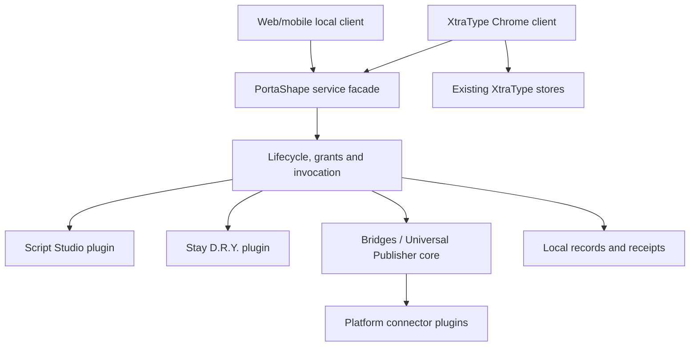

# PortaShape — Wraparound service architecture

**Edition:** 0.1 · **Date:** 2026-10-01 · **Status:** user-directed scope; target implementation specification, not implemented functionality

## Service contract

PortaShape owns the lifecycle boundary through which installed plugins register their allowed operations, receive scoped host services and contribute user interface. It also owns Bridges/Universal Publisher as a core feature. XtraType uses the same service facade as a first-party client while retaining its own domain ownership.

**PS-REQ-001:** a plugin MUST communicate through declared operations and typed records. It MUST NOT import another plugin's private repository, DOM internals or implementation functions. **PS-REQ-002:** service failure MUST preserve XtraType's ability to read existing local annotations and operate its baseline composer. Plugin failures are reported per provider, not as loss of the application.

The web/mobile arrow means the same contract surface in that client's local host. It does not mean a deployed remote connection to the Chrome extension. Cross-device dispatch is unavailable while backend coordination is deferred.

## Internal core responsibilities

| Component | Owns | Does not own |
|---|---|---|
| PS-C01 Installation coordinator | Validate, stage, install, update, disable, remove and reconcile packages | Executing arbitrary imported code in the service worker |
| PS-C02 Operation directory | Exact operation/version/provider declarations and availability | General transformation graph search or automatic provider substitution |
| PS-C03 Grant broker | Local principal, origin, package revision, operation and resource checks | Server accounts, remote ACLs or cookie disclosure |
| PS-C04 Invocation coordinator | Correlation, bounded calls, cancellation requests and truthful outcomes | A general-purpose workflow language or distributed execution engine |
| PS-C05 Local repository boundary | Namespace ownership, transactions, migrations, quota and export | Existing XtraType record semantics or cloud sync |
| PS-C06 Receipt/event boundary | Local effect receipts and versioned lifecycle notifications | A tamper-proof centralized audit service |
| PS-C07 UI contribution boundary | Declared slots, controls, navigation and teardown | Untrusted HTML injection into privileged UI |
| PS-C08 Client bridge | Host availability, typed context and XtraType draft requests | Raw forwarding of legacy xtratype messages |

Bridges' publish sequence and Stay D.R.Y.'s finite routine sequence remain module-owned state machines. The host validates individual invocations and provides local persistence. It does not synthesize arbitrary graphs, recursively load absent engines, discover remote providers or implement chat loops.

## Ownership and data flow

XtraType owns annotation construction, target applicability, quote/media meaning, anchor resolution and context rendering. PortaShape may request a draft or read explicitly authorized context; it cannot silently replace an annotation's target. Universal Publisher owns Publication and ReplicaSet intent. A connector owns platform-specific mapping and effects. Script Studio owns user source/revisions and authoring. Stay D.R.Y. owns consented pattern evidence and candidate helpers/routines.

For a cross-module operation: resolve a pinned provider and operation major version; validate input; establish trusted caller metadata; check current grants and relevant page/account context; record accepted operation identity; invoke with a deadline; validate output; persist a receipt; emit a bounded notification. Validation failure is nonmutating. A timeout after an external request may yield **unknown-outcome**, not proof that nothing happened.

## Execution contexts and trust

| Context | Allowed responsibility | Identity/trust rule |
|---|---|---|
| Extension service worker | Host state, grants, registration and approved connector coordination | Packaged code only; wake/reconcile after suspension |
| Extension-owned UI | Review packages, edit local data, show previews and request actions | User gesture can authorize a specific reviewed intent; UI payload alone is not a grant |
| Bundled content script | Page context/input integration and site adapters | Pin tab/document/frame and validate sender from browser metadata |
| User-script context | User-provided page behavior under installed match scope | Untrusted relative to the host; no arbitrary worker API access |
| Ordinary web/mobile page | Own local library, rendering, pure transforms and explicit exports | Separate origin/storage/grants; cannot claim extension privileges |
| External platform | Platform operation responses and content | Treat outputs as untrusted data; validate and sanitize |

A package-supplied `pluginId`, `tabId`, `accountId` or grant list is a claim, not authentication. Built-in provider identity is bound by the host loader. Any user-script bridge that cannot establish a trustworthy per-script/per-revision identity MUST remain unavailable. Do not give all installed scripts a shared privileged token or treat a claimed ID in a message as proof.

## Plugin installation model

**DESIGN:** core UI plugins and platform connector implementations ship as separately described packages within a reviewed extension release. Users install/enable/remove those packages from PortaShape's local catalog independently. Their code version remains bound to the containing release. User-authored script packages are installed as data/source and execute only through the dedicated userscript mechanism.

Installing a package therefore has three explicit dimensions: bytes available, package registered and enabled, and effective browser/operation registration. These are not interchangeable. A plugin can be installed but disabled, or enabled in desired state while its execution is blocked by a missing grant or unavailable host.

A remote catalog of executable worker/UI plugins is not introduced. New privileged plugin implementations arrive through a normal extension release or a controlled development build. Data-only package import cannot load an arbitrary JavaScript URL into privileged extension contexts. This distribution choice is an engineering default, not an assertion that every future platform must package modules identically.

## Host interface

The conceptual facade exposes `describeHost`, `listPackages`, `inspectPackage`, `installPackage`, `enablePackage`, `disablePackage`, `updatePackage`, `removePackage`, `listOperations`, `invoke`, `cancelInvocation`, `readReceipt`, `subscribeEvents` and `exportPackage`. These are service methods, not proposed HTTP routes. Their payloads use document 03 and the registry operation IDs. Only trusted management UI may alter package lifecycle/grants.

`describeHost` returns protocol major/minor, host build, platform, available operation IDs/versions, package implementation availability and locality constraints. It contains no credentials. Consumers MUST feature-test capabilities rather than infer availability from a module's name.

## Failure and lifecycle invariants

- Startup reconciliation compares stored desired state with actual registrations and grants before announcing readiness.
- Navigation invalidates page-bound context tokens. Pending drafts remain tied to their original context until the user rebinds them.
- Plugin disable removes future triggers and prevents new invocations immediately. Already-started external effects and arbitrary page mutations may remain.
- Package dependency failure blocks only the dependent feature. A disabled Script Studio does not disable existing XtraType notes or the Publisher composer.
- Core publishing can compose/preview without a usable connector. Execution requires an enabled compatible connector, account context and explicit confirmation.
- Local storage exhaustion fails before starting an effect when its recovery receipt cannot be persisted. A post-effect persistence failure enters an explicit recovery condition rather than pretending no effect occurred.

## Proposed code boundaries

Use existing C15 domain/application/adapter separation. Candidate directories are `portashape/host`, `portashape/contracts`, `portashape/local`, `portashape/publisher`, `plugins/script-studio`, `plugins/stay-dry`, `plugins/connectors/<platform>`, and `xtratype/portashape-client`. These are target paths, not existing files. Pure validators/transforms must not import Chrome APIs. Browser access is supplied by typed adapters. No framework or backend database selection is implied.

## Owned component index

| ID | Component | Responsibility | Status / stage | Source |
| --- | --- | --- | --- | --- |
| PS-C01 | Installation coordinator | Validate/install/update/disable/remove and reconcile local packages | specified / C1 | USER; DEC-01/02 |
| PS-C02 | Operation directory | Exact provider/version declarations and effective availability | specified / C1 | USER; DEC-01/02 |
| PS-C03 | Grant broker | Local revision/site/operation authority and revocation | specified / C1 | USER; DEC-01/02 |
| PS-C04 | Invocation coordinator | Bounded correlated calls and truthful effect outcomes | specified / C1 | USER; DEC-01/02 |
| PS-C05 | Local repository boundary | Namespace transactions, migrations, quota and export | specified / C1 | USER; DEC-01/02 |
| PS-C06 | Receipt/event boundary | Causal local receipts and versioned notifications | specified / C1 | USER; DEC-01/02 |
| PS-C07 | UI contribution boundary | Packaged accessible contributions and cleanup | specified / C1 | USER; DEC-01/02 |
| PS-C08 | Client bridge | Trusted context and XtraType draft/application interfaces | specified / C1 | USER; DEC-01/02 |

