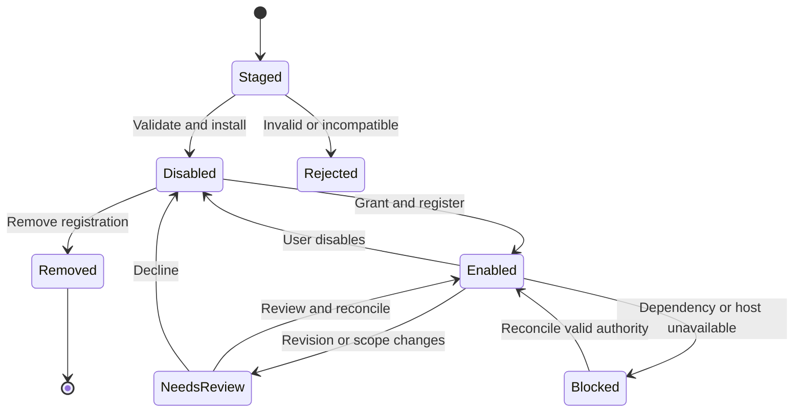

# PortaShape — Plugin packages and installation standard

**Edition:** 0.1 · **Date:** 2026-10-01 · **Status:** user-directed scope; target implementation specification, not implemented functionality

## Package kinds and ownership

A **plugin** is a versioned installable provider with a manifest, declared inputs/outputs, requested permissions, lifecycle, tests and provenance. Script Studio and Stay D.R.Y. are plugins. External-platform adapters are plugins. XtraType is a first-party client; Universal Publisher is a core feature. Neither becomes user-removable through the plugin manager.

Three package kinds are supported: `module` for packaged UI/service plugins; `connector` for packaged platform implementations; `userscript` for user-provided JavaScript managed by Script Studio. Helpers/routines are inert records and may be exported in data bundles; they are not automatically executable plugin installations.

## Package manifest

`Plugin.Manifest@1` has stable `id`, semantic `version`, `kind`, human `name`, `hostApiMajor`, `implementation`, `requires`, `operations`, `permissions`, `uiContributions`, `files`, `tests` and `description`. Exact structural rules are in `contracts/plugin-manifest.schema.json`.

`id` is a lowercase dot-separated namespace controlled by the package author; the built-in IDs are reserved. `version` is `major.minor.patch` in this edition; prerelease/range grammar is deliberately not implicit. A dependency specifies exact `packageId` and `version`. No dependency download occurs during installation. Versions of contract schemas, package code, host API and physical stores are independent.

For module/connector packages, `implementation` references a host release catalog key. It is not a URL/path to evaluate. For userscripts, it identifies the source file hash and execution profile. All file entries contain normalized relative paths, media type, byte length and SHA-256. Reject absolute paths, traversal, duplicate normalized paths, symlinks, unknown executable entry points and mismatched hashes.

**DESIGN limits:** imported JSON manifest ≤256 KiB; package ≤10 MiB uncompressed; ≤100 files; source file ≤1 MiB. These are implementation defaults requiring boundary tests, not historical limits. The import reader MUST enforce limits before allocating/extracting the entire payload. Exceeding a limit gives a nonmutating error.

## Install transaction

1. Parse bounded input and validate its schema/version. Preserve the original bytes/hash as inert evidence.
2. Verify every file hash, namespace ownership and implementation availability. Reject unknown required fields/operations and unsupported execution profiles.
3. Resolve exact local dependencies and reject cycles. Installation never enables a dependency implicitly.
4. Run applicable non-side-effecting package fixtures in the approved test harness. Test completion is recorded; it does not confer trust or grants.
5. Show package identity, source, changed permissions, match scope, dependency effects and supported operations. A checksum proves byte identity, not author trust.
6. Commit package/revision and installation record atomically in PortaShape local storage. Initial desired state is `disabled`.
7. On explicit enablement, collect required local grants and reconcile effective registrations. Return an installation receipt with each operation's availability and any block reason.

Never label a failed registration “enabled and running.” Retain inspectable source/configuration on failure.

## Lifecycle

Stored desired state and observed effective state are separate fields. The state machine is a product lifecycle, not a claim that arbitrary running code can be terminated. Reconciliation is idempotent and can be repeated after startup, update, permission change or interrupted work.

## Grants and capability boundaries

A local `Grant` binds principal, package ID, exact revision digest, operations, site match scope, resource scope and expiry/revocation state. It is created by trusted host UI, never imported from a package. Site permission from Chrome is necessary but does not replace PortaShape's plugin-specific grant. For a userscript, granted DOM access means it can observe/mutate the shared page on authorized sites; isolated JavaScript worlds do not turn the DOM into a security sandbox.

Permissions are scoped by operation and data owner. `plugin.storage` exposes only that package's namespace; `context.read` returns only approved context fields; `xtratype.draft` proposes a draft for review rather than saving silently; `publish.execute` requires a current confirmation bound to immutable intent. Generic filesystem, arbitrary extension repository access, unrestricted network proxies and credential reads are not exposed.

**SS first slice:** no privileged service bridge. The later typed bridge is selected scope but remains blocked until per-script identity and authorization isolation pass the specified tests. Shared user-script messaging alone is not that proof.

## Update, rollback and dependency behavior

An update stages a new immutable revision, verifies compatibility and tests, then presents code/permission/dependency differences. Source or authority changes require review before activation. Store migration is copy-on-write where feasible; failure leaves the previous valid revision selected and the new revision inspectable. Do not claim rollback reverses external effects or arbitrary data migrations.

Rollback selects an available old revision after checking its current compatibility and grants. Grants never transfer just because a version number decreases. A dependency removal displays its dependents and blocks their affected operations; the user can remove or keep those dependents disabled. No recursive destructive uninstall by default.

Deleting a userscript unregisters it for future injections. Installed source/revisions, namespace data and diagnostic history use explicit separate retention choices. Uninstalling a connector does not delete external posts or destroy ReplicaSet records. Removing Stay D.R.Y. does not silently delete exported helpers. No core XtraType Blob/annotation store is touched by plugin uninstall.

## UI contribution standard

Slots are `management.plugins`, `management.pluginDetail`, `composer.assist`, `context.actions`, `publisher.destination`, and `diagnostics.provider`. Contributions declare slot, label, action ID and static packaged view key. The host owns navigation, focus, keyboard access, error announcements and cleanup. User-authored HTML or JavaScript is not rendered in the privileged plugin-manager document. Render plain text by default; alternative content uses XtraType's separate sanitized renderer.

## Package portability

Export source/manifests, immutable revisions, selected inert data and fixture definitions with hashes. Omit effective grants, browser registrations, authenticated sessions, credentials and private observation buffers. Import retains provenance but creates a new local installation in disabled state. Unknown optional extension data is retained inertly; unknown required execution behavior is rejected.

## Acceptance

Installation tests MUST cover tampered hashes, traversal/duplicate paths, size limits, unsupported host major, dependency cycles/missing versions, spoofed built-in IDs, denied permissions, failed fixtures, interrupted commit, missing implementation key and import without activation. Update tests cover expanded sites, changed source, grant revocation, startup reconciliation and safe disable. Integration tests verify one plugin cannot read another namespace or impersonate another revision.
