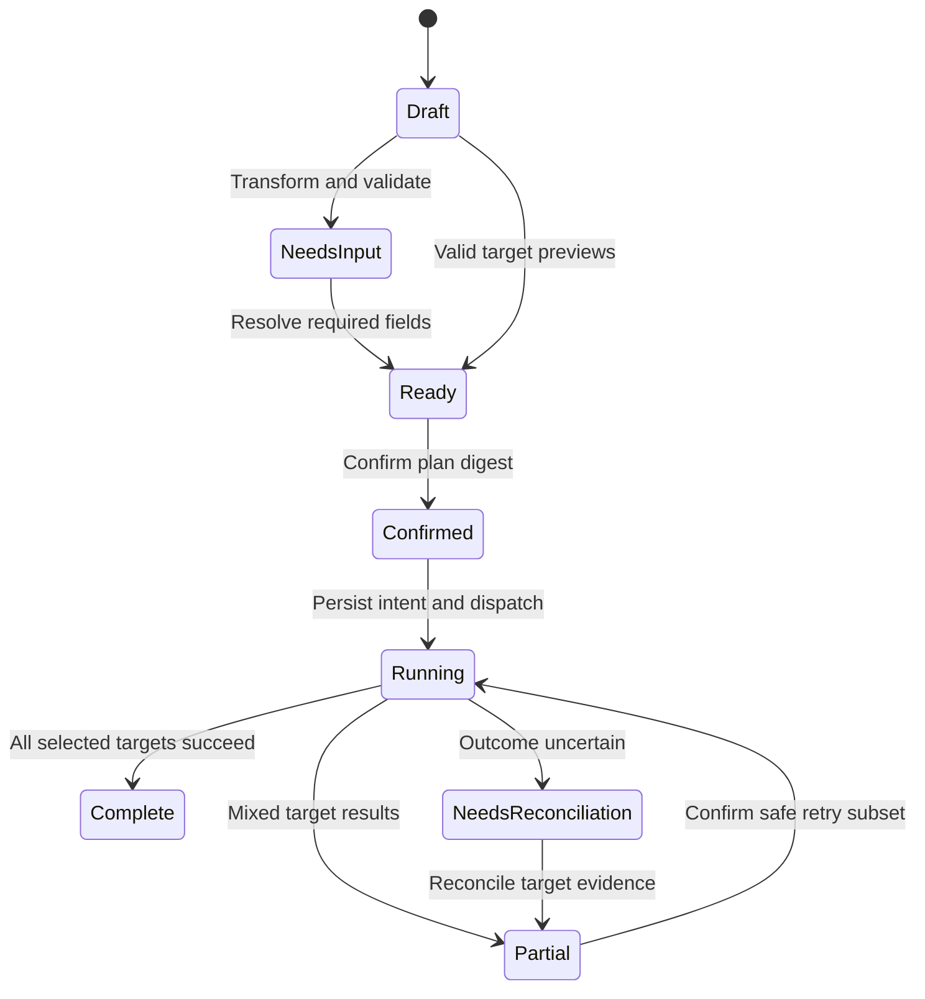

# PortaShape — Bridges and Universal Publisher core

**Edition:** 0.1 · **Date:** 2026-10-01 · **Status:** user-directed scope; target implementation specification, not implemented functionality

## Ownership and purpose

Bridges/Universal Publisher is a PortaShape **core feature**, not an optional plugin. Each external platform is integrated by an independently installable connector plugin. Publisher owns user intent, canonical Publication, destination selection, previews, execution state and ReplicaSet continuity. A connector owns platform mechanics and its declared transformation/fidelity behavior. XtraType can annotate either the conceptual Publication or an individual representation.

Preserve the source model: one Publication can produce multiple target representations without becoming unrelated objects. Publisher is not a second application-wide plugin host. It uses PortaShape installation, grants, receipts and local records.

## Component ownership

Connector Descriptor, Source Adapter and Target Adapter are implemented by platform plugins against core contracts. Canonical Shape Library, Field Mapping definitions, FidelityReport aggregation, Account Binding references, Publisher Composer, Destination Selector, Preview/Validation, Publish Workflow and ReplicaSet Manager belong to core. Platform-specific schemas/transforms extend the library by explicit versioned registrations; no connector can overwrite a core shape by name.

The fixed workflow selects declared transforms for the chosen platform. A general transformation graph planner is not introduced. Missing transforms produce an unsupported-target result, not an automatic chain of unknown conversions. Connector descriptors retain explicit source/target shapes for later composition; multi-hop route discovery from the prototype remains unavailable in this edition because its omitted planner is not imported. This limitation must be shown as unsupported conversion, not hidden by claiming full graph planning.

## Canonical Publication

`Publish.Publication@1` contains conceptual `objectId`, author local reference, optional title, required body or at least one attachment, attachments, links, tags, optional location/price/category/audience, selected destination IDs, revision and timestamps. Attachments use durable local BlobRefs or explicitly resolved external references with hashes when known. Preserve field absence separately from empty values.

Price is an integer minor-unit amount plus explicit ISO currency code; no floating-point inferred currency. Location is structured coordinates/label or a declared platform-specific extension, never silently inferred from browser location. Audience is explicit user intent, not an implemented remote ACL. Each connector validates and previews what it can actually express.

Destination includes destination ID, platform package ID/revision, external account label/reference, optional local CredentialReference, required field presets and supported operations. A browser-session reference is ephemeral and must be revalidated at execution. Display names are not account identity proof.

## Compose and preview

Save drafts locally before network. Selecting destinations creates independent target drafts from one immutable Publication revision. Per-destination overrides are explicit and previewed; they do not alter the canonical body silently. Inputs such as forum, category, group, audience or location remain visible when required by the target.

Every transform returns target-shaped data plus `Evidence.FidelityReport`: `preserves`, `approximates`, `drops`, `requires`. Each item identifies a source field/path, target field/path when applicable, explanation, and whether user acknowledgement is required. Missing required data blocks readiness. Approximation/loss cannot be cleared by hiding the warning. A user may remove a destination instead of supplying its required data.

Text/media normalization and length/threading rules are connector-specific, versioned and surfaced as choices. Do not silently truncate content, strip media or convert a multi-part thread into a single truncated post. A test stub is labeled and never appears as an actual live destination.

## Plan and confirmation

A `Publish.Plan` pins Publication revision/digest, selected destination snapshots, connector revisions, transforms, target payload digests, fidelity acknowledgements and applicable local grants. Validation produces a plan digest. Final user confirmation is tied to that digest and the exact destinations/accounts. Any changed content, account, transform/version or required field invalidates confirmation.

**DESIGN:** the confirmation is single-intent, locally stored, expires after 15 minutes before first dispatch and is not portable. A multi-destination job may continue its already-confirmed remaining operations while the host remains able to validate their unchanged context; an interrupted resume requires review of outstanding destinations. A connector cannot reuse one confirmation for a different Publication.

## Publish state and recovery

Each destination has its own operation ID and status: pending, blocked, executing, succeeded, failed, cancelled or unknown-outcome. Persist intent before external effect. Store returned external Handle, platform result evidence, account reference, target payload digest, connector version, fidelity and provenance per success. The ReplicaSet links these representations to one conceptual object.

**DESIGN idempotency key:** stable local intent ID plus destination ID plus canonical revision ID. Record the precise key sent to a platform where supported. A retry reuses the same intent/key; a deliberate new publication allocates a new intent. Never advertise exactly-once delivery across platforms. If the platform lacks reliable idempotency/reconciliation, a lost response becomes unknown-outcome and requires inspection or explicit new-action acknowledgement. Do not automatically retry it.

By default execute destinations sequentially, persist after each result and continue only those independently authorized and safe. A failed destination does not erase successful representations. “Retry failed” excludes succeeded and unknown-outcome destinations. Cancellation prevents undispatched work; it does not delete successful posts. Any cleanup/update/delete is a separate reviewed operation.

## XtraType integration

A user may attach XtraType context to the Publication's Object ID or to a selected external representation Handle. The UI states which scope is selected. A correction/annotation is not an edit to the external post. Existing URL-target notes can be linked explicitly through an AnnotationExtension; the note's target key stays unchanged.

“Publish selected XtraType content” creates a Publication draft from explicit user selection with provenance, then follows the normal preview/confirmation flow. It never means that private/local notes are automatically distributed. ReplicaSet queries can surface local XtraType context without requiring XtraType to own connector account state.

## Accounts with backend deferred

Initial live connectors use authorized local browser-session interactions where permitted and verifiable. Connectors needing a server-held secret, redirect backend, remote job or durable vault remain unavailable in this edition. A local ephemeral credential may be used only by a separately reviewed provider profile with no persistence/export/logging; no generic vault is specified.

Session expiry, account mismatch or inaccessible login context blocks dispatch with `AUTH_REQUIRED`; the user authenticates with the platform in its normal interface. The plugin cannot extract cookies or embed account secrets in Publication, presets, manifests, receipts or exports.

## Target qualification and retained roadmap

The source calls for at least two real target adapters plus two clearly labeled stubs, with Bluesky, Facebook, Craigslist and phpBB as candidate target shapes. Retain that acceptance goal for the selected publishing feature, but do not assert that any named service is currently supported. Each must pass separate feasibility, authority and fixture gates. No automatic choice of two real targets is made without that evidence.

Optional update/delete/compare, scheduled publishing, destination groups, safe two-way ingest and a broader connector catalog remain feature directions within Bridges. Operations must be individually advertised and tested. Reliable unattended scheduling, cross-device reconciliation and server-dependent connectors are blocked by deferred services; none is smuggled in as a generic background scheduler.

## Acceptance

Two selected real connectors and two labeled stubs; missing target field; incompatible connector; media unavailable; content loss disclosure; changed preview invalidation; wrong/expired account; denied grant; partial success; crash before/after dispatch; response loss; safe subset retry; cancellation with existing successes; stable ReplicaSet; export without secrets; annotate conceptual object versus replica. Shipping without the qualified live adapters is a composer/preview release, not completion of the source's live-publishing gate.

## Owned component index

| ID | Component | Responsibility | Status / stage | Source |
| --- | --- | --- | --- | --- |
| PUB-C070 | Canonical Shape Library | Publication, ForumPost, SocialPost, Listing, media/link abstractions. | specified / C3 | LEGACY-C070; W Components!A71:E71; D08 T015R05 |
| PUB-C071 | Field Mapping | Correspondence/defaults/normalization rules. | specified / C3 | LEGACY-C071; W Components!A72:E72; D08 T015R06 |
| PUB-C072 | Fidelity Report | Preserves/approximates/drops/needs-user-input. | specified / C3 | LEGACY-C072; W Components!A73:E73; D08 T015R07 |
| PUB-C073 | Account Binding | Destination configuration referencing a Credential Reference and defaults. | specified / C3 | LEGACY-C073; W Components!A74:E74; D08 T015R08 |
| PUB-C074 | Publisher Composer | One compose surface for conceptual Publication. | specified / C3 | LEGACY-C074; W Components!A75:E75; D08 T015R09 |
| PUB-C075 | Destination Selector | Select configured targets/accounts and per-target overrides if needed. | specified / C3 | LEGACY-C075; W Components!A76:E76; D08 T015R10 |
| PUB-C076 | Preview/Validation | Target-shaped preview, missing-required-field prompt, fidelity warnings. | specified / C3 | LEGACY-C076; W Components!A77:E77; D08 T015R11 |
| PUB-C077 | Publish Workflow | Transform → validate → execute → capture external handle → provenance. | specified / C3 | LEGACY-C077; W Components!A78:E78; D08 T015R12 |
| PUB-C078 | Replica Set Manager | Associates returned handles with one conceptual Publication. | specified / C3 | LEGACY-C078; W Components!A79:E79; D08 T015R13 |

