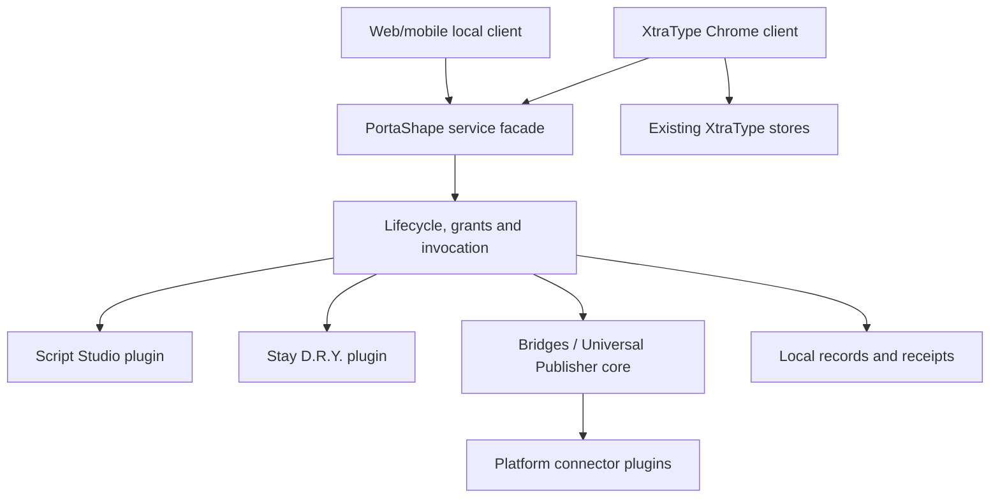
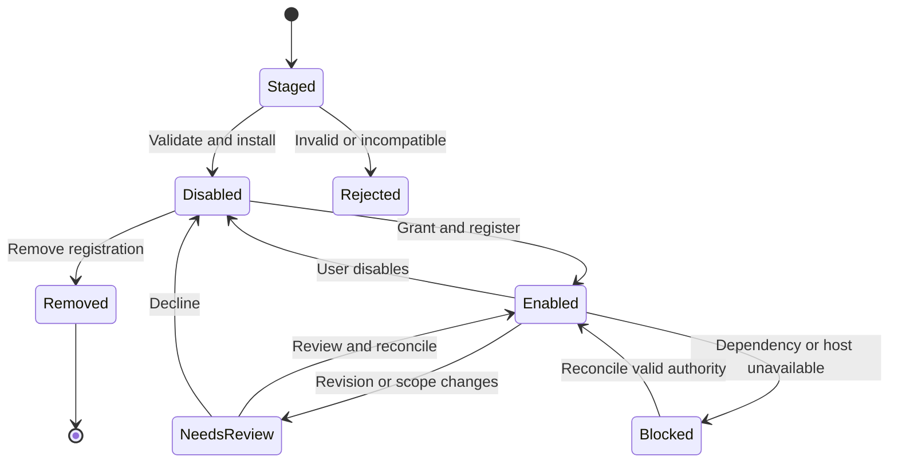
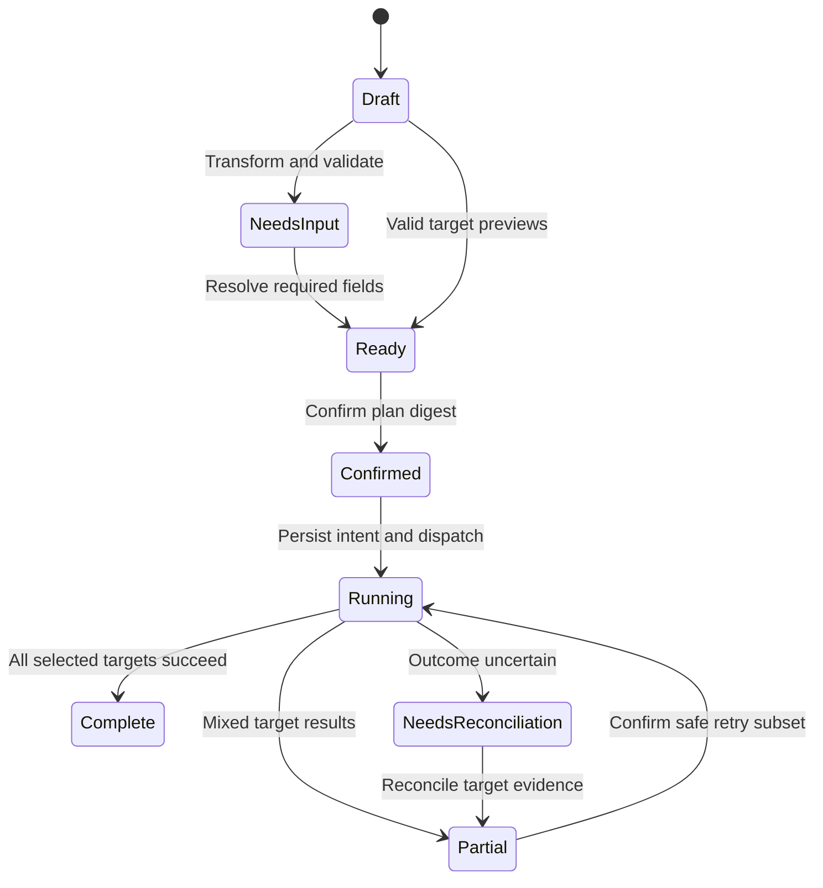

# XtraType and PortaShape — Companion specifications

**Edition 0.1 · 2026-10-01**

PortaShape wraparound service and selected modules. User-directed scope is authoritative; detailed implementation defaults are labeled DESIGN. Existing XtraType canon remains unchanged.

## Contents

- 00_READ_ME_AND_AUTHORITY.md
- 01_PORTASHAPE_SERVICE_ARCHITECTURE.md
- 02_PLUGIN_PACKAGE_LIFECYCLE.md
- 03_SHARED_CONTRACTS_AND_OPERATIONS.md
- 04_XTRATYPE_CLIENT_INTEGRATION.md
- 05_SCRIPT_STUDIO_PLUGIN.md
- 06_STAY_DRY_PLUGIN.md
- 07_BRIDGES_UNIVERSAL_PUBLISHER_CORE.md
- 08_EXTERNAL_PLATFORM_PLUGIN_STANDARD.md
- 09_WEB_MOBILE_SURFACES.md
- 10_LOCAL_DATA_AND_DEFERRED_SERVICES.md
- 11_VERIFICATION_AND_IMPLEMENTATION_SEQUENCE.md
- 12_GLOSSARY_REGISTRY_AND_CHANGE_CONTROL.md
- 13_SOURCE_TRACEABILITY_AND_DECISIONS.md
- 14_STRUCTURAL_CONTRACT_REFERENCE.md

---

# XtraType and PortaShape — Companion canon and authority

**Edition:** 0.1 · **Date:** 2026-10-01 · **Status:** user-directed scope; target implementation specification, not implemented functionality

## Purpose

This companion defines PortaShape as the **wraparound service that installs and hosts plugins around XtraType and the selected related modules**. XtraType remains the contextual application and its Chrome extension is a first-party client of PortaShape. PortaShape is now more than the transport boundary described in the preceding XtraType canon. This change comes directly from the owner's latest instruction and governs this companion.

The existing XtraType v1.0 approval-candidate documents remain the source-grounded description of application v2.3/extension 2.3.0. This set adds target specifications. Neither writing these specifications nor selecting a module means that its code has been implemented, tested or deployed.

## Authority order

1. The owner's latest explicit definitions and future corrections govern scope and ownership.
2. This companion's explicit decisions standardize the selected scope. Requirements labeled **DESIGN** fill implementation details not settled by the source; they are reviewable engineering decisions, not quotations of prior canon.
3. The preceding comparison package governs inherited module meanings and identifies gaps/conflicts. Its source locators are retained.
4. Existing XtraType canon governs unchanged current behavior, storage identifiers and compatibility.
5. Prototype prose supplies historical intention where compatible with the above. It cannot establish delivered functionality.

**MUST/MUST NOT** identify target requirements. **SHOULD** requires a documented reason to deviate. **MAY** is optional. User-directed module assignments are settled scope. New engineering choices are this edition's proposed implementation standard and can be revised by the owner without rewriting history.

## Selected ownership

| Module ID | Concern | Placement | Delivery status |
|---|---|---|---|
| PS | PortaShape wraparound service | Core host and common boundary | New implementation |
| XT | XtraType context layer | Core XtraType Chrome extension client, not a user-installed plugin | v2.3 foundation plus selected extensions |
| SS | Script Studio | Installable PortaShape plugin | New implementation |
| DRY | Stay D.R.Y. | Installable PortaShape plugin serving browser text-input interactions | New implementation |
| PUB | Bridges / Universal Publisher | PortaShape core feature | New implementation |
| EXT | External-platform connector packages | Installable PortaShape plugins, one platform family per package | New implementation; each platform independently qualified |
| UI | Web/mobile surfaces | Shared clients for the selected modules | Existing narrow web companion plus new local/management surfaces |
| DOC | Glossary and relational registry | Shared documentation/change-control assets | Supplied in this companion |

Backend/API/identity/sync is **deferred** across all selected modules. No new backend endpoints, account service, sync service, cloud package registry, credential vault or remote execution service is specified for implementation in this edition. The current PHP companion remains documented legacy functionality; deferral does not pretend it disappears.

The omitted master-system project, POSH project, standalone Runtime, Object Click project and LLM-harvesting project are not imported. Necessary installation, validation and bounded invocation behavior is specified only as internal PortaShape host responsibilities. This does not reinstate those omitted projects under new module IDs. Chat automation and conversation harvesting are absent from this implementation scope.

## Reading order and normative homes

| Document | Responsibility |
|---|---|
| 01 | Service architecture, deployment boundary, ownership and failure isolation |
| 02 | Plugin packages, installation, update, grants and lifecycle |
| 03 | Shared records, operations, events, errors and contract rules |
| 04 | XtraType integration, anchors, context relationships and compatibility |
| 05 | Script Studio authoring, userscript execution, fixtures and promotion |
| 06 | Stay D.R.Y. consent, input assistance, pattern extraction and routines |
| 07 | Core publishing, identity, transformations, previews and replicas |
| 08 | External-platform plugin standard and conformance |
| 09 | Web/mobile surfaces and execution availability |
| 10 | Local persistence, recovery, export and deferred dependencies |
| 11 | Implementation sequence and acceptance gates |
| 12 | Glossary, registry authority and maintenance procedure |
| 13 | Source mapping and explicit decisions |
| 14 | Generated structural field reference and schema/example links |

The registry indexes components, records, operations, permissions, interactions, surfaces, stages and tests. Detailed behavior belongs in these documents and the contract schemas. A spreadsheet status cell is not evidence that a feature exists.

## Changes to prior decisions

- Earlier XtraType ADR-002's “PortaShape is only an interoperability boundary” is superseded for target architecture. PortaShape now also hosts plugin installation and shared services.
- XtraType remains the contextual application. Its internal annotation semantics and v2 storage names are not rebranded into a generic object store.
- The prior userscript first slice remains the initial execution profile. Script Studio's fuller typed tooling and explicitly granted bridges are now selected later stages, rather than assumed unavailable forever.
- Source dependency references to omitted projects are replaced only by the finite host responsibilities described here. No dependency on an omitted project may enter a selected module's manifest.
- Old “MVP-1/R1/R2” labels are replaced by companion stages C0–C5. Those labels do not alter the existing application's version or the old canon's stabilization findings.
- The selected source meaning of sharing, groups, account management and continuity is preserved, but execution requiring the deferred service plane is blocked. A local privacy label is not an enforced remote ACL.

## Baseline and next architecture boundary

**DESIGN:** initially host PortaShape inside the existing extension distribution, behind a transport-neutral facade. “Service” denotes an owned lifecycle and API boundary, not a newly assumed HTTP daemon. Pure contracts and transformations can be reused by web/mobile clients. Browser operations stay in the browser host. A future process/package split requires an explicit deployment ADR; it must preserve these contracts.

The owner indicated further architectural detail may follow. This edition records the above deployable default rather than inventing an unseen server or final cross-device topology. Future corrections replace the relevant design decision; current behavior remains accurately documented.

## Deliverables and review

The package includes modular Markdown documents, one reading edition, a relational `.xlsx` registry, its normalized JSON source, structural JSON schemas, examples, validation evidence and hashes. Contract examples are synthetic. The schemas validate structure; authorization, referential integrity, lifecycle and algorithmic semantics require the specified implementation tests.

No original canon or application file is modified. Approving this target set must not be recorded as approval of unimplemented capabilities or as a change to the historical v2.3 evidence.

---

# PortaShape — Wraparound service architecture

**Edition:** 0.1 · **Date:** 2026-10-01 · **Status:** user-directed scope; target implementation specification, not implemented functionality

## Service contract

PortaShape owns the lifecycle boundary through which installed plugins register their allowed operations, receive scoped host services and contribute user interface. It also owns Bridges/Universal Publisher as a core feature. XtraType uses the same service facade as a first-party client while retaining its own domain ownership.

**PS-REQ-001:** a plugin MUST communicate through declared operations and typed records. It MUST NOT import another plugin's private repository, DOM internals or implementation functions. **PS-REQ-002:** service failure MUST preserve XtraType's ability to read existing local annotations and operate its baseline composer. Plugin failures are reported per provider, not as loss of the application.

The web/mobile arrow means the same contract surface in that client's local host. It does not mean a deployed remote connection to the Chrome extension. Cross-device dispatch is unavailable while backend coordination is deferred.

## Internal core responsibilities

| Component | Owns | Does not own |
|---|---|---|
| PS-C01 Installation coordinator | Validate, stage, install, update, disable, remove and reconcile packages | Executing arbitrary imported code in the service worker |
| PS-C02 Operation directory | Exact operation/version/provider declarations and availability | General transformation graph search or automatic provider substitution |
| PS-C03 Grant broker | Local principal, origin, package revision, operation and resource checks | Server accounts, remote ACLs or cookie disclosure |
| PS-C04 Invocation coordinator | Correlation, bounded calls, cancellation requests and truthful outcomes | A general-purpose workflow language or distributed execution engine |
| PS-C05 Local repository boundary | Namespace ownership, transactions, migrations, quota and export | Existing XtraType record semantics or cloud sync |
| PS-C06 Receipt/event boundary | Local effect receipts and versioned lifecycle notifications | A tamper-proof centralized audit service |
| PS-C07 UI contribution boundary | Declared slots, controls, navigation and teardown | Untrusted HTML injection into privileged UI |
| PS-C08 Client bridge | Host availability, typed context and XtraType draft requests | Raw forwarding of legacy xtratype messages |

Bridges' publish sequence and Stay D.R.Y.'s finite routine sequence remain module-owned state machines. The host validates individual invocations and provides local persistence. It does not synthesize arbitrary graphs, recursively load absent engines, discover remote providers or implement chat loops.

## Ownership and data flow

XtraType owns annotation construction, target applicability, quote/media meaning, anchor resolution and context rendering. PortaShape may request a draft or read explicitly authorized context; it cannot silently replace an annotation's target. Universal Publisher owns Publication and ReplicaSet intent. A connector owns platform-specific mapping and effects. Script Studio owns user source/revisions and authoring. Stay D.R.Y. owns consented pattern evidence and candidate helpers/routines.

For a cross-module operation: resolve a pinned provider and operation major version; validate input; establish trusted caller metadata; check current grants and relevant page/account context; record accepted operation identity; invoke with a deadline; validate output; persist a receipt; emit a bounded notification. Validation failure is nonmutating. A timeout after an external request may yield **unknown-outcome**, not proof that nothing happened.

## Execution contexts and trust

| Context | Allowed responsibility | Identity/trust rule |
|---|---|---|
| Extension service worker | Host state, grants, registration and approved connector coordination | Packaged code only; wake/reconcile after suspension |
| Extension-owned UI | Review packages, edit local data, show previews and request actions | User gesture can authorize a specific reviewed intent; UI payload alone is not a grant |
| Bundled content script | Page context/input integration and site adapters | Pin tab/document/frame and validate sender from browser metadata |
| User-script context | User-provided page behavior under installed match scope | Untrusted relative to the host; no arbitrary worker API access |
| Ordinary web/mobile page | Own local library, rendering, pure transforms and explicit exports | Separate origin/storage/grants; cannot claim extension privileges |
| External platform | Platform operation responses and content | Treat outputs as untrusted data; validate and sanitize |

A package-supplied `pluginId`, `tabId`, `accountId` or grant list is a claim, not authentication. Built-in provider identity is bound by the host loader. Any user-script bridge that cannot establish a trustworthy per-script/per-revision identity MUST remain unavailable. Do not give all installed scripts a shared privileged token or treat a claimed ID in a message as proof.

## Plugin installation model

**DESIGN:** core UI plugins and platform connector implementations ship as separately described packages within a reviewed extension release. Users install/enable/remove those packages from PortaShape's local catalog independently. Their code version remains bound to the containing release. User-authored script packages are installed as data/source and execute only through the dedicated userscript mechanism.

Installing a package therefore has three explicit dimensions: bytes available, package registered and enabled, and effective browser/operation registration. These are not interchangeable. A plugin can be installed but disabled, or enabled in desired state while its execution is blocked by a missing grant or unavailable host.

A remote catalog of executable worker/UI plugins is not introduced. New privileged plugin implementations arrive through a normal extension release or a controlled development build. Data-only package import cannot load an arbitrary JavaScript URL into privileged extension contexts. This distribution choice is an engineering default, not an assertion that every future platform must package modules identically.

## Host interface

The conceptual facade exposes `describeHost`, `listPackages`, `inspectPackage`, `installPackage`, `enablePackage`, `disablePackage`, `updatePackage`, `removePackage`, `listOperations`, `invoke`, `cancelInvocation`, `readReceipt`, `subscribeEvents` and `exportPackage`. These are service methods, not proposed HTTP routes. Their payloads use document 03 and the registry operation IDs. Only trusted management UI may alter package lifecycle/grants.

`describeHost` returns protocol major/minor, host build, platform, available operation IDs/versions, package implementation availability and locality constraints. It contains no credentials. Consumers MUST feature-test capabilities rather than infer availability from a module's name.

## Failure and lifecycle invariants

- Startup reconciliation compares stored desired state with actual registrations and grants before announcing readiness.
- Navigation invalidates page-bound context tokens. Pending drafts remain tied to their original context until the user rebinds them.
- Plugin disable removes future triggers and prevents new invocations immediately. Already-started external effects and arbitrary page mutations may remain.
- Package dependency failure blocks only the dependent feature. A disabled Script Studio does not disable existing XtraType notes or the Publisher composer.
- Core publishing can compose/preview without a usable connector. Execution requires an enabled compatible connector, account context and explicit confirmation.
- Local storage exhaustion fails before starting an effect when its recovery receipt cannot be persisted. A post-effect persistence failure enters an explicit recovery condition rather than pretending no effect occurred.

## Proposed code boundaries

Use existing C15 domain/application/adapter separation. Candidate directories are `portashape/host`, `portashape/contracts`, `portashape/local`, `portashape/publisher`, `plugins/script-studio`, `plugins/stay-dry`, `plugins/connectors/<platform>`, and `xtratype/portashape-client`. These are target paths, not existing files. Pure validators/transforms must not import Chrome APIs. Browser access is supplied by typed adapters. No framework or backend database selection is implied.

## Owned component index

| ID | Component | Responsibility | Status / stage | Source |
| --- | --- | --- | --- | --- |
| PS-C01 | Installation coordinator | Validate/install/update/disable/remove and reconcile local packages | specified / C1 | USER; DEC-01/02 |
| PS-C02 | Operation directory | Exact provider/version declarations and effective availability | specified / C1 | USER; DEC-01/02 |
| PS-C03 | Grant broker | Local revision/site/operation authority and revocation | specified / C1 | USER; DEC-01/02 |
| PS-C04 | Invocation coordinator | Bounded correlated calls and truthful effect outcomes | specified / C1 | USER; DEC-01/02 |
| PS-C05 | Local repository boundary | Namespace transactions, migrations, quota and export | specified / C1 | USER; DEC-01/02 |
| PS-C06 | Receipt/event boundary | Causal local receipts and versioned notifications | specified / C1 | USER; DEC-01/02 |
| PS-C07 | UI contribution boundary | Packaged accessible contributions and cleanup | specified / C1 | USER; DEC-01/02 |
| PS-C08 | Client bridge | Trusted context and XtraType draft/application interfaces | specified / C1 | USER; DEC-01/02 |

---

# PortaShape — Plugin packages and installation standard

**Edition:** 0.1 · **Date:** 2026-10-01 · **Status:** user-directed scope; target implementation specification, not implemented functionality

## Package kinds and ownership

A **plugin** is a versioned installable provider with a manifest, declared inputs/outputs, requested permissions, lifecycle, tests and provenance. Script Studio and Stay D.R.Y. are plugins. External-platform adapters are plugins. XtraType is a first-party client; Universal Publisher is a core feature. Neither becomes user-removable through the plugin manager.

Three package kinds are supported: `module` for packaged UI/service plugins; `connector` for packaged platform implementations; `userscript` for user-provided JavaScript managed by Script Studio. Helpers/routines are inert records and may be exported in data bundles; they are not automatically executable plugin installations.

## Package manifest

`Plugin.Manifest@1` has stable `id`, semantic `version`, `kind`, human `name`, `hostApiMajor`, `implementation`, `requires`, `operations`, `permissions`, `uiContributions`, `files`, `tests` and `description`. Exact structural rules are in `contracts/plugin-manifest.schema.json`.

`id` is a lowercase dot-separated namespace controlled by the package author; the built-in IDs are reserved. `version` is `major.minor.patch` in this edition; prerelease/range grammar is deliberately not implicit. A dependency specifies exact `packageId` and `version`. No dependency download occurs during installation. Versions of contract schemas, package code, host API and physical stores are independent.

For module/connector packages, `implementation` references a host release catalog key. It is not a URL/path to evaluate. For userscripts, it identifies the source file hash and execution profile. All file entries contain normalized relative paths, media type, byte length and SHA-256. Reject absolute paths, traversal, duplicate normalized paths, symlinks, unknown executable entry points and mismatched hashes.

**DESIGN limits:** imported JSON manifest ≤256 KiB; package ≤10 MiB uncompressed; ≤100 files; source file ≤1 MiB. These are implementation defaults requiring boundary tests, not historical limits. The import reader MUST enforce limits before allocating/extracting the entire payload. Exceeding a limit gives a nonmutating error.

## Install transaction

1. Parse bounded input and validate its schema/version. Preserve the original bytes/hash as inert evidence.
2. Verify every file hash, namespace ownership and implementation availability. Reject unknown required fields/operations and unsupported execution profiles.
3. Resolve exact local dependencies and reject cycles. Installation never enables a dependency implicitly.
4. Run applicable non-side-effecting package fixtures in the approved test harness. Test completion is recorded; it does not confer trust or grants.
5. Show package identity, source, changed permissions, match scope, dependency effects and supported operations. A checksum proves byte identity, not author trust.
6. Commit package/revision and installation record atomically in PortaShape local storage. Initial desired state is `disabled`.
7. On explicit enablement, collect required local grants and reconcile effective registrations. Return an installation receipt with each operation's availability and any block reason.

Never label a failed registration “enabled and running.” Retain inspectable source/configuration on failure.

## Lifecycle

Stored desired state and observed effective state are separate fields. The state machine is a product lifecycle, not a claim that arbitrary running code can be terminated. Reconciliation is idempotent and can be repeated after startup, update, permission change or interrupted work.

## Grants and capability boundaries

A local `Grant` binds principal, package ID, exact revision digest, operations, site match scope, resource scope and expiry/revocation state. It is created by trusted host UI, never imported from a package. Site permission from Chrome is necessary but does not replace PortaShape's plugin-specific grant. For a userscript, granted DOM access means it can observe/mutate the shared page on authorized sites; isolated JavaScript worlds do not turn the DOM into a security sandbox.

Permissions are scoped by operation and data owner. `plugin.storage` exposes only that package's namespace; `context.read` returns only approved context fields; `xtratype.draft` proposes a draft for review rather than saving silently; `publish.execute` requires a current confirmation bound to immutable intent. Generic filesystem, arbitrary extension repository access, unrestricted network proxies and credential reads are not exposed.

**SS first slice:** no privileged service bridge. The later typed bridge is selected scope but remains blocked until per-script identity and authorization isolation pass the specified tests. Shared user-script messaging alone is not that proof.

## Update, rollback and dependency behavior

An update stages a new immutable revision, verifies compatibility and tests, then presents code/permission/dependency differences. Source or authority changes require review before activation. Store migration is copy-on-write where feasible; failure leaves the previous valid revision selected and the new revision inspectable. Do not claim rollback reverses external effects or arbitrary data migrations.

Rollback selects an available old revision after checking its current compatibility and grants. Grants never transfer just because a version number decreases. A dependency removal displays its dependents and blocks their affected operations; the user can remove or keep those dependents disabled. No recursive destructive uninstall by default.

Deleting a userscript unregisters it for future injections. Installed source/revisions, namespace data and diagnostic history use explicit separate retention choices. Uninstalling a connector does not delete external posts or destroy ReplicaSet records. Removing Stay D.R.Y. does not silently delete exported helpers. No core XtraType Blob/annotation store is touched by plugin uninstall.

## UI contribution standard

Slots are `management.plugins`, `management.pluginDetail`, `composer.assist`, `context.actions`, `publisher.destination`, and `diagnostics.provider`. Contributions declare slot, label, action ID and static packaged view key. The host owns navigation, focus, keyboard access, error announcements and cleanup. User-authored HTML or JavaScript is not rendered in the privileged plugin-manager document. Render plain text by default; alternative content uses XtraType's separate sanitized renderer.

## Package portability

Export source/manifests, immutable revisions, selected inert data and fixture definitions with hashes. Omit effective grants, browser registrations, authenticated sessions, credentials and private observation buffers. Import retains provenance but creates a new local installation in disabled state. Unknown optional extension data is retained inertly; unknown required execution behavior is rejected.

## Acceptance

Installation tests MUST cover tampered hashes, traversal/duplicate paths, size limits, unsupported host major, dependency cycles/missing versions, spoofed built-in IDs, denied permissions, failed fixtures, interrupted commit, missing implementation key and import without activation. Update tests cover expanded sites, changed source, grant revocation, startup reconciliation and safe disable. Integration tests verify one plugin cannot read another namespace or impersonate another revision.

---

# PortaShape — Shared contracts and operation protocol

**Edition:** 0.1 · **Date:** 2026-10-01 · **Status:** user-directed scope; target implementation specification, not implemented functionality

## Scope of the shared vocabulary

This is a contract set for the selected modules, not a separately introduced language or runtime product. Preserve the source distinctions: an Object is conceptual identity; a Handle locates a representation; a Shape names a representation contract; a Package carries versioned artifacts; a Capability declares an operation; a Procedure is a reusable method distinct from its local execution; a ReplicaSet joins representations of one Publication.

Use JSON for interchange. Each new durable record carries `id`, `recordType`, `schemaVersion:1`, `createdAt` and `updatedAt`. The exceptions are existing `Context.Annotation` v2 and `Revision.Snapshot` v1, which retain their actual fields. `recordType` names are case-sensitive. Resolve the prototype's Publication naming conflict to **`Publish.Publication`**. Capability IDs are case-sensitive dotted identifiers with a separate integer `major`; the registry fixes their exact spelling. Do not apply automatic case conversion.

**DESIGN identity rule:** allocate UUID-based opaque IDs with type prefixes; never infer conceptual equivalence from URL equality or copy an external platform ID into a local record ID. A `Core.Object` may refer to an existing XtraType record or a new Publication. Its `handles` are claims with provenance. An annotation's current `targetKey` is not promoted into global Object identity.

## Common representation rules

| Field/rule | Standard |
|---|---|
| IDs | Nonempty bounded strings; stable through export/import; conflict on same ID with incompatible identity |
| Versions | Record integer version; operation integer major; package semantic version; host protocol major/minor; physical store version are independent |
| Time | UTC RFC 3339 with millisecond precision for new records; original legacy timestamps preserved as evidence |
| Optional versus null | Omitted means absent/unknown; explicit null only where schema permits it; zero/false/empty must not be coerced into absence |
| Hashes | Lowercase SHA-256 hex over original bytes for files; compact sorted-key UTF-8 JSON for defined record digests; finite numbers only; do not normalize string contents |
| Extensions | Unknown fields are rejected at executable boundaries; optional inert `extensions` object uses namespaced keys and cannot alter behavior |
| References | ID plus expected record type/version where required; no secret-bearing URL or executable expression |
| Binary content | Separate BlobRef with content hash, byte length and media type; portable bundles include the bytes or clearly mark an unresolved external reference |
| Text | Preserve original user text; normalize only in explicitly named derived fields |
| Limits | Enforce bytes and logical counts independently; document defaults and reject over-limit input before effects |

## Record families and owners

| Family | Owner | Required semantics |
|---|---|---|
| Plugin.Manifest / Installation | PS | Declared immutable revision separate from local desired/effective state |
| Host.Grant / Invocation / Receipt / Event | PS | Local authority, bounded action identity, terminal or uncertain outcome, versioned notification |
| Core.Object / Handle | PS | Conceptual identity and one or more locators with explicit evidence |
| Browser.Context | PS browser adapter | Tab/document/frame/origin generation, capture time, approved page/selection metadata |
| Context.AnchorBundle / AnnotationExtension / Relationship / Conversation / Message | XT | Contextual additions without changing the existing annotation v2 envelope |
| Script.Definition / Revision | SS | Stable script identity, immutable source hash, metadata and declared execution profile |
| Procedure.TextTemplate / PatternHypothesis / Routine / Run | DRY | Reviewed helper/pattern/method and bounded local execution; no chat domain |
| Publish.Publication / Destination / Plan / Representation / ReplicaSet | PUB | Immutable planned intent, account/destination binding, result per target and common identity |
| Connector.Descriptor | EXT | Exact platform operations, transforms, locality and evidence policy |
| Evidence.FidelityReport / ProvenanceRecord | PS/shared | Honest transformation effects and causal action evidence |
| Trust.CredentialReference | PUB/connector boundary | Opaque local authorized session reference, never secret content |

`Context.AnnotationExtension` is a separate record linked by `annotationId`. It may carry an `objectId`, anchor bundle reference, tags, local-only visibility intention and relationship references. It does not overwrite the v2 note's `author`, `target`, attachments or sync metadata. Until identity services exist, `authorRef` is a local principal, explicitly unverified across devices.

## Operation declaration and invocation

An operation declaration binds `id`, `major`, provider package/revision, input/output contract IDs, required permissions, side-effect class (`read`, `local-write`, `page-write`, `external-write`), locality and maximum duration. Consumers pin a provider revision for an accepted run. A provider update cannot silently change a pending publish plan.

An invocation contains `requestId`, `operationId`, `operationMajor`, `providerId`, `providerRevision`, `input`, optional `contextRef`, `deadlineAt`, and `intentId`. The host adds the **trusted caller identity and effective grant context** outside the untrusted body. A request cannot enlarge its deadline beyond the operation's declared maximum. Input validation, provider/version selection and current grants are checked before execution.

A receipt contains `id`, `requestId`, `intentId`, operation/provider/revision, start/end time, `status`, optional output/error, effect references and provenance references. Status is one of `succeeded`, `failed`, `cancelled`, `partial`, `blocked`, `unknown-outcome`. `failed` means the host has evidence of the stated failure; it must not be used to imply no external effect when uncertain.

**DESIGN limits:** ordinary broker request/response JSON ≤256 KiB, excluding separately authorized BlobRefs; default call deadline 30 seconds, maximum 120 seconds unless the selected operation's own specification defines a reviewed longer limit. Publish jobs may span calls and store status per destination. No unbounded `invoke` is permitted.

## Error contract

`error` has `code`, `message`, `providerId`, optional `stepId`, `retryable`, `effectState` (`none`, `committed`, `unknown`), `userAction` and optional `details` with nonsecret bounded values. Standard codes: `INVALID_INPUT`, `UNSUPPORTED_VERSION`, `UNAVAILABLE_HOST`, `MISSING_IMPLEMENTATION`, `DEPENDENCY_BLOCKED`, `PERMISSION_DENIED`, `CONTEXT_CHANGED`, `STALE_PLAN`, `AUTH_REQUIRED`, `QUOTA_EXCEEDED`, `DEADLINE_EXCEEDED`, `CANCEL_REQUESTED`, `CONFLICT`, `UNKNOWN_OUTCOME`, `INTERNAL_ERROR`.

Retryability describes whether a specific retry is safe after required reconciliation; it is not permission to repeat an external action automatically. Never expose tokens, full observation buffers or secret headers through diagnostics.

## Events and replay

`Host.Event` contains `eventId`, `eventType`, `eventVersion`, `occurredAt`, `sourceId`, `sourceRevision`, `subjectId`, `sequence` and bounded `data`. Initial names are `plugin.installed`, `plugin.stateChanged`, `grant.revoked`, `script.registrationChanged`, `dry.suggestionCreated`, `annotation.extensionChanged`, `publish.destinationChanged` and `operation.completed`.

**DESIGN:** local event delivery is at least once within retained history. Consumers deduplicate `eventId`; `sequence` is monotonic within one local event log, not globally ordered across devices. On a retention gap, subscribers refresh the owning records. Events are notifications, not the sole source of record truth. No event in this edition is a remotely synchronized audit stream.

## Selected integration rules

A Stay D.R.Y. suggestion can open a reviewed helper in Script Studio via `script.importDraft`; it cannot enable it. A script can request `xtratype.proposeDraft` only through an approved later bridge and receives a draft reference, not an automatic committed note. Publisher can ask XtraType to annotate a Publication or individual representation; its object reference remains separate from an external URL handle. XtraType can offer explicitly selected content to Publisher; it does not export a private annotation merely because a connector is installed.

Backend-dependent operations return `UNAVAILABLE_HOST` with a specific dependency reason and are not advertised as available. Absence is not replaced with an insecure localhost request or an unauthenticated endpoint.

## Validation and contract artifacts

The `contracts/` directory provides structural schemas for the new shared envelopes and selected domain records. Record-specific examples are under `examples/`. The registry gives their normative document, owner and implementation stage. Structural validation is necessary but insufficient: reference existence, ownership, grant checks, hashes, context generations, legal transitions and external outcome reconciliation are enforced by application services.

No new type is silently persisted to old PHP endpoints. Unknown companion records remain local/exportable until a future versioned transport is approved. This prevents a nominal schema version from concealing incompatible semantics.

## Exact operation payload bindings

`registry/operation-contracts.json` binds every one of the 40 registry operations at major 1 to an input and success-output schema in `contracts/operation-payloads.schema.json`. The host validates the invocation envelope, then the selected input schema; it validates the provider success output before storing it in `Host.Receipt.output`. Failures use the common Error contract. A malformed provider result does not erase a potentially committed effect.

`reviewToken`, `gestureRef` and `confirmationRef` are host-issued references bound to the trusted caller/context, not self-authenticating strings. Resource fields and imported records do not establish ownership. `storage.get/put` values must also validate against their registered contract ID and namespace policy; their generic JSON slot is not an executable-code or arbitrary repository escape hatch.

Some interfaces return references rather than full records. Resolve them only through an authorized owning service; reference possession alone does not grant access. Unlisted helper methods remain private implementation details and cannot be registered as public capabilities without updating this binding inventory.

---

# XtraType — PortaShape client and context-layer specification

**Edition:** 0.1 · **Date:** 2026-10-01 · **Status:** user-directed scope; target implementation specification, not implemented functionality

## Client role and preserved foundation

XtraType is the first-party Chrome extension client and owner of contextual content, not an installable third-party plugin. Its existing side-panel composer remains primary. PortaShape plugin controls, text assistance and publishing are supporting surfaces. XtraType continues to own URL/GPS/YouTube/custom targets, quote/body/images, local history/capture and the current PHP companion behavior documented in the original canon.

Do not rename `portashape-xtratype`, record types, message names or storage keys as a branding operation. Do not change `Context.Annotation` v2's single `target`, derived `targetKey`, display `author`, quote/media or parent ID without a separate migration. Snapshots do not become generic workflow runs and current reply records do not suddenly become a complete Conversation model.

## Client bridge

Expose selected operations through an application-layer adapter: read approved current context, resolve target applicability, propose a draft, list authorized local context, attach an extension record and open the appropriate XtraType view. Existing worker messages remain internal compatibility interfaces. New plugins MUST NOT send arbitrary `xtratype:*` messages or manufacture a trusted tab ID.

A proposed draft contains its own ID, source provider/revision, original context reference, suggested body/quote/target and intended attachments. The user reviews it in XtraType. Commit uses the common annotation creation service proposed in existing C15 SP-02. Navigation does not silently retarget an open draft. Reject an inaccessible or changed document with a rebind choice.

## Component requirements

Target Resolver retains existing typed-target applicability and adds optional Object/Handle lookup only through explicit mappings. Anchor Bundle adds redundant passage evidence. Annotation Object preserves v2 and gains a separate extension record. Context Relationship stores typed links. Overlay Renderer displays resolved local context with accessibility and cleanup. Capture UI creates context from page, selection or selected Object. Visibility/Sharing keeps the source meaning but shared modes remain blocked by backend deferral. Conversation Layer supports local threads first. Alternative Content is a linked representation, not arbitrary executable replacement. Feed/Query exposes the appropriate locally authorized views.

## AnchorBundle and resolution

**DESIGN:** an anchor bundle contains source URL, optional canonical URL supplied as evidence, captured time, exact selected text, prefix/suffix text, optional DOM selector hints, optional text-position hint and optional content fingerprint. Canonical URL is not automatically trusted to change current target identity. Store original quote separately from normalized matching text.

Initial text normalization: Unicode NFC, normalize CRLF to LF and collapse runs of whitespace for the **derived matching string only**. Preserve source text bytes/content independently. Prefix/suffix are capped at 256 Unicode code points each. Do not capture form field contents as passage context through this operation.

Resolution order is deterministic: validate page applicability; try a still-valid DOM hint and verify text; find exact normalized text with matching prefix/suffix; otherwise enumerate exact-text candidates; return `resolved` only for one qualifying candidate. Multiple plausible candidates return `ambiguous`; absent text returns `missing`; changed page identity returns `stale-context`. No fuzzy automatic rebinding in the first implementation. Later fingerprint/fuzzy matching needs its own acceptance threshold and visible confidence evidence.

A user may rebind an ambiguous/missing anchor. Preserve the previous bundle and explicit rebind provenance; never rewrite the annotation's identity behind the scenes. URL, GPS and video notes with no text anchor remain valid. Whole-video versus zero-second semantics stay distinct.

## Context extension, relationships and aliases

`Context.AnnotationExtension` links one current annotation to optional Object, anchor bundle, tags, local visibility intention and extension revision. `Context.Relationship` has `fromRef`, `relationType`, `toRef`, author local principal, timestamps and optional explanation. Initial relation types: `related-to`, `corrects`, `warns-about`, `alternative-to`, `references`, `supersedes`. Direction is meaningful. Reject self-supersession and supersession cycles; other cycles may exist but queries must be bounded.

A Handle alias means “asserted locator for this Object,” not proof of equivalence. User-approved alias merge preserves old IDs and a merge receipt; conflicting assertions are shown for review. No automatic merge based solely on similar titles, URLs or selected text. Page applicability and conceptual identity remain separate indexes.

## Conversation and alternative-content behavior

Local Conversation references a target/Object and ordered Message records. Existing annotations/replies can be displayed as a legacy thread projection using parent IDs, but this projection does not mutate their envelope. Explicit conversion creates a Conversation and records legacy message references. Deleted or missing parents display a recoverable orphan state. Cap initial page size at 50 messages with a stable `(createdAt,id)` cursor.

Local-only threads have no remote participants. Direct messages, groups, shared/public visibility, moderation, membership and authenticated authors remain specified intentions **blocked by deferred identity/authorization services**. The UI must not advertise a local visibility label as enforced server privacy; the legacy PHP collection remains governed by its existing limitations.

Alternative content is stored as a referenced text/media representation with a relationship to the target. The initial renderer supports escaped plain text and explicitly validated media, with an obvious original/alternative switch. It cannot replace page content or run scripts without separate user action and operation grants.

## Rendering and shared-page coexistence

Owned overlay roots carry provider and instance identity. Renderers are idempotent, ignore their own mutation notifications, coalesce host changes and dispose listeners/observers on document change or disable. Stay D.R.Y. suggestion UI must not become input evidence, and script/connector overlays must not be captured as unnoticed annotation content. XtraType screenshot capture follows its own explicit overlay inclusion policy.

Markers/cards require keyboard access, meaningful accessible labels and reliable dismiss behavior. Async results are discarded if their context generation is stale. Existing YouTube null-time and observer issues must be fixed before building more integrations on those seams.

## Persistence and interoperability

New XtraType companion records live in an XT-owned namespace within the new local PortaShape store, leaving existing DB v1 untouched. Cross-database writes cannot be declared atomic: commit the annotation first, persist a reconciliation task/intent in the new store, then attach the extension; display extension-pending/failure independently of note success. On recovery, link only to an existing matching annotation. Never delete a committed note because an optional sidecar write failed.

Package export can include selected notes, sidecars and binary content through explicit user selection, preserving legacy IDs. Plugin package export by itself does not include the user's annotation corpus. Shared transport for these new records is blocked until a versioned authenticated service is selected.

## Acceptance boundary

Test existing target families unchanged; old note/media/reply round-trip; plugin disabled/host unavailable; context generation race; duplicate quote; moved/deleted text; canonical URL disagreement; SPA cleanup; missing parent; supersession cycle; sidecar failure after committed note; export privacy and inaccessible shared-mode controls. Existing capture and sync stabilization gates remain prerequisites, not automatically completed by this integration.

## Owned component index

| ID | Component | Responsibility | Status / stage | Source |
| --- | --- | --- | --- | --- |
| XT-C047 | Target Resolver | Resolves one or more Handles to a current target. | existing-narrow / C3 | LEGACY-C047; W Components!A48:E48; D06 T015R02 |
| XT-C048 | Anchor Bundle | Canonical URL, selected text, nearby text, DOM/path hints, attributes/fingerprints as available. | specified / C3 | LEGACY-C048; W Components!A49:E49; D06 T015R03 |
| XT-C049 | Annotation Object | Body, author, target handles, tags, visibility, timestamps, provenance. | existing-narrow / C3 | LEGACY-C049; W Components!A50:E50; D06 T015R04 |
| XT-C050 | Context Relationship | Related-to, corrects, warns-about, alternative-to, references, supersedes. | specified / C3 | LEGACY-C050; W Components!A51:E51; D06 T015R05 |
| XT-C051 | Overlay Renderer | Shows contextual markers/threads in the browser host/page UI. | existing-narrow / C3 | LEGACY-C051; W Components!A52:E52; D06 T015R06 |
| XT-C052 | Capture UI | Create annotation from URL, selection, object, place/time later. | existing-narrow / C3 | LEGACY-C052; W Components!A53:E53; D06 T015R07 |
| XT-C053 | Visibility/Sharing | Local visibility intention; shared/group/public enforcement blocked by deferred identity/authorization | blocked-dependency / C3 | LEGACY-C053; W Components!A54:E54; D06 T015R08 |
| XT-C054 | Conversation Layer | Local target/annotation threads; remote participants and groups blocked by deferred services | existing-narrow / C3 | LEGACY-C054; W Components!A55:E55; D06 T015R09 |
| XT-C055 | Alternative Content | Replacement/alternate representation linked to target. | specified / C3 | LEGACY-C055; W Components!A56:E56; D06 T015R10 |
| XT-C056 | Feed/Query API | Retrieve context by handle/object/relation/visibility. | existing-narrow / C3 | LEGACY-C056; W Components!A57:E57; D06 T015R11 |

---

# Script Studio — PortaShape plugin specification

**Edition:** 0.1 · **Date:** 2026-10-01 · **Status:** user-directed scope; target implementation specification, not implemented functionality

## Role and installation

Script Studio supplies exact JavaScript implementations, an editor, testing, a private library and promotion into declared capabilities. It is an installable PortaShape module package, `portashape.script-studio`. It uses the host's package model, permission broker, record contracts and invocation receipts rather than inventing its own authority system.

The user-facing installation model is familiar to userscript managers: inspect source/metadata, install locally, choose sites, enable/disable, edit versions, inspect execution errors and export/remove. Similarity does not promise full Tampermonkey metadata or GM API compatibility.

## Component behavior

| Component | Standardized responsibility |
|---|---|
| Editor | Local JavaScript editing, syntax diagnostics and basic completion; drafts are not executable until saved/reviewed |
| Runner | Manual current-page or controlled-fixture execution through the supported host profile |
| Manifest Editor | Name/version, accepted/produced contract IDs, permissions, triggers, site matches and operation declarations |
| Sandbox/Bridge | Separate user-script context and later explicitly scoped APIs; no arbitrary service-worker evaluation |
| Local Library | Stable script definitions and immutable source revisions with import provenance |
| Package Import/Export | Bounded JSON package with source, manifest, fixtures and hashes; no active grants |
| Trigger Manager | Manual and URL-match first; approved local event/routine invocation later |
| Test Harness | Fixtures, mocked host operations, expected output and expected side-effect assertions |
| Promotion | Scratch to saved script to tested capability/plugin contribution, with explicit review at each transition |
| Diagnostics | Registration state, bounded console output, violations, timing and invocation receipt links |

## Execution profiles

**C2 initial profile:** `USER_SCRIPT` world, `document_idle`, top frame, explicit HTTP(S) site matches and exclusions, manual runs or URL registration. Imported/new scripts start disabled. No XtraType storage/network/capture bridge. `@name`, `@namespace`, `@version`, `@description`, `@match`, `@exclude-match` and `@run-at document-idle` are the initial compatibility profile. Unknown execution-affecting directives are rejected with an explanation; display-only unknown metadata may be preserved inertly.

`@require`, automatic update URLs, arbitrary GM APIs, main-world/all-frame execution and privileged cross-origin fetch are outside this profile. Those are compatibility exclusions within the selected module, not proof that installed code has no DOM/network effects available to ordinary page JavaScript.

**C4 typed profile:** selected operations may be called through a reviewed bridge after trusted script/revision attribution, input/output validation, origin grants and abuse limits are demonstrated. Accepted/produced shapes enable reusable capabilities. Event triggers are restricted to named local events, never arbitrary messages. Routine invocation uses a pinned revision and cannot elevate permissions inherited from the routine author.

## Platform constraint

Chrome's official API requires the userscript permission and applicable host access; the API is available on MV3 from Chrome 120, while 138+ uses a per-extension enablement toggle. Dedicated messaging and update-time registration reconciliation are required. **DESIGN:** retain the prior proposed Chrome 138+ floor for the userscript-capable release and feature-test actual availability. [Chrome userScripts reference](https://developer.chrome.com/docs/extensions/reference/api/userScripts), checked 2026-10-01.

The package implementation strategy in document 01 keeps privileged plugin code in reviewed extension releases. Chrome's MV3 policy permits remote execution only under specified exceptions and documented API purposes; it does not justify a generic downloaded worker-plugin evaluator. [MV3 requirements](https://developer.chrome.com/docs/webstore/program-policies/mv3-requirements), checked 2026-10-01. Revalidate distribution requirements before release; these documents are not a store-approval result.

## Definition and revision

A definition holds `id`, name, namespace, currentRevisionId and desiredEnabled. An immutable revision holds scriptId, revision ID, original UTF-8 source/hash, parsed metadata, normalized matches/exclusions, execution profile, declared I/O, permissions and fixture references. The original source is preserved even when parsing/registration fails. Source changes create a new revision; a changed authority or source digest requires fresh review before activation.

Registration receipts bind browser registration ID to exact source revision, effective match rules and observed status/error. Startup/update reconciliation compares desired state with actual registrations. Disabling prevents future injection; it cannot guarantee cancellation of arbitrary already-running source or undo its changes. Offer page reload guidance where needed.

## Testing and promotion

A fixture declares typed input, page fixture identity, mocked operation responses, expected output and allowed effect calls. Unmocked external effects fail closed during tests. DOM assertions use controlled pages, not promises that a live website's selectors never change. Test history records source hash and host build; changing source invalidates applicability of old results.

Promotion creates a new package/capability draft with explicit manifest, permission diff, tests and provenance link to the source revision. It does not make a userscript trusted worker/UI code. A privileged plugin contribution must be reviewed and included in a host release catalog before it becomes installable as that kind. A script can also remain a personal script indefinitely.

## Failure, storage and privacy

Use the SS namespace for source/revisions/fixture definitions. Diagnostics omit full page text by default and cap individual console messages at 4 KiB and retained run output at 128 KiB. These are DESIGN limits. Unknown outcomes are explicit when a script requests effects before a timeout. An editor crash must not erase saved source; draft autosave is local and visibly separate from the enabled revision.

Removing Script Studio blocks its managed script registrations until an explicit standalone ownership transfer is specified; this edition defines no such transfer. Preserve inert script source for export unless the user separately deletes it. No script source is sent to a backend by this specification.

## Acceptance

Install valid/invalid metadata, denied site grant, changed revision, duplicate namespace/name, unsupported directive, revoked platform toggle, host restart/update, denied broker call, hostile claimed identity, cross-script impersonation, namespace isolation, fixture effect denial, update rollback and disable limitations. Promotion must preserve hashes/tests without creating authority. Full Tampermonkey compatibility remains an unclaimed feature.

## Owned component index

| ID | Component | Responsibility | Status / stage | Source |
| --- | --- | --- | --- | --- |
| SS-C037 | Editor | JavaScript editor with syntax checking and minimal completion. | specified / C2 | LEGACY-C037; W Components!A38:E38; D05 T015R02 |
| SS-C038 | Runner | Execute against current page or typed test fixture. | specified / C2 | LEGACY-C038; W Components!A39:E39; D05 T015R03 |
| SS-C039 | Manifest Editor | Inputs, outputs, permissions, triggers, URL matches, capability names. | specified / C2 | LEGACY-C039; W Components!A40:E40; D05 T015R04 |
| SS-C040 | Sandbox/Bridge | Controlled, separately granted host APIs; initial userscripts have no privileged bridge | specified / C4 | LEGACY-C040; W Components!A41:E41; D05 T015R05 |
| SS-C041 | Local Library | Private scripts and versions. | specified / C2 | LEGACY-C041; W Components!A42:E42; D05 T015R06 |
| SS-C042 | Package Import/Export | Portable JSON/shared contract bundle with code, manifest, tests, metadata. | specified / C2 | LEGACY-C042; W Components!A43:E43; D05 T015R07 |
| SS-C043 | Trigger Manager | Manual, URL-match, event, or workflow-node invocation. | specified / C2 | LEGACY-C043; W Components!A44:E44; D05 T015R08 |
| SS-C044 | Test Harness | Fixture inputs, mocked capabilities, expected output/side-effect assertions. | specified / C4 | LEGACY-C044; W Components!A45:E45; D05 T015R09 |
| SS-C045 | Promotion Workflow | Scratch → personal script → micro-extension → plugin/workflow component. | specified / C4 | LEGACY-C045; W Components!A46:E46; D05 T015R10 |
| SS-C046 | Diagnostics | Console output, permission violations, execution timing, provenance link. | specified / C2 | LEGACY-C046; W Components!A47:E47; D05 T015R11 |

---

# Stay D.R.Y. — Browser text assistance and procedure extraction

**Edition:** 0.1 · **Date:** 2026-10-01 · **Status:** user-directed scope; target implementation specification, not implemented functionality

## Role and scope

Stay D.R.Y., package `portashape.stay-dry`, helps with browser text-input interactions by converting authorized repetition into inspectable helpers, templates, routines and procedures. It observes and proposes; PortaShape mediates allowed browser operations and Script Studio provides exact user-authored logic when needed. The broader action/procedure extraction from D07 remains selected, with text assistance as its primary initial surface.

“All browser text input interactions” means a consistent assistance model across supported editable surfaces, not an authority to collect every field. Unsupported, inaccessible or excluded fields must be identified honestly. Observation is off by default and site-scoped. Installing the plugin does not enable observation.

## Consent and input eligibility

A consent record binds exact origin/site match, supported field categories, permitted event classes, retention choice, source revision and time. Separate choices govern observation, suggestions, insertion and routine execution. The user can pause a site, exclude a field, clear evidence or disable the plugin. Disabling prevents new observations immediately; retained evidence can be separately erased.

Initial supported surfaces: eligible text/search/email/URL/telephone inputs, textareas and ordinary contenteditable elements in authorized top-frame documents. Rich editors require an explicitly tested adapter. Cross-origin frames, closed shadow roots, browser-internal pages and fields inaccessible to the host are unsupported in the first profile. Do not install broad cross-frame observation to hide that limitation.

Exclude password fields and fields with credential, payment, one-time-code or other explicitly sensitive semantics. Also honor user field exclusions and `autocomplete` hints such as current/new password, one-time-code and payment fields. Heuristics are imperfect: show observation state, keep collection minimized and provide immediate deletion. The product must never claim that heuristics guarantee all sensitive text is recognized. Incognito observation is disabled in this edition.

## Text interaction lifecycle

Before proposing insertion, pin document/frame/origin, element identity, current value/selection and editable state. Preserve user cursor/selection. During IME composition, do not normalize, replace or suggest over the composing text. After composition completes, observe the committed value only if eligible. A helper preview displays exact replacement text and variable values before insertion.

Insertion requires a current user gesture and a successful unchanged-field check. If focus/value/context changed, return `CONTEXT_CHANGED` and preserve the draft. Use the native input/editor adapter path and appropriate input/change semantics; do not claim that every page accepts synthetic events. Preserve undo where the adapter supports it and declare the limitation otherwise. Never submit the form, press Enter, click Send or publish solely because a text helper was inserted.

## Components and data flow

| Component | Input → output | Boundary |
|---|---|---|
| Observation Consent | Site/field choices → local consent | No default collection |
| Input Observer | Eligible committed input → bounded observation | No indiscriminate keystroke/transcript recording |
| Action Observer | Separately allowed input-associated actions → typed event sequence | Raw selectors are hints, not durable authority |
| Pattern Detector | Local observations → PatternHypothesis | Confidence/explanation, no automatic execution |
| Template Extractor | Reviewed repetition → TextTemplate | Preserve exact text and explicit variables |
| Routine Extractor | Reviewed finite actions → Routine candidate | No hidden replay macro |
| Procedure Extractor | Routine + I/O/state/conditions → bounded procedure metadata | No dependency on an omitted execution project |
| Suggestion UI | Hypothesis/evidence summary → accept/edit/dismiss | Shows why suggestion appeared |
| Variable/Default Manager | Definitions + current user choices → resolved values | Required missing values block insertion |
| Promotion Bridge | Selected helper/routine → Script Studio draft | No auto-install/enable or grant transfer |

## Pattern detection standard

**DESIGN initial algorithm:** maintain a site-local rolling evidence window; normalize CRLF and trim surrounding whitespace for comparison, while retaining exact content only when the user permits it. Do not lowercase, strip punctuation or collapse interior spaces for insertion. Require at least **three distinct committed uses** of a repeated normalized text within **14 days** before proposing a helper. A single typing session/debounce does not count as multiple uses. Ignore empty and fewer-than-eight-character candidates by default.

Keep at most **200 observations per site**, expire after **14 days**, and retain at most **64 KiB of text per site**. Store normalized hashes and aggregate counts when full text is unnecessary. A usable suggestion may retain one representative text only with the corresponding observation consent. These thresholds are versioned configurable defaults, not claims from D07. A field exclusion or consent revocation purges associated evidence when the user requests deletion.

First sequence detection compares exact normalized sequences of **2–5 authorized actions** and applies the same three-occurrence rule. It does not infer arbitrary causal procedures. The suggestion identifies stable steps and asks the user to choose variables. Later sequence alignment/confidence refinements must publish their algorithm version and preserve explainability. Dismissed patterns remain suppressed until explicitly reset or their meaningful pattern revision changes.

## Templates and variables

`Procedure.TextTemplate` has ID/version, literal template, variable definitions, defaults and provenance. Placeholders use `{{identifier}}`; identifiers are ASCII letters/underscore followed by letters/digits/underscore. No expression evaluation, property traversal or code interpolation. Unknown placeholders, duplicate variable definitions and unmatched braces are validation errors. Literal braces can be escaped with `\{{` and rendered back as `{{`.

Variables have scalar type, label, required flag and optional default. Defaults never override a current explicit value, including zero/false/empty where allowed. Current selection, date/time and prior step output require declared bindings and preview. No hidden clipboard/page scraping supplies a missing variable. Text insertion is text, not HTML. For a text-only template, nonstring scalars render using explicit stable string conversion shown in preview.

## Routines and procedure extraction

A routine contains declared input/output, ordered step references, variable bindings, per-step pre/postconditions, checkpoint intent and stop limits. **DESIGN first execution profile:** manual start, at most **25 steps**, at most **120 seconds total**, no recursion, parallel branch, remote provider or unbounded loop. Supported predicates are equals, contains and numeric comparison over declared scalar state. Failed precondition pauses for review; failed postcondition marks failure/uncertainty as appropriate. The local DRY sequence runner calls PortaShape operations individually; it is not a general workflow engine.

Every mutating step requires current grants and context revalidation. External publishing is not inferred from observed text/actions; it invokes the Publisher review flow and requires its confirmation. Resume begins from a persisted reviewed checkpoint only after checking the page and whether prior effects occurred. Unknown outcomes never trigger blind step replay. Later bounded repetition, richer inference, event triggers and drift diagnostics remain selected-module extensions requiring their own local profile; no chat-specific loop is included.

## Cross-module integration

XtraType composer assistance uses the same consented text model as other fields but defaults to user-invoked helpers, without treating private notes as training data automatically. Publisher can reuse user-selected field presets; learning a destination/account preference does not authorize posting. Promotion opens the reviewed method in Script Studio with explicit scope and tests. If Script Studio is absent, templates and supported local routines remain usable and the promotion action explains its dependency.

Web/mobile can manage imported local templates and assist only inside their own accessible input surfaces. System-wide mobile keyboard integration is not specified. Team templates, cross-device pattern sync and shared libraries remain blocked by deferred services.

## Acceptance

Test consent-off, pause/revoke, sensitive-field exclusion, field replacement, IME, Unicode, multiline/selection/cursor behavior, read-only/disabled fields, unsupported editors/frames, one session counted once, threshold boundaries, TTL/quota, dismissal, missing variable, literal braces, unsafe HTML as text, context change before insertion, no implicit submit, bounded routine termination, uncertain resume and promotion without authority transfer.

## Owned component index

| ID | Component | Responsibility | Status / stage | Source |
| --- | --- | --- | --- | --- |
| DRY-C057 | Observation Consent | Per-site/per-surface authorization and clear pause/disable controls. | specified / C2 | LEGACY-C057; W Components!A58:E58; D07 T015R02 |
| DRY-C058 | Input Observer | Captures normalized repeated text/input patterns without indiscriminate collection. | specified / C2 | LEGACY-C058; W Components!A59:E59; D07 T015R03 |
| DRY-C059 | Action Observer | Captures user-authorized browser events as typed capability invocations. | specified / C4 | LEGACY-C059; W Components!A60:E60; D07 T015R04 |
| DRY-C060 | Pattern Detector | Clusters repeated sequences and estimates stable/variable portions. | specified / C2 | LEGACY-C060; W Components!A61:E61; D07 T015R05 |
| DRY-C061 | Template Extractor | Converts repeated text into static or parameterized templates. | specified / C2 | LEGACY-C061; W Components!A62:E62; D07 T015R06 |
| DRY-C062 | Routine Extractor | Converts repeated action sequences into workflow candidates. | specified / C4 | LEGACY-C062; W Components!A63:E63; D07 T015R07 |
| DRY-C063 | Procedure Extractor | Adds inputs, outputs, state, conditions, checkpoints, and stop criteria. | specified / C4 | LEGACY-C063; W Components!A64:E64; D07 T015R08 |
| DRY-C064 | Suggestion UI | Explains observed pattern and asks user to save/parameterize/edit. | specified / C2 | LEGACY-C064; W Components!A65:E65; D07 T015R09 |
| DRY-C065 | Variable/Default Manager | Fields, defaults, selections, dynamic values, prior-output bindings. | specified / C2 | LEGACY-C065; W Components!A66:E66; D07 T015R10 |
| DRY-C066 | Promotion Bridge | Open reviewed routine/template in Script Studio or local routine inspector without activating it | specified / C4 | LEGACY-C066; W Components!A67:E67; D07 T015R11 |

---

# PortaShape — Bridges and Universal Publisher core

**Edition:** 0.1 · **Date:** 2026-10-01 · **Status:** user-directed scope; target implementation specification, not implemented functionality

## Ownership and purpose

Bridges/Universal Publisher is a PortaShape **core feature**, not an optional plugin. Each external platform is integrated by an independently installable connector plugin. Publisher owns user intent, canonical Publication, destination selection, previews, execution state and ReplicaSet continuity. A connector owns platform mechanics and its declared transformation/fidelity behavior. XtraType can annotate either the conceptual Publication or an individual representation.

Preserve the source model: one Publication can produce multiple target representations without becoming unrelated objects. Publisher is not a second application-wide plugin host. It uses PortaShape installation, grants, receipts and local records.

## Component ownership

Connector Descriptor, Source Adapter and Target Adapter are implemented by platform plugins against core contracts. Canonical Shape Library, Field Mapping definitions, FidelityReport aggregation, Account Binding references, Publisher Composer, Destination Selector, Preview/Validation, Publish Workflow and ReplicaSet Manager belong to core. Platform-specific schemas/transforms extend the library by explicit versioned registrations; no connector can overwrite a core shape by name.

The fixed workflow selects declared transforms for the chosen platform. A general transformation graph planner is not introduced. Missing transforms produce an unsupported-target result, not an automatic chain of unknown conversions. Connector descriptors retain explicit source/target shapes for later composition; multi-hop route discovery from the prototype remains unavailable in this edition because its omitted planner is not imported. This limitation must be shown as unsupported conversion, not hidden by claiming full graph planning.

## Canonical Publication

`Publish.Publication@1` contains conceptual `objectId`, author local reference, optional title, required body or at least one attachment, attachments, links, tags, optional location/price/category/audience, selected destination IDs, revision and timestamps. Attachments use durable local BlobRefs or explicitly resolved external references with hashes when known. Preserve field absence separately from empty values.

Price is an integer minor-unit amount plus explicit ISO currency code; no floating-point inferred currency. Location is structured coordinates/label or a declared platform-specific extension, never silently inferred from browser location. Audience is explicit user intent, not an implemented remote ACL. Each connector validates and previews what it can actually express.

Destination includes destination ID, platform package ID/revision, external account label/reference, optional local CredentialReference, required field presets and supported operations. A browser-session reference is ephemeral and must be revalidated at execution. Display names are not account identity proof.

## Compose and preview

Save drafts locally before network. Selecting destinations creates independent target drafts from one immutable Publication revision. Per-destination overrides are explicit and previewed; they do not alter the canonical body silently. Inputs such as forum, category, group, audience or location remain visible when required by the target.

Every transform returns target-shaped data plus `Evidence.FidelityReport`: `preserves`, `approximates`, `drops`, `requires`. Each item identifies a source field/path, target field/path when applicable, explanation, and whether user acknowledgement is required. Missing required data blocks readiness. Approximation/loss cannot be cleared by hiding the warning. A user may remove a destination instead of supplying its required data.

Text/media normalization and length/threading rules are connector-specific, versioned and surfaced as choices. Do not silently truncate content, strip media or convert a multi-part thread into a single truncated post. A test stub is labeled and never appears as an actual live destination.

## Plan and confirmation

A `Publish.Plan` pins Publication revision/digest, selected destination snapshots, connector revisions, transforms, target payload digests, fidelity acknowledgements and applicable local grants. Validation produces a plan digest. Final user confirmation is tied to that digest and the exact destinations/accounts. Any changed content, account, transform/version or required field invalidates confirmation.

**DESIGN:** the confirmation is single-intent, locally stored, expires after 15 minutes before first dispatch and is not portable. A multi-destination job may continue its already-confirmed remaining operations while the host remains able to validate their unchanged context; an interrupted resume requires review of outstanding destinations. A connector cannot reuse one confirmation for a different Publication.

## Publish state and recovery

Each destination has its own operation ID and status: pending, blocked, executing, succeeded, failed, cancelled or unknown-outcome. Persist intent before external effect. Store returned external Handle, platform result evidence, account reference, target payload digest, connector version, fidelity and provenance per success. The ReplicaSet links these representations to one conceptual object.

**DESIGN idempotency key:** stable local intent ID plus destination ID plus canonical revision ID. Record the precise key sent to a platform where supported. A retry reuses the same intent/key; a deliberate new publication allocates a new intent. Never advertise exactly-once delivery across platforms. If the platform lacks reliable idempotency/reconciliation, a lost response becomes unknown-outcome and requires inspection or explicit new-action acknowledgement. Do not automatically retry it.

By default execute destinations sequentially, persist after each result and continue only those independently authorized and safe. A failed destination does not erase successful representations. “Retry failed” excludes succeeded and unknown-outcome destinations. Cancellation prevents undispatched work; it does not delete successful posts. Any cleanup/update/delete is a separate reviewed operation.

## XtraType integration

A user may attach XtraType context to the Publication's Object ID or to a selected external representation Handle. The UI states which scope is selected. A correction/annotation is not an edit to the external post. Existing URL-target notes can be linked explicitly through an AnnotationExtension; the note's target key stays unchanged.

“Publish selected XtraType content” creates a Publication draft from explicit user selection with provenance, then follows the normal preview/confirmation flow. It never means that private/local notes are automatically distributed. ReplicaSet queries can surface local XtraType context without requiring XtraType to own connector account state.

## Accounts with backend deferred

Initial live connectors use authorized local browser-session interactions where permitted and verifiable. Connectors needing a server-held secret, redirect backend, remote job or durable vault remain unavailable in this edition. A local ephemeral credential may be used only by a separately reviewed provider profile with no persistence/export/logging; no generic vault is specified.

Session expiry, account mismatch or inaccessible login context blocks dispatch with `AUTH_REQUIRED`; the user authenticates with the platform in its normal interface. The plugin cannot extract cookies or embed account secrets in Publication, presets, manifests, receipts or exports.

## Target qualification and retained roadmap

The source calls for at least two real target adapters plus two clearly labeled stubs, with Bluesky, Facebook, Craigslist and phpBB as candidate target shapes. Retain that acceptance goal for the selected publishing feature, but do not assert that any named service is currently supported. Each must pass separate feasibility, authority and fixture gates. No automatic choice of two real targets is made without that evidence.

Optional update/delete/compare, scheduled publishing, destination groups, safe two-way ingest and a broader connector catalog remain feature directions within Bridges. Operations must be individually advertised and tested. Reliable unattended scheduling, cross-device reconciliation and server-dependent connectors are blocked by deferred services; none is smuggled in as a generic background scheduler.

## Acceptance

Two selected real connectors and two labeled stubs; missing target field; incompatible connector; media unavailable; content loss disclosure; changed preview invalidation; wrong/expired account; denied grant; partial success; crash before/after dispatch; response loss; safe subset retry; cancellation with existing successes; stable ReplicaSet; export without secrets; annotate conceptual object versus replica. Shipping without the qualified live adapters is a composer/preview release, not completion of the source's live-publishing gate.

## Owned component index

| ID | Component | Responsibility | Status / stage | Source |
| --- | --- | --- | --- | --- |
| PUB-C070 | Canonical Shape Library | Publication, ForumPost, SocialPost, Listing, media/link abstractions. | specified / C3 | LEGACY-C070; W Components!A71:E71; D08 T015R05 |
| PUB-C071 | Field Mapping | Correspondence/defaults/normalization rules. | specified / C3 | LEGACY-C071; W Components!A72:E72; D08 T015R06 |
| PUB-C072 | Fidelity Report | Preserves/approximates/drops/needs-user-input. | specified / C3 | LEGACY-C072; W Components!A73:E73; D08 T015R07 |
| PUB-C073 | Account Binding | Destination configuration referencing a Credential Reference and defaults. | specified / C3 | LEGACY-C073; W Components!A74:E74; D08 T015R08 |
| PUB-C074 | Publisher Composer | One compose surface for conceptual Publication. | specified / C3 | LEGACY-C074; W Components!A75:E75; D08 T015R09 |
| PUB-C075 | Destination Selector | Select configured targets/accounts and per-target overrides if needed. | specified / C3 | LEGACY-C075; W Components!A76:E76; D08 T015R10 |
| PUB-C076 | Preview/Validation | Target-shaped preview, missing-required-field prompt, fidelity warnings. | specified / C3 | LEGACY-C076; W Components!A77:E77; D08 T015R11 |
| PUB-C077 | Publish Workflow | Transform → validate → execute → capture external handle → provenance. | specified / C3 | LEGACY-C077; W Components!A78:E78; D08 T015R12 |
| PUB-C078 | Replica Set Manager | Associates returned handles with one conceptual Publication. | specified / C3 | LEGACY-C078; W Components!A79:E79; D08 T015R13 |

---

# PortaShape — External-platform connector plugin standard

**Edition:** 0.1 · **Date:** 2026-10-01 · **Status:** user-directed scope; target implementation specification, not implemented functionality

## Definition

A connector package implements one external platform family and declares each supported source/target operation. It is installed through PortaShape, supplies transformations and platform actions to core Publisher, and may provide a destination-specific UI contribution. It cannot replace the Publisher's canonical intent, confirmation rules or ReplicaSet owner.

A platform family may include multiple accounts/instances, such as distinct forums. Destination instances are data records, not separate copies of connector code. Each operation's output must preserve which account/instance actually performed the action.

## Descriptor

`Connector.Descriptor@1` defines `id`, package/revision, platform label, contract versions, operations, accepted canonical types, produced target types, locality, authentication modes, input limits, required fields, side-effect classes, idempotency mode, reconciliation capability, fidelity behavior and fixture references. Unsupported operations are omitted, not implemented as no-op success.

Initial operation family: `validate`, `preview`, `create`, `inspectResult`. Optional later operations: `read`, `update`, `delete`, `compare`. Source adaptation maps an explicitly acquired external representation into canonical fields with provenance. It never silently imports a user's entire account or comments.

## Required interface

| Method | Input | Output | Effect |
|---|---|---|---|
| describe | Host compatibility context | Descriptor and current availability | Read |
| validate | Publication revision + destination config | Structured missing/invalid fields | Read/pure |
| preview | Same immutable input | Target payload + fidelity report + digest | Read/pure except explicit media reads |
| resolveAccount | Pinned authorized local platform context | Nonsecret account identity evidence or AUTH_REQUIRED | Read |
| create | Confirmed immutable target plan + operation/idempotency identity | External Handle and evidence, failure or unknown-outcome | External write |
| inspectResult | Prior intent/known handle and authorized context | Found/not-found/ambiguous/unavailable evidence | Read |
| optional mutation | Existing representation + reviewed change | New representation state/evidence | External write |

The host supplies trusted caller/grant context separately. `create` MUST revalidate the account, payload digest and platform context immediately before mutation. A connector cannot authorize itself based on a `confirmed:true` field sent by another plugin.

## Mapping and fidelity

A mapping declares source field, destination field, conversion/default, supported values and loss. Schema/type failure must remain distinct from a platform availability error. Defaults that change audience, location, identity, price or destination require explicit configuration and preview. No platform-specific field may silently become a new canonical field; register a namespaced extension or propose a shared contract change.

The output includes exact target payload and transform version, with preserved/approximated/dropped/required fields. Validation and preview must be repeatable for the same frozen input and declared external dependencies. If a platform constraint changes between preview and execution, return `STALE_PLAN` and ask for review.

## Browser interaction profile

Browser connectors operate only on permitted pages and verified user-selected accounts. Selectors are implementation details with tested fallbacks; absent/ambiguous controls block execution. Revalidate document identity after navigation. Avoid hidden cross-tab target switching. A submitted action must be associated with concrete platform evidence such as returned ID/URL or a reliable observed confirmation. “Click succeeded” alone does not prove publication.

No bypass of access controls, CAPTCHA, paid access or platform restrictions is part of the contract. If supported interaction cannot complete, present a manual completion path without falsely marking the operation successful.

## Locality and credentials

Declare `browser-local`, `web-local` or `mobile-local` availability only when that host actually supports the needed operation. A web management view must not pretend to run a Chrome-only connector. Server-required providers remain `blocked-service-deferred`. Local browser session references expire and are revalidated; no cookies, tokens or secret request bodies appear in portable packages/records.

There is no cloud credential broker in this edition. Host support for an ephemeral token profile, if selected later within this module, requires explicit provider-specific security and lifecycle review; a descriptor alone does not make it available.

## Conformance package

Every connector includes target fixtures, mapping fixtures, valid/invalid field examples, fidelity expectations, stubbed operation responses, and outcome/reconciliation cases. Tests identify connector revision, host build and platform adapter fixture version. Live feasibility evidence is stored separately from unit results with date/environment and supported operations. A working stub is not a working live connector.

Required cases: required-field mismatch; unsupported media; length/thread choices; audience default; wrong account; expiry; selector drift; rate limit; lost response; duplicate intent; uncertain external outcome; update/delete unsupported; denied permissions and redacted diagnostics. Platform quotas are observed from the provider and may not be bypassed by retries.

## Catalog and updates

A catalog entry names package/revision, platform, operations, host locality, required permissions, implementation availability and verification evidence. Candidate example platforms from the source are not shipped catalog promises. User updates revalidate pending plans and invalidate confirmations bound to old transforms. Historical representations retain the version that created them even after uninstall/update.

Core/plugin separation is testable: adding a compliant platform package must not require changing the Publication envelope or copying Publisher orchestration. If a genuine new common field is needed, change the versioned contract and migration first.

## Owned component index

| ID | Component | Responsibility | Status / stage | Source |
| --- | --- | --- | --- | --- |
| EXT-C067 | Connector Descriptor | Target service/site, versions, supported capability operations, authentication modes. | specified / C3 | LEGACY-C067; W Components!A68:E68; D08 T015R02 |
| EXT-C068 | Source Adapter | External representation → canonical shape. | existing-narrow / C3 | LEGACY-C068; W Components!A69:E69; D08 T015R03 |
| EXT-C069 | Target Adapter | Canonical shape → external representation. | existing-narrow / C3 | LEGACY-C069; W Components!A70:E70; D08 T015R04 |

---

# XtraType and PortaShape — Web and mobile surfaces

**Edition:** 0.1 · **Date:** 2026-10-01 · **Status:** user-directed scope; target implementation specification, not implemented functionality

## Shared client rule

Web/mobile surfaces present the selected module contracts without inventing separate object, permission or package semantics. Locality remains explicit: a browser-only operation is available only in a supporting browser host. A responsive page is not a native mobile shell and does not acquire extension privileges because it displays a script or connector manifest.

The existing PHP companion remains an online server-first annotation client with its current limits. New local management surfaces may share pure rendering/validation libraries but must not write new companion records into the legacy endpoints. This specification does not turn the deferred backend into a hidden prerequisite for all UI work.

## Surface inventory and availability

| Surface | Local edition behavior | Blocked dependency |
|---|---|---|
| Web Library | Inspect/import/export selected local objects, notes, scripts, helpers, publication drafts and replicas | Account-wide libraries and cross-device sync |
| Execution View | Inspect local selected-module receipts, steps, outcomes and permitted resume/cancel controls | Remote execution/history aggregation |
| Package Manager | Review inert packages, show compatibility and manage packages supported by that host | Remote executable marketplace/distribution service |
| Account/Permission Center | Local package/site grants and nonsecret connector session status | Central identity, devices, account sessions and server credentials |
| Annotation Feed | Existing legacy feed where configured; separate locally authorized companion context views | Private/shared/group remote queries and notifications |
| Publisher Web Surface | Compose, transform/preview with locally present implementations; execute only supported local connectors | Server-required connectors and remote queue/dispatch |
| Responsive Mobile Web | Same local data/preview/helper management adapted to touch and screen size | System-wide browser input observation and desktop extension execution |
| Native Mobile Shell | Later local share ingestion, annotation drafts and declared device-local location/time capture | Cross-device helpers, remote notifications and backend collaboration |

No third-party API developer program is added. The corresponding old D11 row depends on deferred service authorization and is held at the boundary rather than expanded into a new module.

## Local host discovery and handoff

A surface asks `describeHost` for effective capabilities. Unknown/unavailable operations show a specific reason. An ordinary web page cannot call extension internals. **DESIGN initial handoff:** explicitly export/import an inert draft/package or open a trusted extension UI where already available; do not imply a background cross-origin or cross-device command channel.

A future same-device direct bridge requires its own origin allowlist, authenticated pairing, request correlation, replay protection and consent boundary before exposure. It is not required to deliver the initial local surfaces. Cross-device handoff remains blocked by backend deferral.

Importing a Publication draft into the extension creates a local draft, re-resolves destinations and requires fresh preview/confirmation. Importing a script keeps it disabled. Imported grants, local session references and execution ownership are never activated. A receipt imported for history is not a resumable current job.

## UI flow standards

Navigation provides Context, Plugins, Helpers, Publisher and Activity where their providers are installed/available. Preserve XtraType's primary composer. Plugin install detail shows package source/revision, effective permissions, locality, dependencies and error state. Publisher shows one source draft and separate destination results; partial success remains visible. Stay D.R.Y. controls show observation status near assistance settings and offer pause/clear/exclude.

Shared semantic form controls preserve number/boolean/enum types. Empty input is not coerced into a coordinate zero. Error messages identify the field and recovery action. Long operations show current stage and cancellability truthfully. Keyboard focus, labels, screen-reader announcements and touch targets are part of component acceptance, not later polish.

## Web/mobile execution limits

On web/mobile-local hosts, arbitrary imported code is stored and inspected unless a specifically approved execution profile exists. No equivalent userscript engine is assumed. Bundled pure transformations can run locally. Platform operations must satisfy that host's actual permissions/authentication/CORS/runtime constraints; otherwise the client presents preview/export only.

Text assistance in web/mobile applies to the application's own editable fields. Native share-sheet support receives explicit OS-shared text/URL/media and creates a local draft with source metadata. Location/time capture is explicit and permissioned. No keyboard extension, background screen reader or system-wide recorder is implied.

## Development sequence and acceptance

Deliver responsive extension-owned management and pure shared components first. Add independent web-local inspection/drafts using the same structural contracts. Add native mobile only after selecting a concrete host build and device-permission profile. Do not promise native parity from the prototype's conflicting stage labels.

Verify import does not activate source, unsupported-host status, preview without dispatch, expired local session, narrow mobile viewport, keyboard/touch access, missing BlobRef, unknown contract version, rejected remote resume, explicit draft handoff, legacy/companion data separation and no silent exposure of local-only context through the old global feed.

## Owned component index

| ID | Component | Responsibility | Status / stage | Source |
| --- | --- | --- | --- | --- |
| UI-C103 | Web Library | Objects, annotations, scripts/packages, helpers, procedures, replica sets. | existing-narrow / C5 | LEGACY-C103; W Components!A104:E104; D11 T015R02 |
| UI-C104 | Workflow/Execution View | Run status, steps, inputs, provenance, pause/resume/cancel. | specified / C5 | LEGACY-C104; W Components!A105:E105; D11 T015R03 |
| UI-C105 | Package Manager | Import/export/install/update/remove packages. | specified / C5 | LEGACY-C105; W Components!A106:E106; D11 T015R04 |
| UI-C106 | Account/Permission Center | Local permissions/session status; centralized account/device administration blocked | specified / C5 | LEGACY-C106; W Components!A107:E107; D11 T015R05 |
| UI-C107 | Annotation Feed | Context feed and object-centered views. | existing-narrow / C5 | LEGACY-C107; W Components!A108:E108; D11 T015R06 |
| UI-C108 | Publisher Web Surface | Compose canonical Publication and choose configured destinations where supported. | specified / C5 | LEGACY-C108; W Components!A109:E109; D11 T015R07 |
| UI-C109 | Responsive Mobile Web | Immediate mobile access before native app. | existing-narrow / C5 | LEGACY-C109; W Components!A110:E110; D11 T015R08 |
| UI-C110 | Native Mobile Shell | Later local share ingestion and explicit location/time capture; sync/remote notifications blocked | specified / C5 | LEGACY-C110; W Components!A111:E111; D11 T015R09 |

---

# PortaShape and XtraType — Local data and deferred-service boundary

**Edition:** 0.1 · **Date:** 2026-10-01 · **Status:** user-directed scope; target implementation specification, not implemented functionality

## Local persistence ownership

**DESIGN:** create a separate IndexedDB database `portashape-local`, version 1, in the host origin. Preserve the existing `portashape-xtratype` database and all current keys. Other web/mobile origins have independent stores; identical names do not mean shared data or synchronization.

| Store | Key / indexes | Owner and semantics |
|---|---|---|
| packages | `id`; kind | Installed manifest and current revision selection |
| revisions | `id`; packageId, digest | Immutable source/manifest/file metadata |
| installations | `packageId`; desiredState, effectiveState | Local lifecycle/reconciliation state |
| grants | `id`; principalId, packageId, revokedAt | Local authority; never portable |
| records | `id`; recordType, ownerId, updatedAt | Selected shared/domain records with namespace ownership |
| blobs | `id`; hash | Binary content/length/type; explicit reference tracking |
| invocations | `requestId`; status, intentId | Accepted local operation and outcome/recovery context |
| receipts | `id`; intentId, subjectId, occurredAt | Append-oriented local evidence with retention |
| events | `eventId`; sequence, subjectId | Local notifications; sequence allocated transactionally |
| observations | `id`; siteKey, expiresAt, patternKey | DRY consented short-lived evidence |
| reconciliation | `id`; kind, state | Recoverable local cross-boundary tasks |

This schema is a target, not a description of files already present. A single IndexedDB transaction can update several stores in this database. It cannot atomically commit a remote platform action or a write to the old XtraType DB. Explicit staged state and recovery are mandatory at those boundaries.

## Namespaces and ownership

Each durable record carries `ownerId` or is bound to an owning service by its store/API. Plugins access only their own namespace through the host repository facade. Core Publication/ReplicaSet and XT context records have application-owned services; a plugin cannot rewrite them through generic key/value storage. Record IDs remain globally unique within one local database; an import collision with different content is an explicit conflict.

Host grants and connector sessions are not normal portable records. `Trust.CredentialReference` is an opaque identifier and metadata; its resolution is in a trusted local provider context. This edition does not persist raw platform secrets. Session loss after service-worker suspension yields reauthentication, not a fabricated reusable credential.

## Atomicity and outbox-like local recovery

For a local action, stage payload/blobs, validate, then commit record references and a receipt in one transaction where possible. Do not expose an orphan Blob as a complete attachment. For XtraType sidecars, use the explicit two-store recovery protocol in document 04. For publishing, persist intent/plan before dispatch and destination results after; reconciliation handles the unavoidable uncertain interval.

Do not call this local recovery queue “sync.” It coordinates selected local operations; it does not upload records or guarantee remote exactly-once execution. Each reconciliation item records kind, owner, stable intent, attempt state, last evidence and next permitted action. A restart never blindly replays an external mutation.

## Export, import and deletion

Portable bundles contain manifest, selected inert records, referenced binaries with hashes and provenance links. A complete requested backup includes those bytes; a metadata-only export is clearly labeled and cannot be described as a restorable backup. Existing XtraType metadata export remains incomplete until its baseline recovery specification is implemented.

Import validates bounds, hashes, type/version and reference integrity in staging. Conflicting IDs require a user choice or safe copy-as-new with remapped internal references; never silently overwrite dirty local content. Imported scripts remain disabled, sessions unresolved and historical runs non-resumable. Unknown executable content is rejected; unknown optional inert fields may be preserved.

Plugin removal disables first and preserves unrelated records. Explicit data deletion identifies affected local references and Blob ownership. External publications are not deleted through local data cleanup. Deleting local receipts is a retention/privacy action, not a claim that external effects disappear. Deleting a referenced object retains an explicit tombstone/reference-unavailable state where needed for local graph integrity; this is not a distributed delete protocol.

## Quota and retention defaults

**DESIGN:** plugin namespace data budget 10 MiB excluding user-approved binary/source packages; prompt before increasing. DRY evidence uses its stricter document 06 limits. Keep event notifications for 30 days/10,000 entries, whichever is reached first; consumers detect sequence gaps. Keep action receipts while referenced by active publication/routine records, with explicit user-managed cleanup; do not silently delete evidence needed to reconcile unknown outcomes.

Store no full page contents in routine diagnostics by default. Capture/snapshot retention remains XtraType-owned. Quota failure before dispatch blocks the action; failure after effect becomes an explicit recovery problem. These defaults must be measured and adjusted through a versioned decision rather than hidden constant changes.

## Deferred service boundary

| Deferred concern | Consequence in this edition |
|---|---|
| Backend identity/accounts | Local principals/display labels only; no verified cross-device author |
| Server authorization/groups | No operational private/shared/group collaboration or remote visibility enforcement |
| Incremental cloud sync | Manual inert export/import only for new companion records |
| Server object/package/execution stores | Local records and history; no remote continuation |
| Credential vault and broker | Local permitted session references only; server-secret connectors unavailable |
| API gateway/developer tokens | No new public/client API or third-party provider onboarding |
| Notification/event service | Local activity only; no cross-device delivery promise |

The original XtraType PHP endpoints remain current baseline. They cannot be reused to sidestep these deferred requirements. Existing public-host security defects and C15 stabilization gates remain in force before any broader deployment.

## Future seam without implementation

The local repository interfaces accept IDs, revisions, typed errors and immutable intent identifiers so a later service can be designed. This edition does not select endpoints, authentication providers, server databases, conflict policy or transport schedules. Reopening the service plane requires a separate approved specification, including migrations from local principal/session references and privacy rules for every new record family.

## Acceptance

Old DB untouched; schema creation/reopen; atomic multi-store commit; failed Blob staging; XtraType sidecar recovery; grant namespace isolation; import conflict/hash mismatch; export restore with binaries; quota failure; expired evidence; event gap; service-worker interruption after external effect; no raw secret export/logging; unavailable backend mode and safe plugin uninstall.

---

# XtraType and PortaShape — Implementation sequence and acceptance

**Edition:** 0.1 · **Date:** 2026-10-01 · **Status:** user-directed scope; target implementation specification, not implemented functionality

## Evidence rule

The comparison established scope and current limitations. It did not execute these new modules. All companion components start as **specified**, **existing-narrow**, or **blocked-dependency**, never “implemented” based on a document row. The existing application's prior verification evidence stays in its original canon. New acceptance requires a build/commit, test environment, results and the exact contract/package versions.

## Companion stages

| Stage | Delivered boundary | Exit gate |
|---|---|---|
| C0 Baseline protection | Existing XtraType stabilization and migration/export prerequisites | Relevant C14/C15 integrity, context, media, observer/capture and exposure findings addressed with evidence |
| C1 Host and package boundary | Local PortaShape facade, lifecycle, grants, namespace storage and bundled plugin catalog | Invalid package/authority rejected; disabled/imported packages never execute; XtraType works with host unavailable |
| C2 Local assistance | Script Studio first profile and DRY consented text/templates | Registration lifecycle, site isolation, sensitive-field/IME/insertion tests; no implicit submit or privileged script bridge |
| C3 Context and publishing | Resilient anchors/local relations; core Publisher and platform packages | Text re-anchor ambiguity handled; immutable previews; selected live connectors and stubs qualify; partial/unknown outcomes recover |
| C4 Selected advanced behavior | Reviewed typed script bridges, finite DRY routines, promotion and local execution inspection | Trusted identity, per-operation grants, bounded runs, no unsafe resume or authority transfer |
| C5 Additional local clients | Web-local management and selected native local share/capture surfaces | Host availability truthful, imports inert, no invented remote dispatch/sync |

Stages are not dates or all-or-nothing rewrites. Independent scoped work can proceed when its own prerequisites are satisfied. Backend-dependent features remain blocked regardless of reaching C5. A preview-only Publisher release must be named as such and cannot claim the source's full live-publishing acceptance.

## Required demonstrations

| Demo | Steps | Success evidence |
|---|---|---|
| DEMO-01 Install and isolate | Install SS/DRY package → inspect scope → enable one origin → disable | Correct effective state, no ungranted origin execution, preserved XtraType baseline |
| DEMO-02 Text helper | Consent on eligible field → repeat → review template → insert | Explained suggestion, resolved variables, unchanged target validation, no submission |
| DEMO-03 Context continuity | Select passage → note/anchor → revisit mutated page → resolve or show ambiguity | Correct local attachment, no silent mis-anchor, retained legacy record |
| DEMO-04 Publisher | Compose → preview two real targets/two stubs → confirm → partial failure → safe recovery | Stable ReplicaSet, per-target receipts and no duplicate successes |
| DEMO-05 Promotion | DRY candidate → SS draft/fixtures → reviewed package/capability | Immutable provenance and fresh grants; no hidden activation |
| DEMO-06 Client portability | Export selected inert draft/helper/script → import in another local surface | Record meaning preserved, source disabled, sessions unresolved and unsupported execution explicit |

These selected demonstrations replace the old suite's inconsistent three/four-demo gate. There is no omitted-module demonstration required to release the selected scope.

## Test levels and responsibilities

Structural contract tests cover valid/invalid examples, field types, null/absence, unknown fields, versions and hashes. Service tests cover lifecycle/state transitions, local transactions, context identity and quotas. Negative authority tests cover spoofed IDs, revoked grants, wrong site/account, package namespace and imported grants. Integration fixtures cover selected-module seams and failure after each durable/effect boundary. Live connector checks establish only the named platform operation/environment/date, not permanent compatibility.

Chrome tests include real registration lifecycle and controlled DOM pages. They must distinguish “API call returned” from user-visible behavior and external side effects. Web/mobile tests establish actual host capabilities; responsive CSS tests alone do not establish native functionality. Do not use syntax success or generated fixture validity as proof of runtime readiness.

## Failure injection priorities

Exercise interruption after intent persistence and before dispatch; after external effect and before receipt; during package update; during grant revocation; between annotation commit and extension commit; after document navigation; while IME composition is active; with missing media; under storage quota; and with an unavailable plugin/deferred service. The expected recovery action and uncertainty state must be asserted for each case.

## Approval and release record

A release entry names companion version/hash, source commit/build, accepted decisions, installed package versions, available operations/locality, migrations, unresolved limitations and test evidence. “Specified” moves to “implemented” only with source evidence; “implemented” moves to “verified” only with acceptance evidence. Blocking backend dependencies cannot be overridden by painting a registry cell green.

The user-directed module topology is the governing scope. Review technical defaults—embedded deployment, package distribution, sidecar storage, local routine limits, text thresholds and connector selection—as explicit decisions. A later owner correction updates the decision register, affected contracts and acceptance fixtures together.

---

# XtraType and PortaShape — Glossary and relational registry standard

**Edition:** 0.1 · **Date:** 2026-10-01 · **Status:** user-directed scope; target implementation specification, not implemented functionality

## Canonical vocabulary

| Term | Meaning in this companion |
|---|---|
| PortaShape | Wraparound plugin service and owner of core interoperability/publishing around the selected clients/modules |
| XtraType | Contextual application; first-party Chrome extension client with preserved annotation/capture foundation |
| Plugin | Installable package with provider identity, revision, lifecycle, operation declarations and grants |
| Core feature | Built-in owned responsibility, not removable through the user plugin manager |
| Script Studio | Plugin for user JavaScript authoring, execution, tests, packages and promotion |
| Stay D.R.Y. | Plugin for consented input assistance and extraction of explicit reusable helpers/routines/procedures |
| Bridges | Core contracts and transformations connecting canonical content to platform-specific representations |
| Universal Publisher | Core compose/preview/confirm/execute/replica flow over selected connectors |
| Connector | Platform plugin; declared operations and transforms for one platform family |
| Destination | Configured target instance/account and defaults, separate from connector implementation |
| Object | Conceptual identity preserved across explicitly linked representations |
| Handle | Locator/reference for a representation, with evidence; not automatic identity equivalence |
| Shape/schema | Named record representation and structural constraints; not executable plugin code |
| Mapping/transform | Declared field correspondence and conversion with fidelity; not implicit format guessing |
| Capability/operation | Named versioned callable behavior with typed I/O, locality and required authority |
| Policy/grant | Governing rule and concrete local authorization; package declarations request but do not grant it |
| Package/revision | Portable artifact set and immutable content version; installed/effective state stays local |
| Anchor bundle | Redundant evidence for resolving a contextual passage; distinct from quoted text |
| AnnotationExtension | Companion record linking added context fields to an unchanged v2 annotation |
| Context relationship | Typed directional link such as corrects, references or alternative-to |
| Template/helper | Reusable text with explicit variables/defaults, inserted only after current-context checks |
| Pattern hypothesis | Explained candidate repetition, awaiting user acceptance |
| Routine/procedure | Reviewed reusable finite method with declared inputs/steps/outputs/conditions; no automatic grant |
| Run/invocation | Particular local execution and individual operation request, distinct from the reusable definition |
| ReplicaSet | One Publication Object linked to per-platform representations and outcomes |
| Fidelity report | What conversion preserves, approximates, drops or still requires |
| Provenance/receipt | Causal/versioned evidence and outcome of a specific action; local logs are not tamper-proof audit infrastructure |
| CredentialReference | Opaque local reference to authorized account material; never the secret value |
| Surface/locality | UI or execution environment and the actual place a capability can run |
| Deferred service | Explicitly unimplemented backend/identity/sync dependency, not a placeholder success path |

The glossary uses source meanings for the selected concerns while applying the owner's new PortaShape placement. It does not import every old glossary term as a module or implementation requirement.

## Registry contents

The workbook has distinct tables for modules, components, contracts, operations, permissions, interactions, surfaces, stages, acceptance cases, decisions and source traceability, with a summary showing actual row counts and status counts. It replaces the old all-to-all project matrix with specific selected seams. No relationship is implied just because two modules exist.

Stable IDs are preserved in documents and machine JSON. New host components use `PS-Cxx`; imported component IDs retain a `LEGACY-Cnnn` source reference while receiving an owned companion ID. Every row has a normative document and source/decision reference. Changing a display name must not change stable identity.

## Authority between documents, schemas and workbook

- These specifications own behavioral meaning and scope.
- JSON schemas own the stated structural validation for their version, subject to this edition's semantic rules.
- `registry/registry.json` is the normalized authoring source for the generated registry workbook and Markdown inventory.
- The `.xlsx` is an editable review/index surface. Workbook edits are proposed changes until reconciled into the normalized source and the owning specification in the same change.
- Runtime discovery/installation state comes from the host, never from the planning workbook.

Do not maintain two independently authoritative field definitions in spreadsheet prose and JSON schema. The registry links to the schema/document and records ownership/status; detailed field meaning remains at its canonical home.

## Regular maintenance procedure

Update the registry whenever a module/component/operation/record/permission/surface is added, changed, deferred, deprecated or removed, and before every companion release. This is an engineering change-control requirement, not a background scheduled service.

The change author records a change ID, owner, rationale, old/new contract version, affected IDs, migration/rollback, grant impact and acceptance evidence. Review checks unique IDs, valid references, no prohibited module dependencies, correct selected/deferred status, matching schema examples and truthful implementation status. Regenerate workbook/counts/reading edition/hashes from the accepted normalized data. Preserve removed IDs as retired references where historical records depend on them; never reuse an ID for unrelated semantics.

## Status vocabulary

`specified`: target requirement with no delivered source evidence. `existing-narrow`: part of current XtraType behaves similarly, with the difference explicitly documented. `implemented`: linked build source exists. `verified`: acceptance evidence exists for the stated environment. `blocked-dependency`: selected behavior cannot operate under current deferred prerequisites. `deferred`: deliberately not in implementation scope. `retired`: retained only for history. Approval status and implementation status are separate columns/records.

## Change compatibility

Breaking operation/record changes require a new major/schema version and migration plan. Additive optional inert metadata can use a minor contract documentation revision only when old consumers remain correct. A field that changes identity, authority, side effects or matching is behaviorally significant even when the JSON parser still accepts it. Package updates never turn compatibility metadata into permission grants.

## Source provenance

Primary scope is the owner's latest module selection. Inherited definitions come from the immediately preceding comparison package and its D00/D05/D06/D07/D08/D11/D12/W references. D10 is present only as the deferred boundary. The source's cited public-release overview remains unprovided. Detailed mappings and deliberate dependency substitutions appear in document 13. No historical claim is silently promoted into current implementation evidence.

## Owned component index

| ID | Component | Responsibility | Status / stage | Source |
| --- | --- | --- | --- | --- |
| DOC-C01 | Glossary | Selected semantic vocabulary and authority | specified / C1 | D12; USER |
| DOC-C02 | Relational registry | Versioned engineering index updated with each change | specified / C1 | W; USER |

---

# XtraType and PortaShape — Source traceability and decisions

**Edition:** 0.1 · **Date:** 2026-10-01 · **Status:** user-directed scope; target implementation specification, not implemented functionality

## Scope traceability

The latest user message is the direct source of module placement and service deferral. Source D identifiers refer to the prototype locators preserved in the preceding comparison ZIP. “Retained” means its selected-module purpose remains, not that old dependency names or completion claims become implementation facts.

| ID | Source | Selected content | Disposition | Spec | Reason |
| --- | --- | --- | --- | --- | --- |
| TR01 | D00 | Shared authority/index | Retained with owner precedence | 00 | USER topology overrides source umbrella |
| TR02 | D05 C037-C046 | Script Studio components | All ten retained; staged bridge/promotion | 05 | Replace omitted-project dependencies with selected host facade |
| TR03 | D06 C047-C056 | XtraType context components | All ten retained; local/blocked modes explicit | 04 | Preserve v2; companion sidecars; shared modes blocked |
| TR04 | D07 C057-C066 | Stay D.R.Y. components | All ten retained; text assistance first | 06 | Host mediates; finite local routine profile |
| TR05 | D08 C067-C078 | Publisher/connector components | All twelve retained with core/plugin split | 07/08 | Direct declared transforms; no generic omitted engine |
| TR06 | D10 | Backend/API/identity/sync | Deferred only | 10 | No component/service implementation imported |
| TR07 | D11 C103-C110 | Web/mobile components | Eight retained with locality/dependency gates | 09 | No remote execution or invented service availability |
| TR08 | D11 C111 | Third-party API client boundary | Not active; tied to deferred service plane | 09/10 | No new external API developer program |
| TR09 | D12 | Glossary/shared shapes/capability meanings | Selected vocabulary only | 03/12 | No chat or omitted-project contract family imported |
| TR10 | W | Component/contract/interaction inventory | Filtered and re-owned registry | 12 | All-to-all topology removed; source IDs retained |
| TR11 | Current canon C01/C16 | PortaShape boundary/userscript scope | Selective target overrides only | 00/05 | Current-state evidence unchanged |
| TR12 | Current canon C04/C10/C15 | Records/storage/stabilization | Preserved foundation/prerequisites | 04/10/11 | No renamed DB or false atomicity |
| TR13 | D08 first MVP | Named example targets | Candidate shapes, not support promises | 07/08 | Feasibility evidence required for actual selection |
| TR14 | D05/D07 roadmap | Shared libraries/remote stubs/team routines | Local portions staged; service-dependent portions blocked | 05/06/10 | No backend or omitted intelligence modules inferred |
| TR15 | D08 roadmap | Scheduling/two-way sync/catalog | Retained direction within selected concern | 07 | Reliable remote/deferred-service execution blocked |
| TR16 | D11 roadmap | Native/locality/parity | Local shell later; sync/remote notifications blocked | 09 | Resolve conflicting old native stage labels explicitly |

## Decision register

| ID | Authority | Decision | Consequence | Spec |
| --- | --- | --- | --- | --- |
| DEC-01 | USER | PortaShape is the wraparound plugin service | Supersedes target interpretation of old ADR-002 | 01 |
| DEC-02 | DESIGN | Embed first host in existing extension distribution | No assumed daemon/remote service; replaceable deployment ADR | 01 |
| DEC-03 | DESIGN | Privileged module/connector code in host release catalog | Users install package state; no arbitrary worker code import | 02 |
| DEC-04 | INHERITED | Imports never transfer execution grants | Device-local authority and review | 02 |
| DEC-05 | DESIGN | Preserve annotation v2; add linked extension records | No silent incompatible envelope or database rename | 04 |
| DEC-06 | DESIGN | Module-owned finite routines and publish sequences | No omitted general runtime dependency | 01/06/07 |
| DEC-07 | USER | Script Studio and Stay D.R.Y. are plugins | Their source definitions retained within selected scope | 05/06 |
| DEC-08 | USER | Publisher is core; external platforms are plugins | No generic single mandatory platform implementation | 07/08 |
| DEC-09 | USER | Backend/API/identity/sync deferred | Local editions; blocked sharing/remote execution/continuity | 10 |
| DEC-10 | DESIGN | DRY three uses / 14 days; bounded evidence | Defaults exposed and versioned; not historical claims | 06 |
| DEC-11 | DESIGN | Confirm immutable plan; uncertain effects never blindly retried | Per-target operation identity and reconciliation | 07 |
| DEC-12 | DESIGN | Chrome 138+ userscript release floor; initial no bridge | Retains C16 proposal and verifies platform requirements | 05 |
| DEC-13 | DESIGN | Publish.Publication is canonical selected name | Resolves POSH.Publication wording inconsistency | 03/07 |
| DEC-14 | DESIGN | New portashape-local DB; old DB untouched | No cross-database atomicity claim | 10 |
| DEC-15 | USER | Web/mobile and shared glossary/registry included | No new third-party API program under deferred services | 09/12 |
| DEC-16 | DESIGN | Specific selected seams replace all-to-all graph | Omitted projects absent from active dependencies | 01/12 |
| DEC-17 | DESIGN | Registry JSON + specs are authoring source; workbook is review surface | Reconcile workbook edits in same change | 12 |
| DEC-18 | INHERITED | Two qualified live connector targets plus two labeled stubs | Source goal retained; actual platform feasibility unasserted | 07/08 |

## Dependency substitution rule

Selected documents originally named other projects as providers. This companion does not import them. Package declarations and structural validation live within PortaShape's selected host; browser authority remains in its Chrome adapter and XtraType client seam; finite routine and publish orchestration stays module-owned. General graph planning, a separate language/runtime/microkernel, chat harvesting and remote execution are not introduced. If a feature cannot be delivered within that boundary, mark it unavailable or request a future scope decision rather than adding the omitted project implicitly.

## Preserved versus deferred selected features

Script Studio retains all ten components with fuller bridges/testing/promotion staged after the narrow userscript profile. Stay D.R.Y. retains all ten components, prioritizing consented text input and using a finite method profile. XtraType retains all ten contextual concerns, with local-only variants and explicit service blocks for sharing/groups. Bridges retains all twelve concerns split between core and platform plugins. Web/mobile retains local management/execution surfaces; server identity/sync and third-party API exposure are not active. Old advanced/assisted ideas are not permission to import an unselected intelligence subsystem.

## Evidence fingerprint

Comparison package: `XtraType_Prototype_Comparison_Complete.zip`  
SHA-256: `e4a0f3a741d0c2dc5a0abdbe33c30a71a82c145225dae9cd5549e2f322c6a442`

Existing code/canon is unchanged. Public platform references are limited to the two official Chrome pages cited in document 05 and checked on 2026-10-01. Structural example validation and registry verification are recorded separately; no new application runtime or connector completion is claimed.

---

# XtraType and PortaShape — Structural contract reference

**Edition:** 0.1. Generated from the companion JSON schemas. Semantic requirements remain in the owning specifications.

Examples are synthetic structural fixtures, not a coherent user database or evidence of successful effects. Some references intentionally name records outside the isolated example. `$id` uses an `.invalid` namespace for offline resolution; no network schema service is deployed.

## CT01 — Plugin.Manifest v1

Owner: PS. Specification: document 02. Stage: C1. Schema: [contracts/plugin-manifest.schema.json](contracts/plugin-manifest.schema.json). Example: [examples/plugin-manifest.json](examples/plugin-manifest.json).

| Field | Required | Type / constraint |
| --- | --- | --- |
| id | yes | string; minLength=1; maxLength=512 |
| recordType | yes | constant Plugin.Manifest |
| schemaVersion | yes | constant 1 |
| createdAt | yes | string; format=date-time |
| updatedAt | yes | string; format=date-time |
| ownerId | yes | string; minLength=1; maxLength=512 |
| name | yes | string; minLength=1; maxLength=512 |
| description | yes | string; maxLength=80000 |
| version | yes | string |
| kind | yes | enum module, connector, userscript |
| hostApiMajor | yes | constant 1 |
| implementation | yes | object |
| requires | yes | array; maxItems=20 |
| operations | yes | array; maxItems=100 |
| permissions | yes | array; maxItems=30 |
| uiContributions | yes | array; maxItems=20 |
| files | yes | array; maxItems=100 |
| tests | yes | array; maxItems=100 |

## CT02 — Plugin.Installation v1

Owner: PS. Specification: document 02. Stage: C1. Schema: [contracts/installation.schema.json](contracts/installation.schema.json). Example: [examples/installation.json](examples/installation.json).

| Field | Required | Type / constraint |
| --- | --- | --- |
| id | yes | string; minLength=1; maxLength=512 |
| recordType | yes | constant Plugin.Installation |
| schemaVersion | yes | constant 1 |
| createdAt | yes | string; format=date-time |
| updatedAt | yes | string; format=date-time |
| ownerId | yes | string; minLength=1; maxLength=512 |
| packageId | yes | string; minLength=1; maxLength=512 |
| revisionDigest | yes | string |
| desiredState | yes | enum enabled, disabled, removed |
| effectiveState | yes | enum staged, disabled, enabled, needs-review, blocked, rejected, removed |
| blockReason | no | string; maxLength=80000 |
| registeredOperations | yes | array; maxItems=100 |
| reconciledAt | no | string; format=date-time |

## CT03 — Host.Grant v1

Owner: PS. Specification: document 02. Stage: C1. Schema: [contracts/grant.schema.json](contracts/grant.schema.json). Example: [examples/grant.json](examples/grant.json).

| Field | Required | Type / constraint |
| --- | --- | --- |
| id | yes | string; minLength=1; maxLength=512 |
| recordType | yes | constant Host.Grant |
| schemaVersion | yes | constant 1 |
| createdAt | yes | string; format=date-time |
| updatedAt | yes | string; format=date-time |
| ownerId | yes | string; minLength=1; maxLength=512 |
| principalId | yes | string; minLength=1; maxLength=512 |
| packageId | yes | string; minLength=1; maxLength=512 |
| revisionDigest | yes | string |
| operationIds | yes | array; maxItems=100 |
| siteMatches | yes | array; maxItems=100 |
| resourceRefs | yes | array; maxItems=100 |
| approvedAt | yes | string; format=date-time |
| expiresAt | no | string; format=date-time |
| revokedAt | no | string; format=date-time |

## CT04 — Host.Invocation v1

Owner: PS. Specification: document 03. Stage: C1. Schema: [contracts/invocation.schema.json](contracts/invocation.schema.json). Example: [examples/invocation.json](examples/invocation.json).

| Field | Required | Type / constraint |
| --- | --- | --- |
| id | yes | string; minLength=1; maxLength=512 |
| recordType | yes | constant Host.Invocation |
| schemaVersion | yes | constant 1 |
| createdAt | yes | string; format=date-time |
| updatedAt | yes | string; format=date-time |
| ownerId | yes | string; minLength=1; maxLength=512 |
| requestId | yes | string; minLength=1; maxLength=512 |
| operationId | yes | string; minLength=1; maxLength=512 |
| operationMajor | yes | integer; minimum=1 |
| providerId | yes | string; minLength=1; maxLength=512 |
| providerRevision | yes | string; minLength=1; maxLength=512 |
| input | yes | object |
| contextRef | no | string; minLength=1; maxLength=512 |
| deadlineAt | yes | string; format=date-time |
| intentId | yes | string; minLength=1; maxLength=512 |

## CT05 — Host.Receipt v1

Owner: PS. Specification: document 03. Stage: C1. Schema: [contracts/receipt.schema.json](contracts/receipt.schema.json). Example: [examples/receipt.json](examples/receipt.json).

| Field | Required | Type / constraint |
| --- | --- | --- |
| id | yes | string; minLength=1; maxLength=512 |
| recordType | yes | constant Host.Receipt |
| schemaVersion | yes | constant 1 |
| createdAt | yes | string; format=date-time |
| updatedAt | yes | string; format=date-time |
| ownerId | yes | string; minLength=1; maxLength=512 |
| requestId | yes | string; minLength=1; maxLength=512 |
| intentId | yes | string; minLength=1; maxLength=512 |
| operationId | yes | string; minLength=1; maxLength=512 |
| operationMajor | yes | integer; minimum=1 |
| providerId | yes | string; minLength=1; maxLength=512 |
| providerRevision | yes | string; minLength=1; maxLength=512 |
| startedAt | yes | string; format=date-time |
| endedAt | yes | string; format=date-time |
| status | yes | enum succeeded, failed, cancelled, partial, blocked, unknown-outcome |
| output | no | object |
| error | no | object |
| effectRefs | yes | array; maxItems=100 |
| provenanceRefs | yes | array; maxItems=100 |

## CT06 — Host.Event v1

Owner: PS. Specification: document 03. Stage: C1. Schema: [contracts/event.schema.json](contracts/event.schema.json). Example: [examples/event.json](examples/event.json).

| Field | Required | Type / constraint |
| --- | --- | --- |
| id | yes | string; minLength=1; maxLength=512 |
| recordType | yes | constant Host.Event |
| schemaVersion | yes | constant 1 |
| createdAt | yes | string; format=date-time |
| updatedAt | yes | string; format=date-time |
| ownerId | yes | string; minLength=1; maxLength=512 |
| eventId | yes | string; minLength=1; maxLength=512 |
| eventType | yes | enum plugin.installed, plugin.stateChanged, grant.revoked, script.registrationChanged, dry.suggestionCreated, annotation.extensionChanged, publish.destinationChanged, operation.completed |
| eventVersion | yes | constant 1 |
| occurredAt | yes | string; format=date-time |
| sourceId | yes | string; minLength=1; maxLength=512 |
| sourceRevision | yes | string; minLength=1; maxLength=512 |
| subjectId | yes | string; minLength=1; maxLength=512 |
| sequence | yes | integer; minimum=1 |
| data | yes | object |

## CT07 — Core.Object v1

Owner: PS. Specification: document 03. Stage: C3. Schema: [contracts/object.schema.json](contracts/object.schema.json). Example: [examples/object.json](examples/object.json).

| Field | Required | Type / constraint |
| --- | --- | --- |
| id | yes | string; minLength=1; maxLength=512 |
| recordType | yes | constant Core.Object |
| schemaVersion | yes | constant 1 |
| createdAt | yes | string; format=date-time |
| updatedAt | yes | string; format=date-time |
| ownerId | yes | string; minLength=1; maxLength=512 |
| type | yes | string; minLength=1; maxLength=512 |
| handleRefs | yes | array; maxItems=100 |
| shape | yes | string; minLength=1; maxLength=512 |
| payloadRef | yes | string; minLength=1; maxLength=512 |
| provenanceRefs | yes | array; maxItems=100 |

## CT08 — Core.Handle v1

Owner: PS. Specification: document 03. Stage: C3. Schema: [contracts/handle.schema.json](contracts/handle.schema.json). Example: [examples/handle.json](examples/handle.json).

| Field | Required | Type / constraint |
| --- | --- | --- |
| id | yes | string; minLength=1; maxLength=512 |
| recordType | yes | constant Core.Handle |
| schemaVersion | yes | constant 1 |
| createdAt | yes | string; format=date-time |
| updatedAt | yes | string; format=date-time |
| ownerId | yes | string; minLength=1; maxLength=512 |
| objectId | yes | string; minLength=1; maxLength=512 |
| type | yes | string; minLength=1; maxLength=512 |
| value | yes | string; minLength=1; maxLength=512 |
| resolverHints | no | object |
| confidence | yes | enum asserted, verified, ambiguous |
| provenanceRefs | yes | array; maxItems=100 |

## CT09 — Browser.Context v1

Owner: PS. Specification: document 03. Stage: C1. Schema: [contracts/browser-context.schema.json](contracts/browser-context.schema.json). Example: [examples/browser-context.json](examples/browser-context.json).

| Field | Required | Type / constraint |
| --- | --- | --- |
| id | yes | string; minLength=1; maxLength=512 |
| recordType | yes | constant Browser.Context |
| schemaVersion | yes | constant 1 |
| createdAt | yes | string; format=date-time |
| updatedAt | yes | string; format=date-time |
| ownerId | yes | string; minLength=1; maxLength=512 |
| tabId | yes | integer; minimum=0 |
| documentId | yes | string; minLength=1; maxLength=512 |
| frameId | yes | integer; minimum=0 |
| generation | yes | string; minLength=1; maxLength=512 |
| origin | yes | string; minLength=1; maxLength=512 |
| pageUrl | yes | string; minLength=1; maxLength=512 |
| title | no | string; maxLength=80000 |
| capturedAt | yes | string; format=date-time |
| selectedText | no | string; maxLength=80000 |
| scriptAccess | yes | boolean |

## CT10 — Context.AnchorBundle v1

Owner: XT. Specification: document 04. Stage: C3. Schema: [contracts/anchor-bundle.schema.json](contracts/anchor-bundle.schema.json). Example: [examples/anchor-bundle.json](examples/anchor-bundle.json).

| Field | Required | Type / constraint |
| --- | --- | --- |
| id | yes | string; minLength=1; maxLength=512 |
| recordType | yes | constant Context.AnchorBundle |
| schemaVersion | yes | constant 1 |
| createdAt | yes | string; format=date-time |
| updatedAt | yes | string; format=date-time |
| ownerId | yes | string; minLength=1; maxLength=512 |
| sourceUrl | yes | string; minLength=1; maxLength=512 |
| canonicalUrl | no | string; minLength=1; maxLength=512 |
| capturedAt | yes | string; format=date-time |
| exactText | yes | string; maxLength=80000 |
| prefix | yes | string; maxLength=256 |
| suffix | yes | string; maxLength=256 |
| domHint | no | string; minLength=1; maxLength=512 |
| textPosition | no | object |
| fingerprint | no | string |
| normalizationVersion | yes | constant 1 |

## CT11 — Context.AnnotationExtension v1

Owner: XT. Specification: document 04. Stage: C3. Schema: [contracts/annotation-extension.schema.json](contracts/annotation-extension.schema.json). Example: [examples/annotation-extension.json](examples/annotation-extension.json).

| Field | Required | Type / constraint |
| --- | --- | --- |
| id | yes | string; minLength=1; maxLength=512 |
| recordType | yes | constant Context.AnnotationExtension |
| schemaVersion | yes | constant 1 |
| createdAt | yes | string; format=date-time |
| updatedAt | yes | string; format=date-time |
| ownerId | yes | string; minLength=1; maxLength=512 |
| annotationId | yes | string; minLength=1; maxLength=512 |
| objectId | no | string; minLength=1; maxLength=512 |
| anchorBundleRef | no | string; minLength=1; maxLength=512 |
| tags | yes | array; maxItems=50 |
| visibilityIntent | yes | enum local, shared, group, public |
| relationshipRefs | yes | array; maxItems=100 |
| revision | yes | integer; minimum=1 |
| authorRef | yes | string; minLength=1; maxLength=512 |

## CT12 — Context.Relationship v1

Owner: XT. Specification: document 04. Stage: C3. Schema: [contracts/relationship.schema.json](contracts/relationship.schema.json). Example: [examples/relationship.json](examples/relationship.json).

| Field | Required | Type / constraint |
| --- | --- | --- |
| id | yes | string; minLength=1; maxLength=512 |
| recordType | yes | constant Context.Relationship |
| schemaVersion | yes | constant 1 |
| createdAt | yes | string; format=date-time |
| updatedAt | yes | string; format=date-time |
| ownerId | yes | string; minLength=1; maxLength=512 |
| fromRef | yes | string; minLength=1; maxLength=512 |
| relationType | yes | enum related-to, corrects, warns-about, alternative-to, references, supersedes |
| toRef | yes | string; minLength=1; maxLength=512 |
| authorRef | yes | string; minLength=1; maxLength=512 |
| explanation | no | string; maxLength=80000 |

## CT13 — Context.Conversation v1

Owner: XT. Specification: document 04. Stage: C3. Schema: [contracts/conversation.schema.json](contracts/conversation.schema.json). Example: [examples/conversation.json](examples/conversation.json).

| Field | Required | Type / constraint |
| --- | --- | --- |
| id | yes | string; minLength=1; maxLength=512 |
| recordType | yes | constant Context.Conversation |
| schemaVersion | yes | constant 1 |
| createdAt | yes | string; format=date-time |
| updatedAt | yes | string; format=date-time |
| ownerId | yes | string; minLength=1; maxLength=512 |
| targetRef | yes | string; minLength=1; maxLength=512 |
| title | no | string; maxLength=80000 |
| visibility | yes | constant local |
| messageRefs | yes | array; maxItems=10000 |

## CT14 — Context.Message v1

Owner: XT. Specification: document 04. Stage: C3. Schema: [contracts/message.schema.json](contracts/message.schema.json). Example: [examples/message.json](examples/message.json).

| Field | Required | Type / constraint |
| --- | --- | --- |
| id | yes | string; minLength=1; maxLength=512 |
| recordType | yes | constant Context.Message |
| schemaVersion | yes | constant 1 |
| createdAt | yes | string; format=date-time |
| updatedAt | yes | string; format=date-time |
| ownerId | yes | string; minLength=1; maxLength=512 |
| conversationId | yes | string; minLength=1; maxLength=512 |
| body | yes | string; maxLength=80000 |
| authorRef | yes | string; minLength=1; maxLength=512 |
| parentMessageId | no | string; minLength=1; maxLength=512 |
| legacyAnnotationRef | no | string; minLength=1; maxLength=512 |

## CT15 — Script.Definition v1

Owner: SS. Specification: document 05. Stage: C2. Schema: [contracts/script-definition.schema.json](contracts/script-definition.schema.json). Example: [examples/script-definition.json](examples/script-definition.json).

| Field | Required | Type / constraint |
| --- | --- | --- |
| id | yes | string; minLength=1; maxLength=512 |
| recordType | yes | constant Script.Definition |
| schemaVersion | yes | constant 1 |
| createdAt | yes | string; format=date-time |
| updatedAt | yes | string; format=date-time |
| ownerId | yes | string; minLength=1; maxLength=512 |
| name | yes | string; minLength=1; maxLength=512 |
| namespace | yes | string; minLength=1; maxLength=512 |
| currentRevisionId | yes | string; minLength=1; maxLength=512 |
| desiredEnabled | yes | boolean |

## CT16 — Script.Revision v1

Owner: SS. Specification: document 05. Stage: C2. Schema: [contracts/script-revision.schema.json](contracts/script-revision.schema.json). Example: [examples/script-revision.json](examples/script-revision.json).

| Field | Required | Type / constraint |
| --- | --- | --- |
| id | yes | string; minLength=1; maxLength=512 |
| recordType | yes | constant Script.Revision |
| schemaVersion | yes | constant 1 |
| createdAt | yes | string; format=date-time |
| updatedAt | yes | string; format=date-time |
| ownerId | yes | string; minLength=1; maxLength=512 |
| scriptId | yes | string; minLength=1; maxLength=512 |
| source | yes | string; maxLength=1048576 |
| sourceHash | yes | string |
| version | yes | string |
| matches | yes | array; maxItems=100 |
| excludeMatches | yes | array; maxItems=100 |
| profile | yes | enum userscript-initial-v1, userscript-typed-v1 |
| runAt | yes | constant document_idle |
| world | yes | constant USER_SCRIPT |
| allFrames | yes | constant False |
| inputContract | no | string; minLength=1; maxLength=512 |
| outputContract | no | string; minLength=1; maxLength=512 |
| permissions | yes | array; maxItems=30 |
| fixtureRefs | yes | array; maxItems=100 |

## CT17 — Procedure.TextTemplate v1

Owner: DRY. Specification: document 06. Stage: C2. Schema: [contracts/text-template.schema.json](contracts/text-template.schema.json). Example: [examples/text-template.json](examples/text-template.json).

| Field | Required | Type / constraint |
| --- | --- | --- |
| id | yes | string; minLength=1; maxLength=512 |
| recordType | yes | constant Procedure.TextTemplate |
| schemaVersion | yes | constant 1 |
| createdAt | yes | string; format=date-time |
| updatedAt | yes | string; format=date-time |
| ownerId | yes | string; minLength=1; maxLength=512 |
| template | yes | string; maxLength=80000 |
| variables | yes | array; maxItems=50 |
| provenanceRefs | yes | array; maxItems=100 |
| revision | yes | integer; minimum=1 |

## CT18 — Procedure.PatternHypothesis v1

Owner: DRY. Specification: document 06. Stage: C2. Schema: [contracts/pattern.schema.json](contracts/pattern.schema.json). Example: [examples/pattern.json](examples/pattern.json).

| Field | Required | Type / constraint |
| --- | --- | --- |
| id | yes | string; minLength=1; maxLength=512 |
| recordType | yes | constant Procedure.PatternHypothesis |
| schemaVersion | yes | constant 1 |
| createdAt | yes | string; format=date-time |
| updatedAt | yes | string; format=date-time |
| ownerId | yes | string; minLength=1; maxLength=512 |
| siteKey | yes | string; minLength=1; maxLength=512 |
| patternKey | yes | string |
| algorithmVersion | yes | constant 1 |
| occurrences | yes | integer; minimum=1 |
| windowStart | yes | string; format=date-time |
| expiresAt | yes | string; format=date-time |
| summary | yes | string; maxLength=80000 |
| status | yes | enum candidate, accepted, dismissed |
| observationRefs | yes | array; maxItems=200 |

## CT19 — Procedure.Routine v1

Owner: DRY. Specification: document 06. Stage: C4. Schema: [contracts/routine.schema.json](contracts/routine.schema.json). Example: [examples/routine.json](examples/routine.json).

| Field | Required | Type / constraint |
| --- | --- | --- |
| id | yes | string; minLength=1; maxLength=512 |
| recordType | yes | constant Procedure.Routine |
| schemaVersion | yes | constant 1 |
| createdAt | yes | string; format=date-time |
| updatedAt | yes | string; format=date-time |
| ownerId | yes | string; minLength=1; maxLength=512 |
| name | yes | string; minLength=1; maxLength=512 |
| inputs | yes | array; maxItems=50 |
| outputNames | yes | array; maxItems=50 |
| steps | yes | array; maxItems=25 |
| maxDurationMs | yes | integer; minimum=1; maximum=120000 |
| trigger | yes | constant manual |
| revision | yes | integer; minimum=1 |
| provenanceRefs | yes | array; maxItems=100 |

## CT20 — Procedure.Run v1

Owner: DRY. Specification: document 06. Stage: C4. Schema: [contracts/routine-run.schema.json](contracts/routine-run.schema.json). Example: [examples/routine-run.json](examples/routine-run.json).

| Field | Required | Type / constraint |
| --- | --- | --- |
| id | yes | string; minLength=1; maxLength=512 |
| recordType | yes | constant Procedure.Run |
| schemaVersion | yes | constant 1 |
| createdAt | yes | string; format=date-time |
| updatedAt | yes | string; format=date-time |
| ownerId | yes | string; minLength=1; maxLength=512 |
| routineId | yes | string; minLength=1; maxLength=512 |
| routineRevision | yes | integer; minimum=1 |
| status | yes | enum ready, running, paused, succeeded, failed, cancelled, unknown-outcome |
| currentStep | yes | integer; minimum=0 |
| state | yes | object |
| checkpointRefs | yes | array; maxItems=25 |
| receiptRefs | yes | array; maxItems=100 |
| deadlineAt | yes | string; format=date-time |

## CT21 — Publish.Publication v1

Owner: PUB. Specification: document 07. Stage: C3. Schema: [contracts/publication.schema.json](contracts/publication.schema.json). Example: [examples/publication.json](examples/publication.json).

| Field | Required | Type / constraint |
| --- | --- | --- |
| id | yes | string; minLength=1; maxLength=512 |
| recordType | yes | constant Publish.Publication |
| schemaVersion | yes | constant 1 |
| createdAt | yes | string; format=date-time |
| updatedAt | yes | string; format=date-time |
| ownerId | yes | string; minLength=1; maxLength=512 |
| objectId | yes | string; minLength=1; maxLength=512 |
| authorRef | yes | string; minLength=1; maxLength=512 |
| title | no | string; maxLength=80000 |
| body | yes | string; maxLength=80000 |
| attachments | yes | array; maxItems=20 |
| links | yes | array; maxItems=50 |
| tags | yes | array; maxItems=50 |
| location | no | object |
| price | no | object |
| category | no | string; minLength=1; maxLength=512 |
| audience | no | string; minLength=1; maxLength=512 |
| destinationIds | yes | array; maxItems=20 |
| revision | yes | integer; minimum=1 |

## CT22 — Publish.Destination v1

Owner: PUB. Specification: document 07. Stage: C3. Schema: [contracts/destination.schema.json](contracts/destination.schema.json). Example: [examples/destination.json](examples/destination.json).

| Field | Required | Type / constraint |
| --- | --- | --- |
| id | yes | string; minLength=1; maxLength=512 |
| recordType | yes | constant Publish.Destination |
| schemaVersion | yes | constant 1 |
| createdAt | yes | string; format=date-time |
| updatedAt | yes | string; format=date-time |
| ownerId | yes | string; minLength=1; maxLength=512 |
| platformId | yes | string; minLength=1; maxLength=512 |
| connectorRevision | yes | string; minLength=1; maxLength=512 |
| accountLabel | yes | string; minLength=1; maxLength=512 |
| accountRef | yes | string; minLength=1; maxLength=512 |
| credentialRef | no | string; minLength=1; maxLength=512 |
| presets | yes | object |
| operations | yes | array; maxItems=20 |

## CT23 — Publish.Plan v1

Owner: PUB. Specification: document 07. Stage: C3. Schema: [contracts/publish-plan.schema.json](contracts/publish-plan.schema.json). Example: [examples/publish-plan.json](examples/publish-plan.json).

| Field | Required | Type / constraint |
| --- | --- | --- |
| id | yes | string; minLength=1; maxLength=512 |
| recordType | yes | constant Publish.Plan |
| schemaVersion | yes | constant 1 |
| createdAt | yes | string; format=date-time |
| updatedAt | yes | string; format=date-time |
| ownerId | yes | string; minLength=1; maxLength=512 |
| publicationId | yes | string; minLength=1; maxLength=512 |
| publicationRevision | yes | integer; minimum=1 |
| publicationDigest | yes | string |
| targets | yes | array; maxItems=20 |
| planDigest | yes | string |
| intentId | yes | string; minLength=1; maxLength=512 |
| status | yes | enum needs-input, ready, confirmed, running, complete, partial, needs-reconciliation, cancelled |
| confirmationRef | no | string; minLength=1; maxLength=512 |

## CT24 — Publish.Representation v1

Owner: PUB. Specification: document 07. Stage: C3. Schema: [contracts/representation.schema.json](contracts/representation.schema.json). Example: [examples/representation.json](examples/representation.json).

| Field | Required | Type / constraint |
| --- | --- | --- |
| id | yes | string; minLength=1; maxLength=512 |
| recordType | yes | constant Publish.Representation |
| schemaVersion | yes | constant 1 |
| createdAt | yes | string; format=date-time |
| updatedAt | yes | string; format=date-time |
| ownerId | yes | string; minLength=1; maxLength=512 |
| publicationId | yes | string; minLength=1; maxLength=512 |
| objectId | yes | string; minLength=1; maxLength=512 |
| destinationId | yes | string; minLength=1; maxLength=512 |
| connectorId | yes | string; minLength=1; maxLength=512 |
| connectorRevision | yes | string; minLength=1; maxLength=512 |
| operationId | yes | string; minLength=1; maxLength=512 |
| status | yes | enum pending, blocked, executing, succeeded, failed, cancelled, unknown-outcome |
| externalHandleRef | no | string; minLength=1; maxLength=512 |
| payloadDigest | yes | string |
| fidelityRef | yes | string; minLength=1; maxLength=512 |
| receiptRefs | yes | array; maxItems=100 |

## CT25 — Publish.ReplicaSet v1

Owner: PUB. Specification: document 07. Stage: C3. Schema: [contracts/replica-set.schema.json](contracts/replica-set.schema.json). Example: [examples/replica-set.json](examples/replica-set.json).

| Field | Required | Type / constraint |
| --- | --- | --- |
| id | yes | string; minLength=1; maxLength=512 |
| recordType | yes | constant Publish.ReplicaSet |
| schemaVersion | yes | constant 1 |
| createdAt | yes | string; format=date-time |
| updatedAt | yes | string; format=date-time |
| ownerId | yes | string; minLength=1; maxLength=512 |
| objectId | yes | string; minLength=1; maxLength=512 |
| publicationId | yes | string; minLength=1; maxLength=512 |
| representationRefs | yes | array; maxItems=1000 |

## CT26 — Evidence.FidelityReport v1

Owner: PUB. Specification: document 07. Stage: C3. Schema: [contracts/fidelity.schema.json](contracts/fidelity.schema.json). Example: [examples/fidelity.json](examples/fidelity.json).

| Field | Required | Type / constraint |
| --- | --- | --- |
| id | yes | string; minLength=1; maxLength=512 |
| recordType | yes | constant Evidence.FidelityReport |
| schemaVersion | yes | constant 1 |
| createdAt | yes | string; format=date-time |
| updatedAt | yes | string; format=date-time |
| ownerId | yes | string; minLength=1; maxLength=512 |
| transformId | yes | string; minLength=1; maxLength=512 |
| transformVersion | yes | string; minLength=1; maxLength=512 |
| sourceDigest | yes | string |
| targetDigest | yes | string |
| preserves | yes | array; maxItems=100 |
| approximates | yes | array; maxItems=100 |
| drops | yes | array; maxItems=100 |
| requires | yes | array; maxItems=100 |

## CT27 — Evidence.ProvenanceRecord v1

Owner: PS. Specification: document 03. Stage: C1. Schema: [contracts/provenance.schema.json](contracts/provenance.schema.json). Example: [examples/provenance.json](examples/provenance.json).

| Field | Required | Type / constraint |
| --- | --- | --- |
| id | yes | string; minLength=1; maxLength=512 |
| recordType | yes | constant Evidence.ProvenanceRecord |
| schemaVersion | yes | constant 1 |
| createdAt | yes | string; format=date-time |
| updatedAt | yes | string; format=date-time |
| ownerId | yes | string; minLength=1; maxLength=512 |
| subjectRef | yes | string; minLength=1; maxLength=512 |
| action | yes | string; minLength=1; maxLength=512 |
| componentId | yes | string; minLength=1; maxLength=512 |
| componentVersion | yes | string; minLength=1; maxLength=512 |
| actorRef | yes | string; minLength=1; maxLength=512 |
| occurredAt | yes | string; format=date-time |
| parentRefs | yes | array; maxItems=100 |
| warnings | yes | array; maxItems=50 |
| effectState | yes | enum none, committed, unknown |

## CT28 — Trust.CredentialReference v1

Owner: PUB. Specification: document 08. Stage: C3. Schema: [contracts/credential-reference.schema.json](contracts/credential-reference.schema.json). Example: [examples/credential-reference.json](examples/credential-reference.json).

| Field | Required | Type / constraint |
| --- | --- | --- |
| id | yes | string; minLength=1; maxLength=512 |
| recordType | yes | constant Trust.CredentialReference |
| schemaVersion | yes | constant 1 |
| createdAt | yes | string; format=date-time |
| updatedAt | yes | string; format=date-time |
| ownerId | yes | string; minLength=1; maxLength=512 |
| providerId | yes | string; minLength=1; maxLength=512 |
| opaqueRef | yes | string; minLength=1; maxLength=512 |
| accountLabel | yes | string; minLength=1; maxLength=512 |
| scopes | yes | array; maxItems=100 |
| mode | yes | constant browser-session |
| expiresAt | no | string; format=date-time |

## CT29 — Connector.Descriptor v1

Owner: EXT. Specification: document 08. Stage: C3. Schema: [contracts/connector-descriptor.schema.json](contracts/connector-descriptor.schema.json). Example: [examples/connector-descriptor.json](examples/connector-descriptor.json).

| Field | Required | Type / constraint |
| --- | --- | --- |
| id | yes | string; minLength=1; maxLength=512 |
| recordType | yes | constant Connector.Descriptor |
| schemaVersion | yes | constant 1 |
| createdAt | yes | string; format=date-time |
| updatedAt | yes | string; format=date-time |
| ownerId | yes | string; minLength=1; maxLength=512 |
| packageId | yes | string; minLength=1; maxLength=512 |
| packageRevision | yes | string; minLength=1; maxLength=512 |
| platformLabel | yes | string; minLength=1; maxLength=512 |
| operations | yes | array; maxItems=20 |
| accepts | yes | array; maxItems=20 |
| produces | yes | array; maxItems=20 |
| authModes | yes | array; maxItems=3 |
| locality | yes | enum browser-local, web-local, mobile-local |
| requiredFields | yes | array; maxItems=100 |
| idempotencyMode | yes | enum platform-key, reconcile-before-retry, manual-only |
| canReconcile | yes | boolean |
| fixtureRefs | yes | array; maxItems=100 |
| status | yes | enum candidate, stub, qualified, blocked-service-deferred |

## Semantic checks beyond schemas

- Verify ownership and existence of references; never trust caller-supplied identity.
- Enforce lifecycle transitions, revision immutability, exact file/record hashes and schema-specific digest inputs.
- Publication requires nonblank body or at least one valid attachment; platform constraints may be stricter.
- `Host.Invocation.input` and receipt output use the declared operation payload contract; structural envelope validation alone is insufficient.
- Reject shared/group/public execution while service prerequisites are deferred, even if visibility intent is retained as data.
- A succeeded representation requires a verified external Handle; unknown outcomes never qualify as success.
- Validate template placeholder/variable consistency, predicate type compatibility and routine step/input dependencies.
- A source hash is not a trust signature; a successful schema check is not an execution grant.
- Match patterns, URLs, file paths and numeric/time boundaries receive their owning module validation in addition to structural checks.

